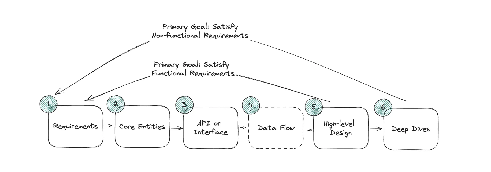

## Design a Ticket Booking Site Like Ticketmaster


---

- Ticketmaster is an online platform that allows users to purchase tickets for **concerts**, sports events, **theater**, 
  and other live entertainment. Has **~100M DAU**

## Reuqirements:

### Functional Requirement
- book tickets
- view events
- search for events
  

### Non-functional Requirements
- strong consistency for booking tickets & high availability for search and viewing events
- read >> write
- scalability to handle surges(激增) from popular events

### Out of scope:
- GDPR Compliance
- fault tolerance
---

## Core Entities
- event
- venue
- performer
- Ticket
- Booking

---
## API


```ruby
GET /events/:eventId -> Event & Venue & Performer & Ticket[]

- tickets are to render the seat map on the Client


GET /events/search?keyword={keyword}&start={start_date}&end={end_date}&pageSize={page_size}&page={page_number} -> Event[]


POST /bookings/reserve
header: JWT sessionToken
body: {
    ticketId
}

POST /bookings/confirm
header: JWT sessionToken
body: {
    ticketId, 
     "paymentDetails": (stripe)
}
```
---

## High-Level Design


