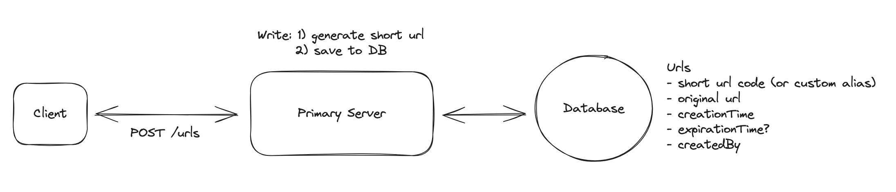
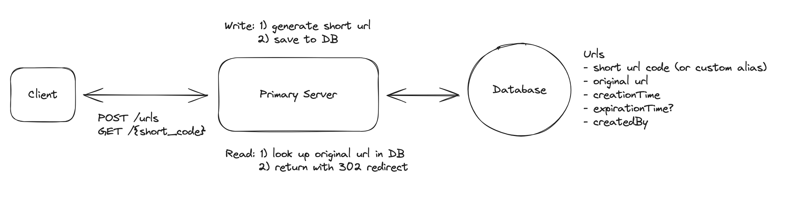
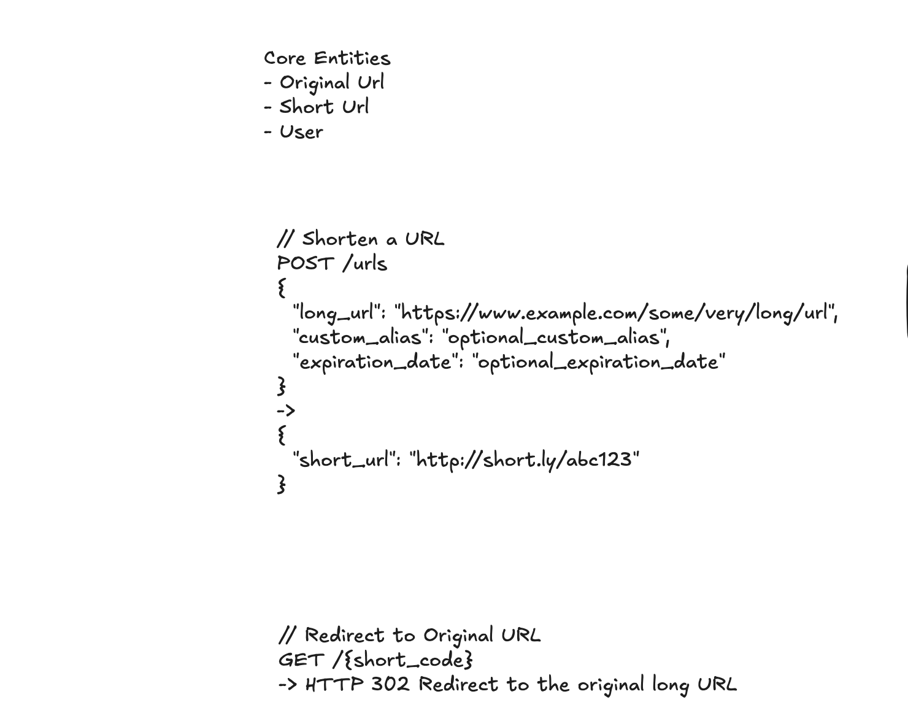
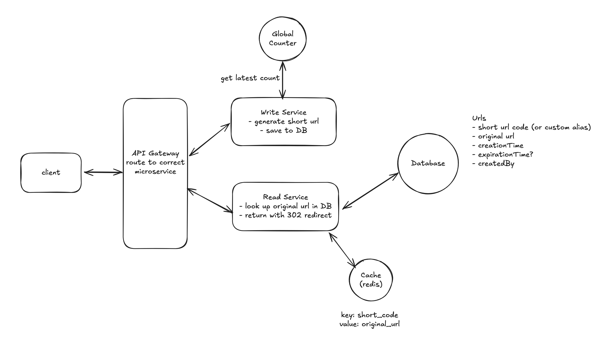

## [Design a URL Shortener Like Bit.ly](https://www.hellointerview.com/learn/system-design/problem-breakdowns/bitly)

- **Functional Requirements**:
  - 1. Users should be able to submit a long URL and receive a shortened version.
    - Optionally, users should be able to specify a custom alias for their shortened URL.
    - Optionally, users should be able to specify an expiration date for their shortened URL.
  - 2. Users should be able to access the original URL by using the shortened URL.

- **Below the line (out of scope):**
  - User authentication and account management.
  - Analytics on link clicks (e.g., click counts, geographic data).


- **Non-Functional Requirements**:
  - 1. The system should ensure uniqueness for the short codes (no two long URLs can map to the same short URL)
  - 2. The redirection should occur with minimal delay (< 100ms)
  - 3. The system should be reliable and available 99.99% of the time (availability > consistency)
  - 4. ​​The system should scale to support 1B shortened URLs and 100M DAU


- **Defining the Core Entities**
  - 1. **Original URL**: The original long URL that the user wants to shorten.
  - 2. **Short URL**: The shortened URL that the user receives and can share.
  - 3. **User**: Represents the user who created the shortened URL.

---

- **The APIs**

- To shorten a URL, we'll need a POST endpoint that takes in the long URL and optionally a custom alias and expiration date, 
  and returns the shortened URL. We use post here because we are creating a new entry in our database mapping the long url to the newly created short url.


```ruby
// Shorten a URL

POST /urls
{
  "long_url": "https://www.example.com/some/very/long/url",
  "custom_alias": "optional_custom_alias",
  "expiration_date": "optional_expiration_date"
}
->
{
  "short_url": "http://short.ly/abc123"
}
```


- For redirection, we'll need a GET endpoint that takes in the short code and redirects the user to the original long URL. 
  **GET** is the right verb here because we are reading the existing long url from our database based on the short code.


```ruby
// Redirect to Original URL

GET /{short_code}
-> HTTP 302 Redirect to the original long URL
```


---

## High-Level Design

1. Users should be able to submit a long URL and receive a shortened version




- 1. **Client**: Users interact with the system through a web or mobile application.
- 2. **Primary Server**: The primary server receives requests from the client and handles all business logic like short url creation and validation.
- 3. **Database**: Stores the mapping of short codes to long urls, as well as user-generated aliases and expiration dates.


2. Users should be able to access the original URL by using the shortened URL



---


## Deep Dives

1. How can we ensure short urls are unique?
2. How can we ensure that redirects are fast?
3. How can we scale to support 1B shortened urls and 100M DAU?








