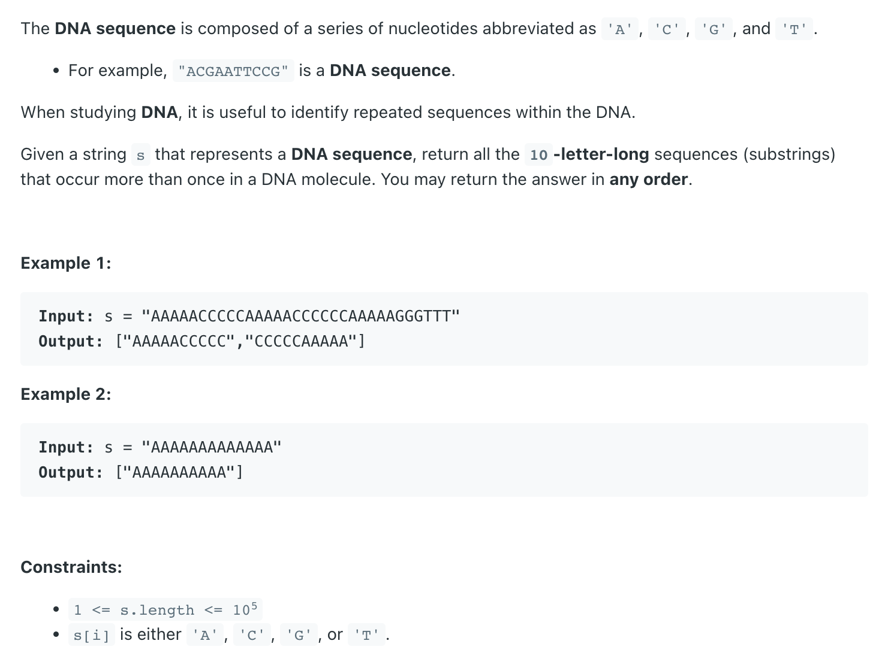

## 187. Repeated DNA Sequences


- Note: `AACCCCCAAA` is also a sequence, the only thing we need to care is that 
  ** return all the 10-letter-long sequences that occur more than once in a DNA molecule.**

---
```java
class repeatedDNASequences {
    public List<String> findRepeatedDnaSequences(String s) {
        Set<String> seen = new HashSet<>(), res = new HashSet<>();
        for (int i = 0; i + 9 < s.length(); i++) {
            String tenDna = s.substring(i, i + 10);
            if (seen.contains(tenDna)) {
                res.add(tenDna);
            }
            seen.add(tenDna);
        }
        return new ArrayList<>(res);
    }

    public static void main(String[] args) {
        repeatedDNASequences rns = new repeatedDNASequences();
        String s = "AAAAACCCCCAAAAACCCCCCAAAAAGGGTTT";
        List<String> res = rns.findRepeatedDnaSequences(s);
        System.out.println(res); // [AAAAACCCCC, CCCCCAAAAA]
    }
}
```