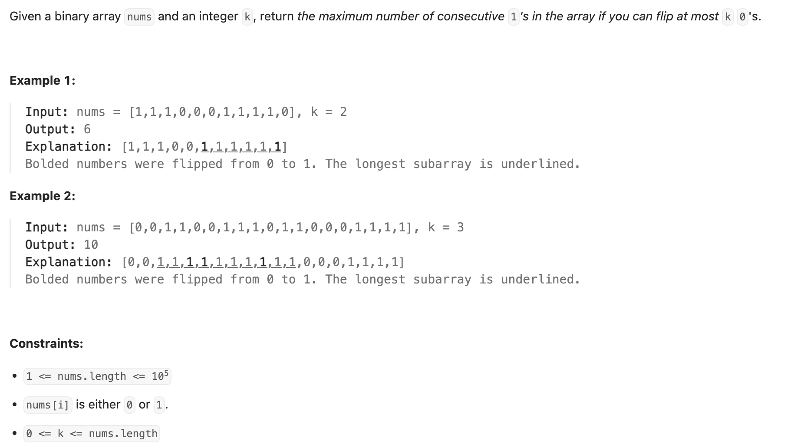
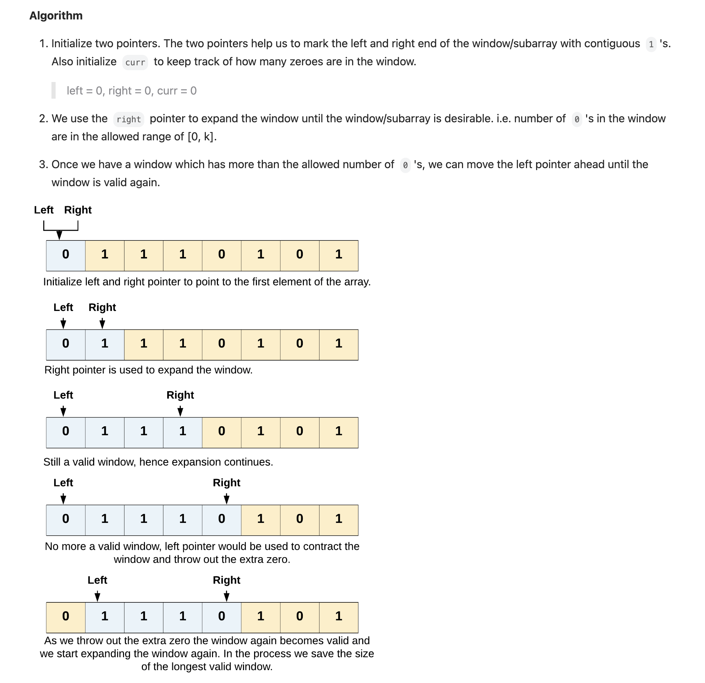

## 1004. Max Consecutive Ones III

---

---

```java
class Solution {
    public int longestOnes(int[] nums, int k) {
        int left = 0;
        int zeros = 0;
        int res = 0;
        for (int right = 0; right < nums.length; right++) {
            if (nums[right] == 0) {
                zeros++;
            }
            while (zeros > k) {
                if (nums[left] == 0) {
                    zeros--;
                }
                left++;
            }

            res = Math.max(res, right - left + 1);
        }
        return res;
    }
}
```
---

```py
class Solution:
    def longestOnes(self, nums: List[int], k: int) -> int:
        res = 0
        flip_zero_to_one = 0
        left = 0
        for right, x in enumerate(nums):
            if x == 0:
                flip_zero_to_one += 1
            while flip_zero_to_one > k:
                if nums[left] == 0:
                    flip_zero_to_one -= 1
                left += 1
            res = max(res, right - left + 1)
        return res
```