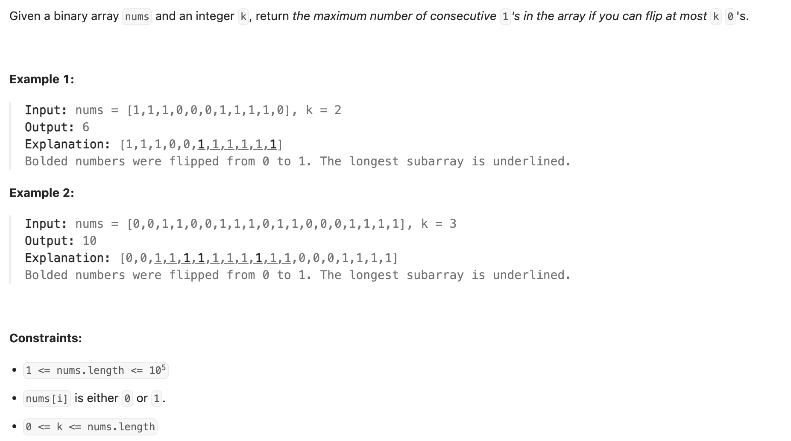
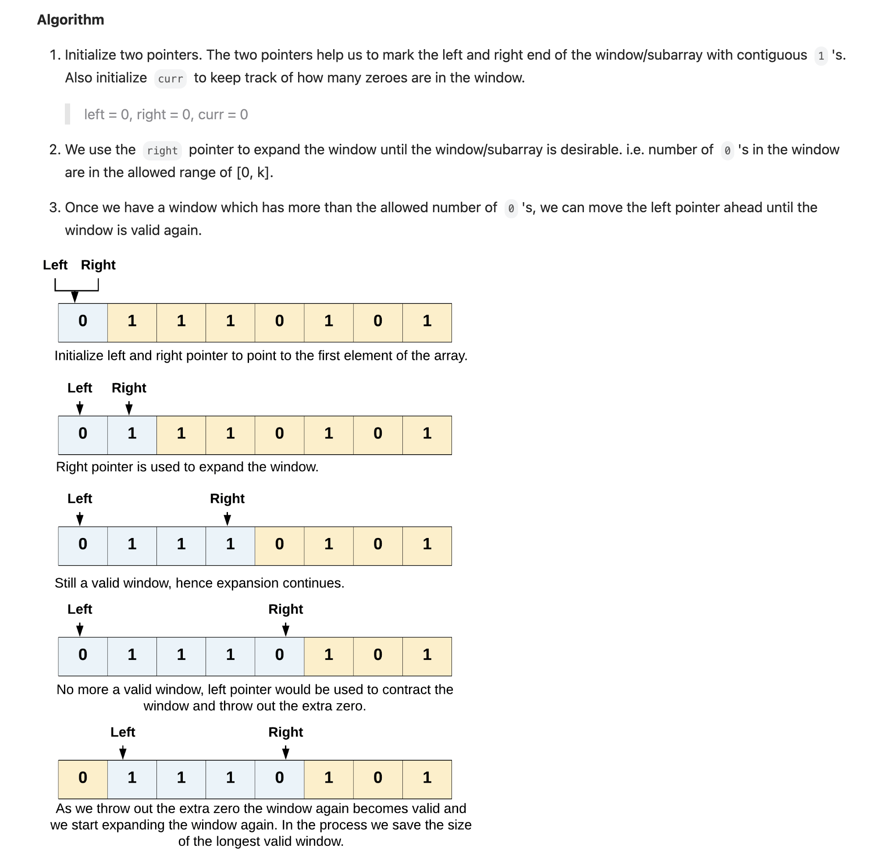

## 1004. Max Consecutive Ones III

---

---
```py
class Solution:
    def longestOnes(self, nums: List[int], k: int) -> int:
        flip_zero_to_one = k  # remaining zeros we can flip
        left = 0
        res = 0               # max length of valid window

        for right, num in enumerate(nums):
            if num == 0:
                flip_zero_to_one -= 1  # use one flip for this zero

            # 2. shrink window if invalid (too many zeros)
            # condition: flipped more than k zeros → invalid
            while flip_zero_to_one < 0:
                # if we remove a zero from left, we "refund" one flip
                if nums[left] == 0:
                    flip_zero_to_one += 1
                left += 1  # move left pointer to shrink window

            # 3. update result (current window is always valid here)    
            res = max(res, right - left + 1)
        return res
```


----
```java
class Solution {
    public int longestOnes(int[] nums, int k) {
        int left = 0;
        int zeros = 0;
        int res = 0;
        for (int right = 0; right < nums.length; right++) {
            if (nums[right] == 0) {
                zeros++;
            }
            while (zeros > k) {
                if (nums[left] == 0) {
                    zeros--;
                }
                left++;
            }

            res = Math.max(res, right - left + 1);
        }
        return res;
    }
}
```
---
