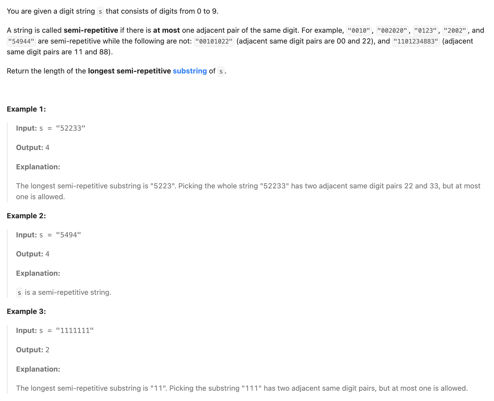
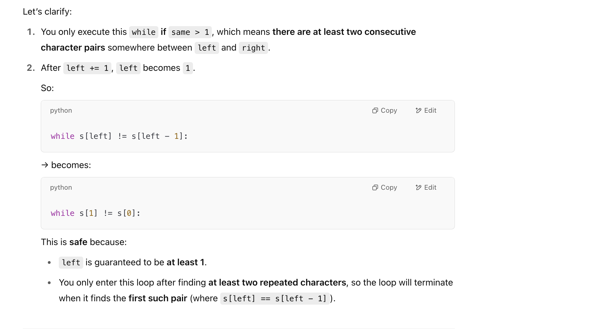

## 2730. Find the Longest Semi-Repetitive Substring

---


- if **left is equal to 1** after **left += 1**, how does while s[left] != s[left - 1] work?


---

```py
class Solution:
    def longestSemiRepetitiveSubstring(self, s: str) -> int:
        same = 0
        left = 0
        res = 1
        cnt = Counter()
        for right in range(1, len(s)):
            same += s[right] == s[right - 1]
            if same > 1:  # same == 2
                left += 1
                while s[left] != s[left - 1]:
                    left += 1
                same = 1
            res = max(res, right - left + 1)
        return res
```