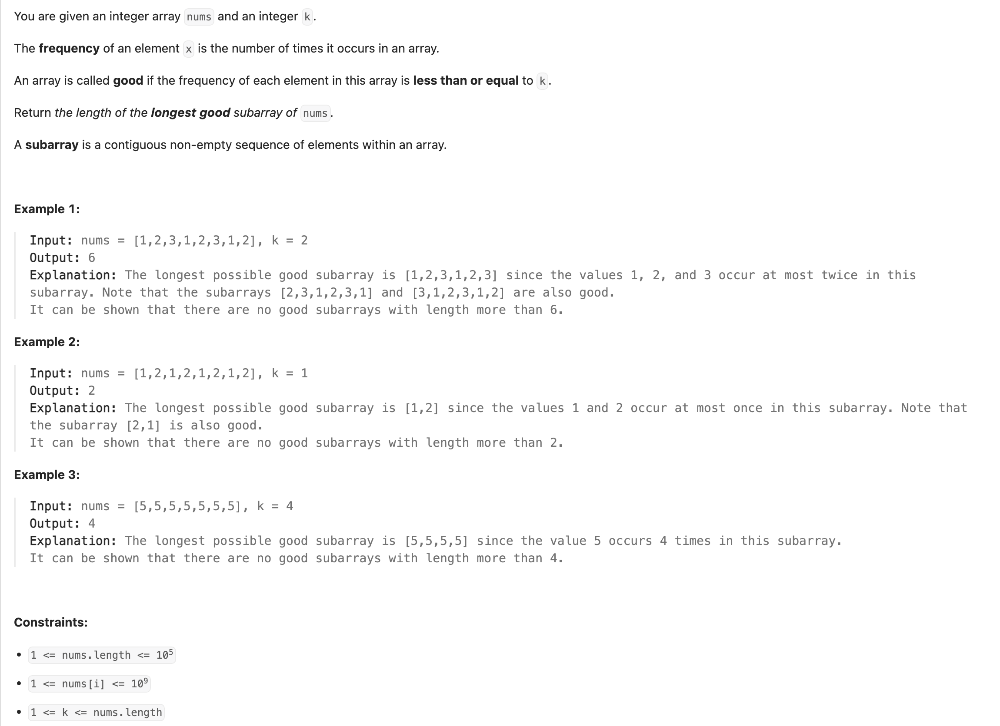

## 2958. Length of Longest Subarray With at Most K Frequency

---

```py
class Solution:
    def maxSubarrayLength(self, nums: List[int], k: int) -> int:
        res = 0
        left = 0
        cnt = Counter()
        for right, num in enumerate(nums):
            cnt[num] += 1
            while cnt[num] > k:
                cnt[nums[left]] -= 1
                left += 1
            res = max(res, right - left + 1)
        return res
```

- TC: O(n)
- SC: O(n)