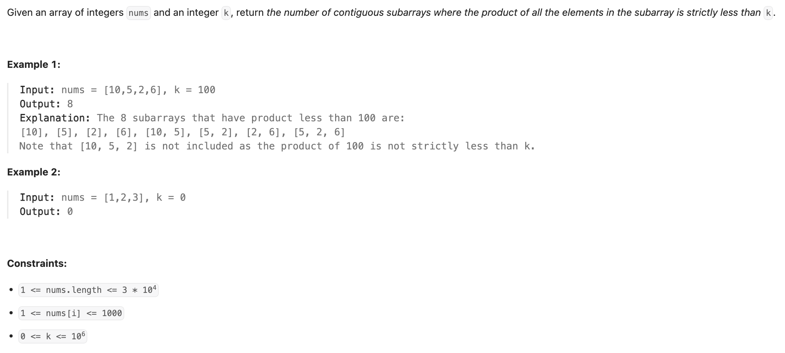
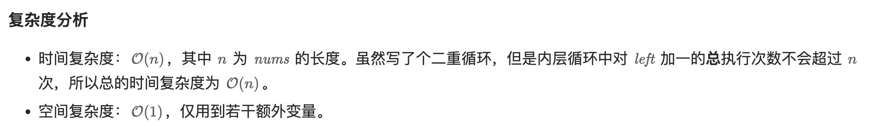

## 713. Subarray Product Less Than K


- **Can't use DFS**

- Time complexity is exponential **(O(2^n))**:
- DFS would consider all subsets (or even all contiguous subarrays if restricted), which is extremely inefficient. For 
  example, for an **array of size 100**, you'd explore **~2¹⁰⁰** combinations. example input = "111111111...." size = 1000


- Why sliding window works perfectly
- **All numbers are positive**
- This guarantees that increasing the window size (adding more numbers) will never decrease the product — an ideal 
  scenario for a two-pointer technique.

---


```py
class Solution:
    def numSubarrayProductLessThanK(self, nums: List[int], k: int) -> int:
        if k <= 1:
            return 0
        res = 0
        product = 1
        left = 0
        for right, num in enumerate(nums):
            product *= num
            while product >= k:
                product //= nums[left]
                left += 1
            res += right - left + 1
        return res
```

