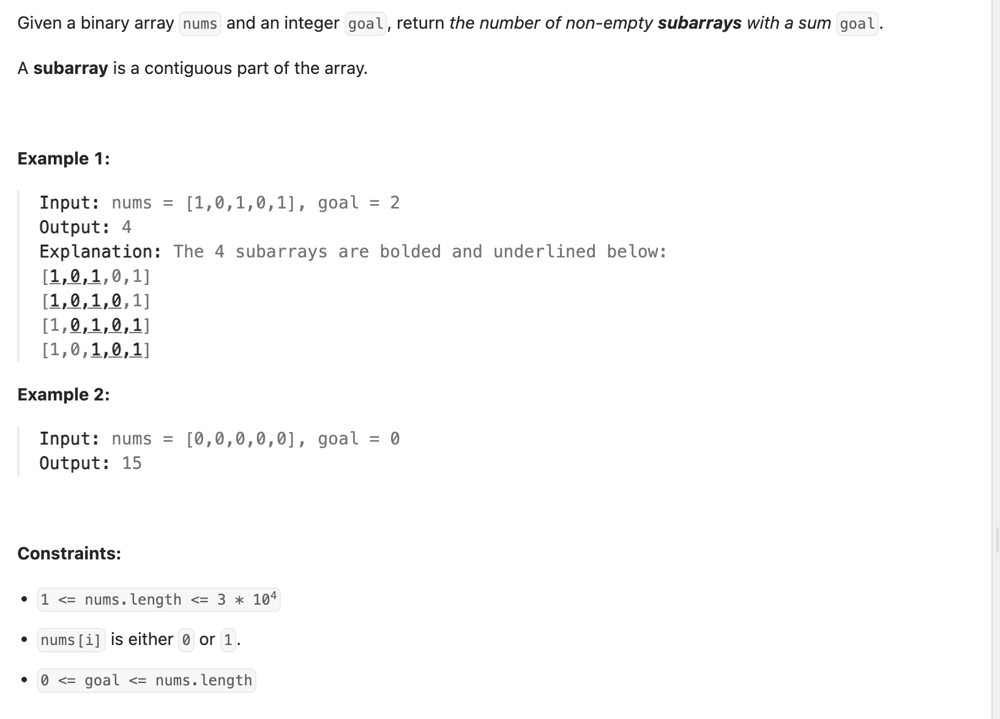

## 930. Binary Subarrays With Sum

---

```py
class Solution:
    def numSubarraysWithSum(self, nums: List[int], goal: int) -> int:
        # 1. Build prefix sum array
        preSum = [0] * (len(nums) + 1)
        for i in range(1, len(nums) + 1):
            preSum[i] = preSum[i - 1] + nums[i - 1]

        # 2. Count using hashmap
        count = 0
        preSumMap = {}

        for i in range(len(preSum)):
            # Check how many times (preSum[i] - goal) appeared before
            if preSum[i] - goal in preSumMap:
                count += preSumMap[preSum[i] - goal]

            # Record current prefix sum
            preSumMap[preSum[i]] = preSumMap.get(preSum[i], 0) + 1

        return count
```