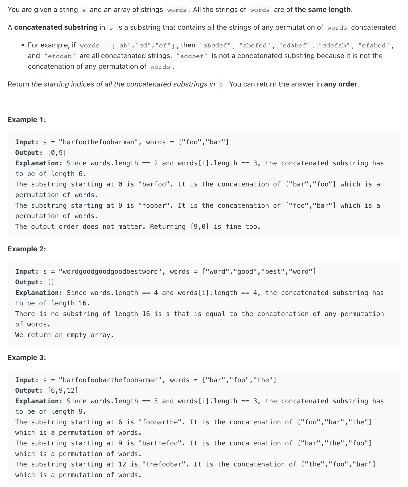
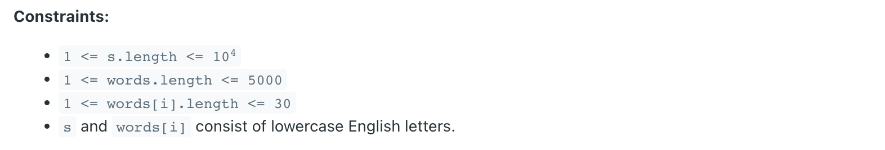

## 30. Substring with Concatenation of All Words


---

- [中文教程](https://leetcode.cn/problems/substring-with-concatenation-of-all-words/solution/chuan-lian-suo-you-dan-ci-de-zi-chuan-by-powcai/)

```java
class Solution {
    public List<Integer> findSubstring(String s, String[] words) {
        /*
        滑动窗口+双HashMap优化
        关键在于只需要遍历0-wordLen-1为起始索引的子串,然后遍历边维护符合条件res
        具体逻辑可以看代码,核心就是动态维护根据cur的数目动态查找合法子串
        时间复杂度:O(N),空间复杂度:O(N)
        */
        List<Integer> res = new ArrayList<>();
        // 阴间案例
        if(s == null || s.length() == 0 || words == null || words.length == 0) {
            return res;
        }
        // s的长度
        int len = s.length();
        // 单词总个数
        int wordNum = words.length;
        // 每个单词长度
        int wordLen = words[0].length();
        // words总长度
        int totalLen = wordNum * wordLen;
        // 长度不符合预期
        if(totalLen > len) {
            return res;
        }
        // 存储words的单词和个数
        Map<String, Integer> allWords = new HashMap<>();
        for(String word : words) {
            // 找不到当前单词肯定没有
            if(s.indexOf(word) == -1) {
                return res;
            }
            allWords.put(word, allWords.getOrDefault(word, 0) + 1);
        }
        // 只需要遍历wordLen种起点:0~wordLen-1
        for(int i = 0; i < wordLen; i++) {
            // 左右指针以及当前窗口中符合的单词个数
            int left = i, right = i, count = 0;
            // 存储[left,right)内符合条件的单词及其数量
            Map<String, Integer> hasWords = new HashMap<>();
            // right移动的右边界为len(含)
            while(right + wordLen <= len) {
                // 当前要考虑的单词部分[right,right+wordLen)
                String cur = s.substring(right, right + wordLen);
                // 选了当前单词就要移动右指针
                right += wordLen;
                if(allWords.containsKey(cur)) {
                    // 1.allWords里有cur,说明是合法的,可以加入
                    hasWords.put(cur, hasWords.getOrDefault(cur, 0) + 1);
                    // 有效单词数+1
                    count++;
                    // 有一种特殊情况是有cur,但其数目超过了上限,需要一直舍弃左边的直至合法
                    while(hasWords.get(cur) > allWords.get(cur)) {
                        // 要移除的单词
                        String del = s.substring(left, left + wordLen);
                        // 更新haswords
                        hasWords.put(del, hasWords.get(del) - 1);
                        // 同时移动左指针
                        left += wordLen;
                        // count数目-1
                        count--;
                    }
                }else {
                    // 2.allWords里有没cur,说明cur是不合法的,得将left指针移动到新的1right后面
                    left = right;
                    // 清空hasWords
                    hasWords.clear();
                    // 清空count
                    count = 0;
                }
                // 每当count更新一次就判断是否符合预期
                if(count == wordNum) res.add(left);
            }
        }
        return res;
    }
}
```
---

### English Version

```java
class _30_SubstringWithConcatenationOfAllWords {
    public List<Integer> findSubstring(String s, String[] words) {
        List<Integer> res = new ArrayList<>();
        if (words.length == 0 || s.length() < words.length * words[0].length()) {
            return res;
        }
        int n = s.length(), wordNums = words.length;
        int wordLen = words[0].length();
        Map<String, Integer> seen = buildMap(words);
        Map<String, Integer> curMap = new HashMap<>();
        String str = null, tmp = null;

        for (int i = 0; i < wordLen; i++) {
            int count = 0; // remark: reset count
            int start = i;
            for (int r = i; r + wordLen <= n; r += wordLen) {
                str = s.substring(r, r + wordLen);
                if (seen.containsKey(str)) {

                    curMap.put(str, curMap.getOrDefault(str, 0) + 1);
                    count++;

                    while (curMap.get(str) > seen.get(str)) {
                        tmp = s.substring(start, start + wordLen);
                        curMap.put(tmp, curMap.get(tmp) - 1);
                        start += wordLen;

                        count--;
                    }
                } else {
                    curMap.clear();
                    count = 0;
                    start = r + wordLen; //not contain, so move the start
                }
                if (count == wordNums) {
                    res.add(start);
                }
            }
            curMap.clear();
        }
        return res;
    }

    private Map<String, Integer> buildMap(String[] words) {
        Map<String, Integer> map = new HashMap<>();
        for (String word : words) {
            map.put(word, map.getOrDefault(word, 0) + 1);
        }
        return map;
    }
}
```