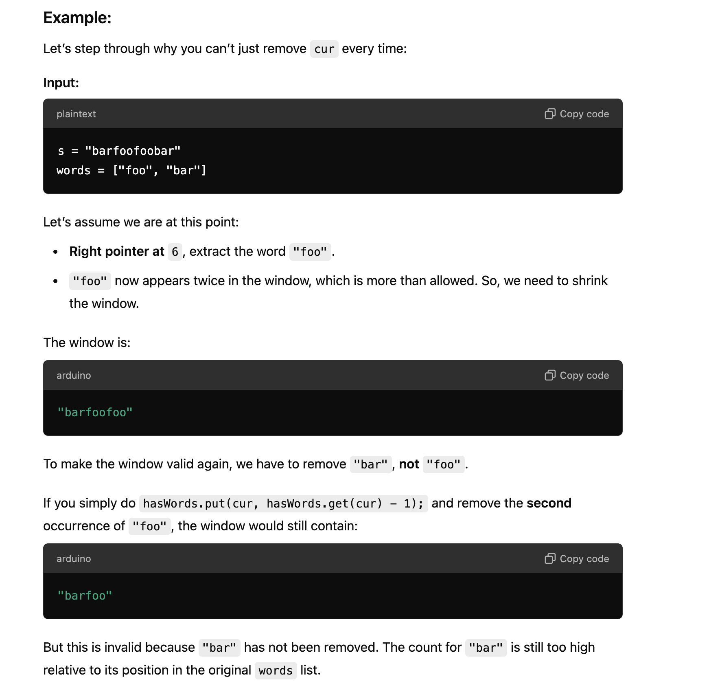
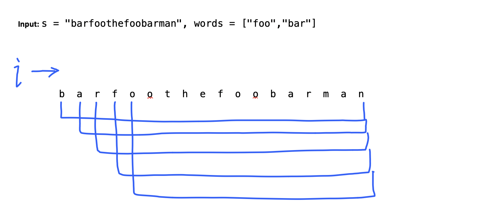

## 30. Substring with Concatenation of All Words


---

- [中文教程](https://leetcode.cn/problems/substring-with-concatenation-of-all-words/solution/chuan-lian-suo-you-dan-ci-de-zi-chuan-by-powcai/)

- 注意: **words's elements can be duplicate**

---
```java
        while (hasWords.get(cur) > allWords.get(cur)) {
            // The word to remove
            String del = s.substring(left, left + wordLen);
            // Update hasWords
            hasWords.put(del, hasWords.get(del) - 1);
            // Move the left pointer
            left += wordLen;
            // Decrease the count
            count--;
        }
```

- you cannot replace this part of the code with just `hasWords.put(cur, hasWords.get(cur) - 1);` 
  because the loop is designed to remove any word at the left side of the sliding window, not just the word **cur**.





- within this **for loop**, `every index i from leftmost to rightmost is a sliding window`

---
```ruby
    words = ["bar","foo","the"],   seen[bar: 1, foo: 1, the: 1]

    count = 0   res[ ],   curSeen[bar: 0, foo: 0, the: 0]
    b a r f o o f o o b a r t h e f o o b a r m a n
    l
    r


    count = 1   res[ ]    curSeen[bar: 1, foo: 0, the: 0]
    b a r f o o f o o b a r t h e f o o b a r m a n
    l
          r


    count = 2   res[ ]    curSeen[bar: 1, foo: 1, the: 0]
    b a r f o o f o o b a r t h e f o o b a r m a n
    l
                r


    count = 3   res[ ]    curSeen[bar: 1, foo: 2, the: 0],  since curSeen.get(cur) > seen.get(cur)
    b a r f o o f o o b a r t h e f o o b a r m a n
          l
                      r


    count = 2   res[ ]    curSeen[bar: 0, foo: 2, the: 0],  since curSeen.get(cur) > seen.get(cur)
    b a r f o o f o o b a r t h e f o o b a r m a n
          l
                      r


    count = 1   res[ ]    curSeen[bar: 0, foo: 1, the: 0],  since curSeen.get(cur) > seen.get(cur)
    b a r f o o f o o b a r t h e f o o b a r m a n
                l
                      r


    count = 2   res[ ]    curSeen[bar: 1, foo: 1, the: 0]
    b a r f o o f o o b a r t h e f o o b a r m a n
                l
                            r


    count = 3   res[ ]    curSeen[bar: 1, foo: 1, the: 1]
    b a r f o o f o o b a r t h e f o o b a r m a n
                l
                                  r


    count = 3   res[6, ]    curSeen[bar: 1, foo: 1, the: 1]
    b a r f o o f o o b a r t h e f o o b a r m a n
                l
                                  r


    count = 4   res[6, ]    curSeen[bar: 1, foo: 2, the: 1], since curSeen.get(cur) > seen.get(cur)
    b a r f o o f o o b a r t h e f o o b a r m a n
                l
                                        r


    count = 3   res[6, ]    curSeen[bar: 1, foo: 1, the: 1]
    b a r f o o f o o b a r t h e f o o b a r m a n
                      l
                                        r


    count = 3   res[6, 9]    curSeen[bar: 1, foo: 1, the: 1]
    b a r f o o f o o b a r t h e f o o b a r m a n
                      l
                                        r


    count = 4   res[6, 9]    curSeen[bar: 2, foo: 1, the: 1]
    b a r f o o f o o b a r t h e f o o b a r m a n
                      l
                                              r    
                                              
                                              
    count = 3   res[6, 9]    curSeen[bar: 1, foo: 1, the: 1]
    b a r f o o f o o b a r t h e f o o b a r m a n
                            l
                                              r  


    count = 3   res[6, 9, 12]    curSeen[bar: 1, foo: 1, the: 1]
    b a r f o o f o o b a r t h e f o o b a r m a n
                            l
                                              r  
```

---
```java
class Solution {
    public List<Integer> findSubstring(String s, String[] words) {
        /*
        Sliding window + double HashMap optimization
        The key is that we only need to iterate through the substring starting at indices 0 to wordLen-1,
        and then maintain valid substrings as we iterate. 
        The core logic is to dynamically maintain and search for valid substrings based on the current count.
        Time complexity: O(N), Space complexity: O(N)
        */
        List<Integer> res = new ArrayList<>();
        
        if (words.length == 0 || s.length() < words.length * words[0].length()) {
            return res;
        }
        
        // Length of the string
        int len = s.length();
        // Total number of words
        int wordNum = words.length;
        // Length of each word
        int wordLen = words[0].length();
        // Total length of all words combined
        int totalLen = wordNum * wordLen;
        // If the total length is greater than the string length, return
        if (totalLen > len) {
            return res;
        }

        // Store words and their counts
        Map<String, Integer> allWords = new HashMap<>();
        for (String word : words) {
            // If the current word is not found, return
            if (s.indexOf(word) == -1) {
                return res;
            }
            allWords.put(word, allWords.getOrDefault(word, 0) + 1);
        }
        
        // We only need to iterate through wordLen starting points: 0 to wordLen-1
        for (int i = 0; i < wordLen; i++) {
            // Left and right pointers and the count of valid words in the current window
            int left = i, right = i, count = 0;
            // Store the words that are valid in the current window and their counts
            Map<String, Integer> hasWords = new HashMap<>();
            // The right boundary of the right pointer can be up to len (inclusive)
            while (right + wordLen <= len) {
                // The current substring to consider [right, right + wordLen)
                String cur = s.substring(right, right + wordLen);
                // Move the right pointer after choosing the current word
                right += wordLen;
                
                if (allWords.containsKey(cur)) {
                    // 1. If allWords contains cur, it means it's valid, we can add it
                    hasWords.put(cur, hasWords.getOrDefault(cur, 0) + 1);
                    // Increase the count of valid words
                    count++;
                    // There is a special case where cur exists, but its count exceeds the limit,
                    // we need to continuously discard from the left until it's valid
                    while (hasWords.get(cur) > allWords.get(cur)) {
                        // The word to remove
                        String del = s.substring(left, left + wordLen);
                        // Update hasWords
                        hasWords.put(del, hasWords.get(del) - 1);
                        // Move the left pointer
                        left += wordLen;
                        // Decrease the count
                        count--;
                    }
                } else {
                    // 2. If allWords does not contain cur, it means cur is invalid,
                    // we need to move the left pointer to the position right after the new right
                    left = right;
                    // Clear hasWords
                    hasWords.clear();
                    // Reset count
                    count = 0;
                }
                
                // Each time the count is updated, check if it meets the expectation
                if (count == wordNum) res.add(left);
            }
        }
        return res;
    }
}

```
---

#### Python

