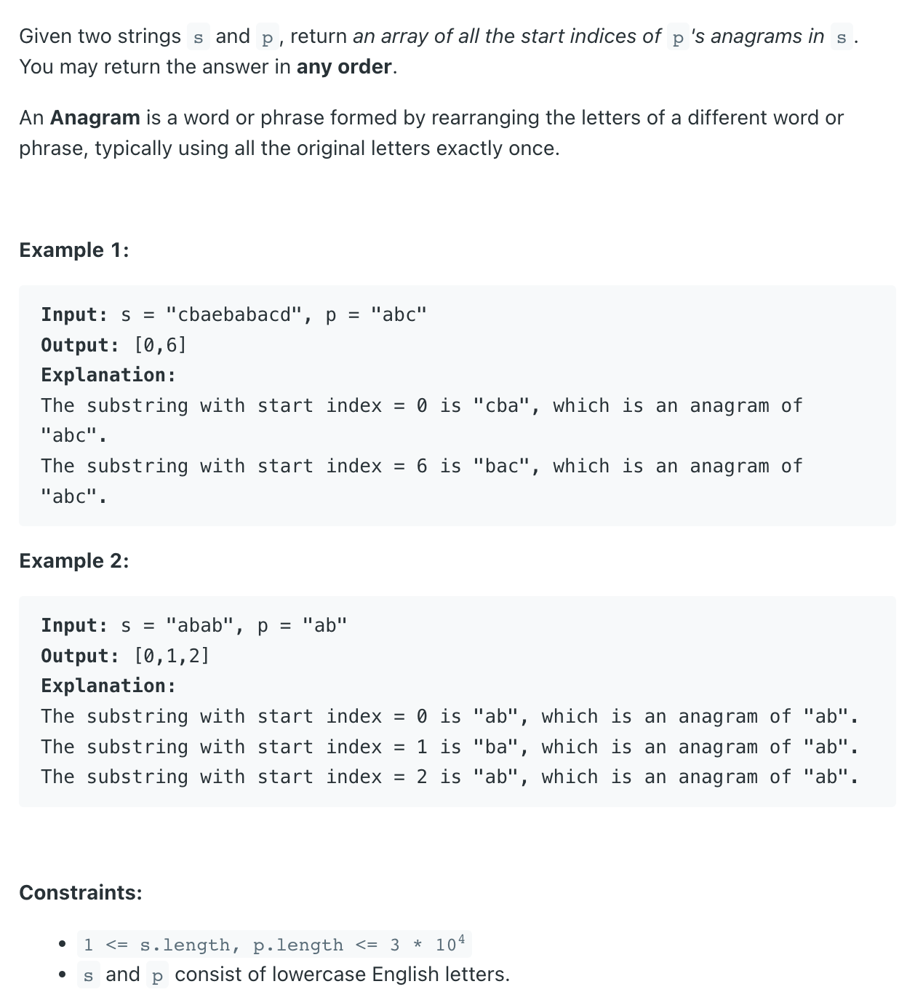
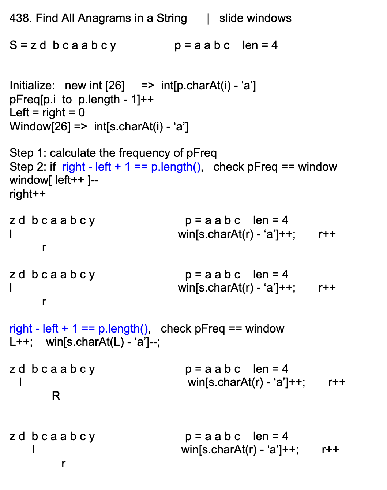

## 438. Find All Anagrams in a String

---

### sliding window




```java
class Solution {
    public List<Integer> findAnagrams(String s, String p) {
        List<Integer> res = new ArrayList<>();
        if (p.length() > s.length()) return res;

        //Record the frequency of occurrence of all letters of p
        int[] pFreq = new int[26];
        for(int i = 0; i < p.length(); i++){
            pFreq[p.charAt(i) - 'a']++;
        }

        //[left right] corresponding to the left and right of window
        int[] window = new int[26];
        int left = 0;
        for (int right = 0; right < s.length(); right++) {
            window[s.charAt(right) - 'a']++;
            if (right - left + 1 == p.length()) {
                if (Arrays.equals(pFreq, window)) {
                    res.add(left);
                }
                window[s.charAt(left) - 'a']--;
                left++;
            }
        }
        return res;
    }
}
```

---

### HashMap

```java
class FindAllAnagramsInAString_slidingWindow {
    public List<Integer> findAnagrams(String s, String p) {
        List<Integer> res = new ArrayList<>();
        if (p.length() > s.length()) return res;

        Map<Character, Integer> map = buildMap(p);
        int count = map.size();
        int slow = 0;

        for (int fast = 0; fast < s.length(); fast++) {
            char c = s.charAt(fast);
            if (map.containsKey(c)) {
                map.put(c, map.get(c) - 1);
                if (map.get(c) == 0) {
                    count--;
                }

                while (count == 0) {
                    char slowChar = s.charAt(slow);
                    if (map.containsKey(slowChar)) {
                        map.put(slowChar, map.get(slowChar) + 1);
                        if (map.get(slowChar) > 0) {
                            count++;
                        }
                    }
                    if (fast - slow + 1 == p.length()) {
                        res.add(slow);
                    }
                    slow++;
                }
            }
        }
        return res;
    }

    private Map<Character, Integer> buildMap(String p) {
        Map<Character, Integer> map = new HashMap<>();
        for (char c : p.toCharArray()) {
            map.put(c, map.getOrDefault(c, 0) + 1);
        }
        return map;
    }
}
```

---

### Python

#### solution 1:

```py
class Solution:
    def findAnagrams(self, s: str, p: str) -> list[int]:
        res = []
        if not s or not p:
            return res
        # this map records for each of the distinct characters in s, how many chars are needed.
        # e.g. s = "abbc", map = {'a':1, 'b':2, 'c':1}
        # when we get an instance of 'a' in p, we let count of 'a' decremented by 1
        # and only when the count is from 1 to 0, we have 'a' totally matched.
        counter = self.countMap(p)
        # Record how many distinct chars have been matched
        # mach == len(counter), we find an anagram
        match = 0
        # We have a sliding window of size s.length(), and since the size is fixed,
        # we only need to record the end index of the sliding window
        # Also, when move the sliding window by one step from left to right,
        # what we only need to change is
        # 1. remove the leftmost char at the previous sliding window
        # 2. add the rightmost char at the current sliding window
        slow = 0  # left pointer of the sliding window
        for fast in range(len(s)):
            letter = s[fast]
            if letter in counter:
                counter[letter] -= 1
                if counter[letter] == 0:
                    match += 1
            # When window size reaches the length of p
            if fast - slow + 1 == len(p):
                if match == len(counter):
                    res.append(slow)
                left_char = s[slow]                    
                if left_char in counter:
                    if counter[left_char] == 0:
                        match -= 1
                    counter[left_char] += 1
                slow += 1
                
        return res

    def countMap(self, p):
        dict = {}
        for letter in p:
            dict[letter] = dict.get(letter, 0) + 1
        return dict
```
---

#### solution 2:

```py
class Solution:
    def findAnagrams(self, s: str, p: str) -> list[int]:
        res = []
        if len(p) > len(s):
            return res

        # Record the frequency of characters in p
        p_freq = [0] * 26
        for ch in p:
            p_freq[ord(ch) - ord('a')] += 1

        window = [0] * 26
        slow = 0
        for fast in range(len(s)):
            window[ord(s[fast]) - ord('a')] += 1

            if fast - slow + 1 == len(p):
                if window == p_freq:
                    res.append(slow)
                window[ord(s[slow]) - ord('a')] -= 1
                slow += 1

        return res

```
