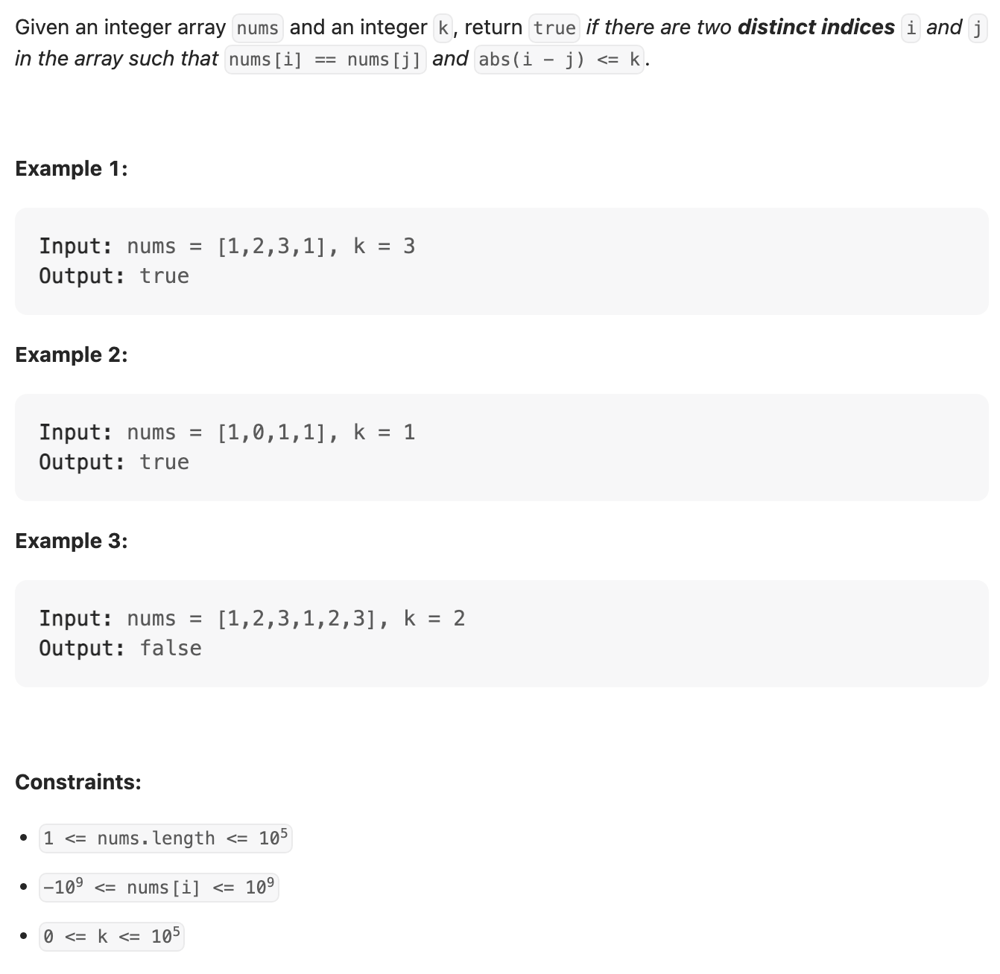
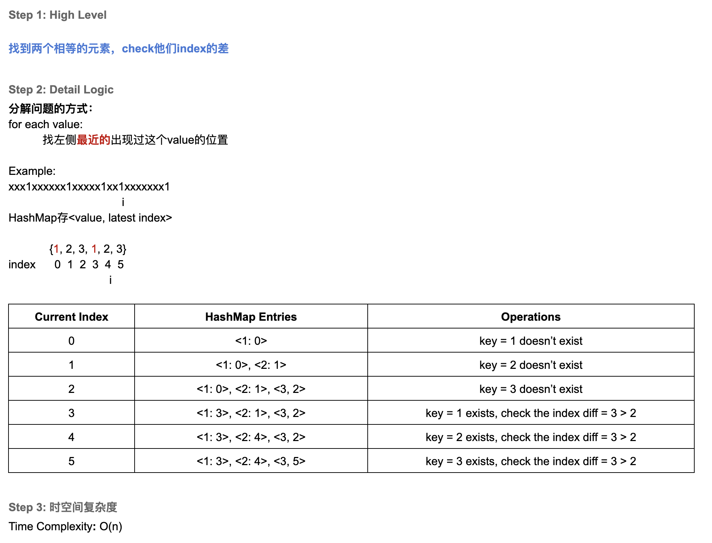
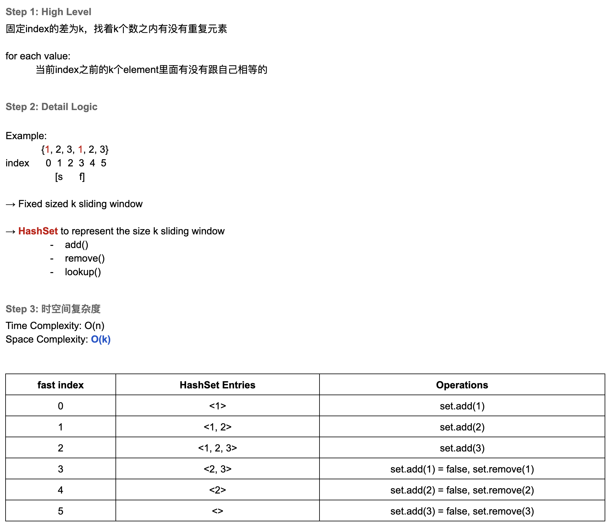

## 219. Contains Duplicate II





---

### Method 1


```java
class containsDuplicate_II_slidingWindow {
    public boolean containsNearbyDuplicate(int[] nums, int k) {
        if (nums == null || nums.length == 0) return true;

        Set<Integer> window = new HashSet<>();
        int left = 0;
        for (int right = 0; right < nums.length; right++) {
            if (right - left > k) {
                window.remove(nums[left]);
                left++;
            }
            if (window.contains(nums[right])) {
                return true;
            }
            window.add(nums[right]);
        }
        return false;
    }
}
```

