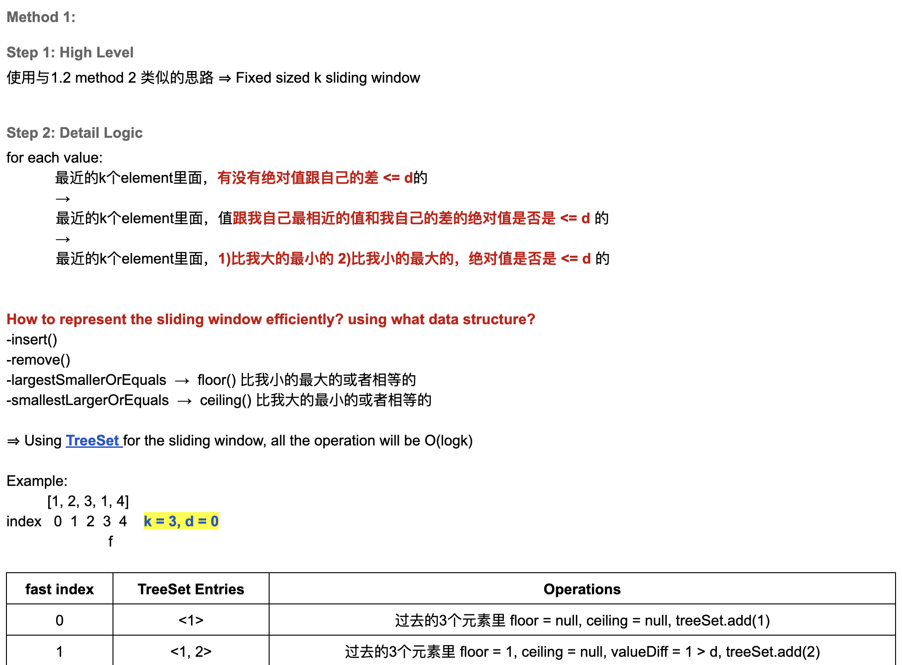
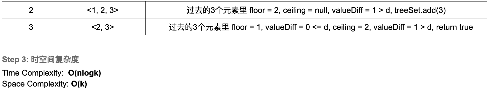
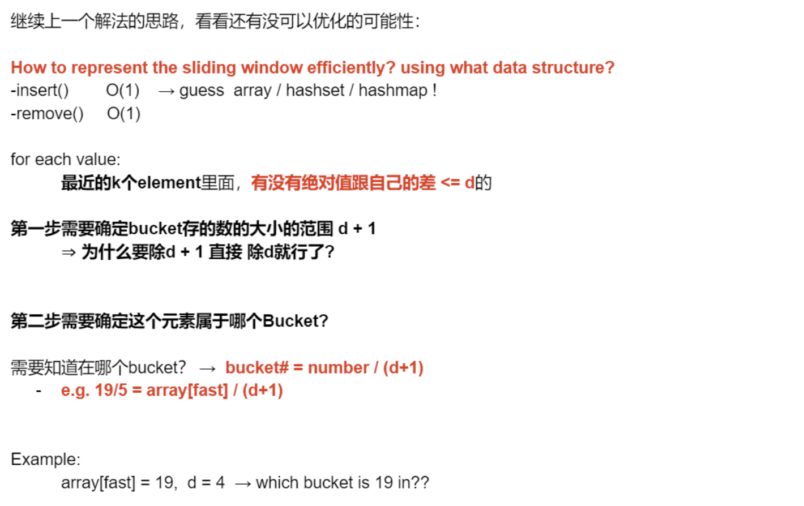
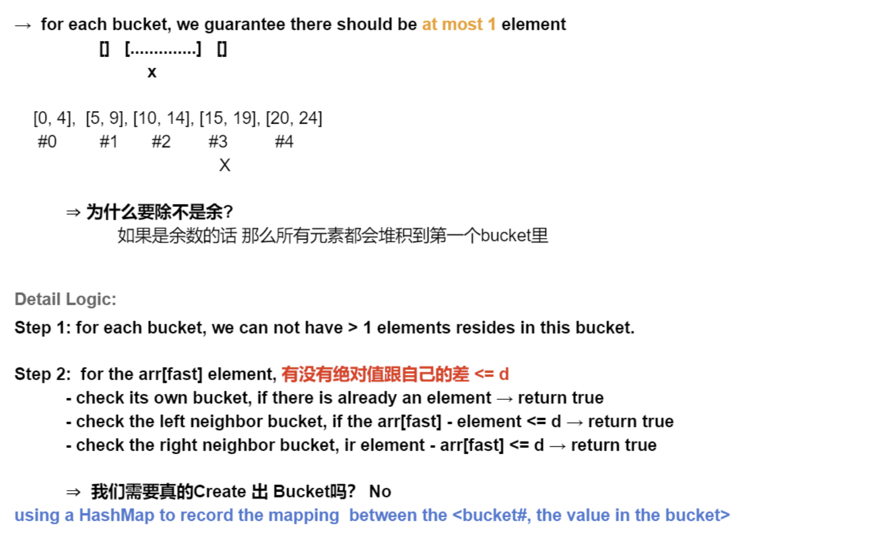

## 220. Contains Duplicate III





```java
class _220_ContainsDuplicate_III {
    public static boolean containsNearbyAlmostDuplicate(int[] nums, int indexDiff, int valueDiff) {
        if (nums == null || nums.length == 0) return true;

        TreeSet<Integer> window = new TreeSet<>();
        for (int fast = 0; fast < nums.length; fast++) {
            // step 1: to get a `less than or equal` to the given element
            Integer floor = window.floor(nums[fast]);
            if (floor != null && nums[fast] - floor <= valueDiff) {
                return true;
            }

            // step 2: to get a `greater than or equal` to the given element
            Integer ceiling = window.ceiling(nums[fast]);
            if (ceiling != null && ceiling - nums[fast] <= valueDiff) {
                return true;
            }
            // step 3: add fast
            window.add(nums[fast]);

            // step 4: remove slow
            if (fast >= indexDiff) {
                window.remove(nums[fast - indexDiff]);
            }
        }
        return false;
    }

    public static void main(String[] args) {
        int[] nums = new int[]{1, 5, 9, 1, 5, 9};
        boolean res = containsNearbyAlmostDuplicate(nums, 2, 3);
        System.out.println(res); // false
    }
}
```
---

### Optimize

- 大胆猜想到有可能优化到什么时间复杂度 (anti-engineering)
  - The only possible of optimization is: `Time: O(nlogk) -> O(n)`




- 注意在第一步，`d(valueDiff) != 0`, 因为如果这里 `d = 0`, 无法除以 `0`， 不合法。


- [关于负数的处理，可以参考leetcode 官方](https://leetcode.cn/problems/contains-duplicate-iii/solutions/726905/gong-shui-san-xie-yi-ti-shuang-jie-hua-d-dlnv/)

```java
class containsDuplicate_III_bucket {
    public boolean containsNearbyAlmostDuplicate(int[] nums, int indexDiff, int valueDiff) {
        if (nums == null || nums.length == 0 || indexDiff == 0 || valueDiff < 0) {
            return false;
        }
        Map<Integer, Integer> map = new HashMap<>();
        for (int fast = 0; fast < nums.length; fast++) {
            int bucketIndex = getBucketIndex(nums, fast, valueDiff);
            if (map.put(bucketIndex, nums[fast]) != null) {
                return true;
            }
            Integer left = map.get(bucketIndex - 1);
            if (left != null && nums[fast] - left <= valueDiff) {
                return true;
            }
            Integer right = map.get(bucketIndex + 1);
            if (right != null && right - nums[fast] <= valueDiff) {
                return true;
            }

            if (fast >= indexDiff) {
                map.remove(getBucketIndex(nums, fast - indexDiff, valueDiff));
            }
        }
        return false;
    }

    private int getBucketIndex(int[] nums, int i, int d) {
        return nums[i] < 0 ? nums[i] / (d + 1) - 1 : nums[i] / (d + 1);
    }
}
```