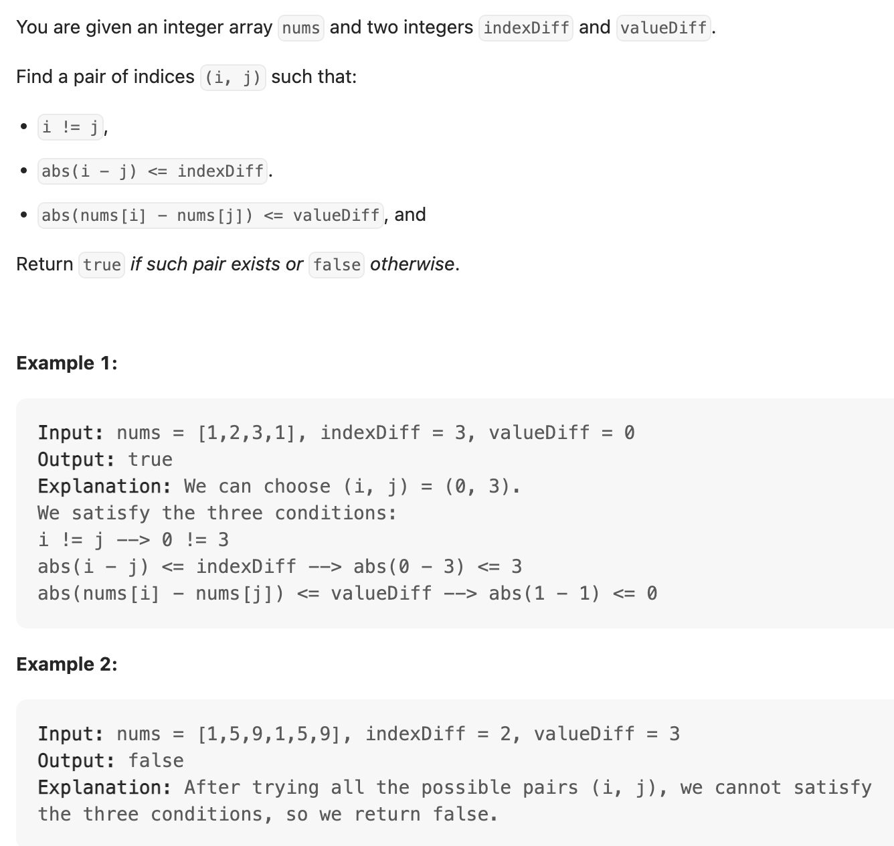

## 220. Contains Duplicate III



```java
class _220_ContainsDuplicate_III {
    public static boolean containsNearbyAlmostDuplicate(int[] nums, int indexDiff, int valueDiff) {
        if (nums == null || nums.length == 0) return true;

        TreeSet<Integer> window = new TreeSet<>();
        for (int fast = 0; fast < nums.length; fast++) {
            // step 1: to get a `less than or equal` to the given element
            Integer floor = window.floor(nums[fast]);
            if (floor != null && nums[fast] - floor <= valueDiff) {
                return true;
            }

            // step 2: to get a `greater than or equal` to the given element
            Integer ceiling = window.ceiling(nums[fast]);
            if (ceiling != null && ceiling - nums[fast] <= valueDiff) {
                return true;
            }
            // step 3: add fast
            window.add(nums[fast]);

            // step 4: remove slow
            if (fast >= indexDiff) {
                window.remove(nums[fast - indexDiff]);
            }
        }
        return false;
    }

    public static void main(String[] args) {
        int[] nums = new int[]{1, 5, 9, 1, 5, 9};
        boolean res = containsNearbyAlmostDuplicate(nums, 2, 3);
        System.out.println(res); // false
    }
}
```