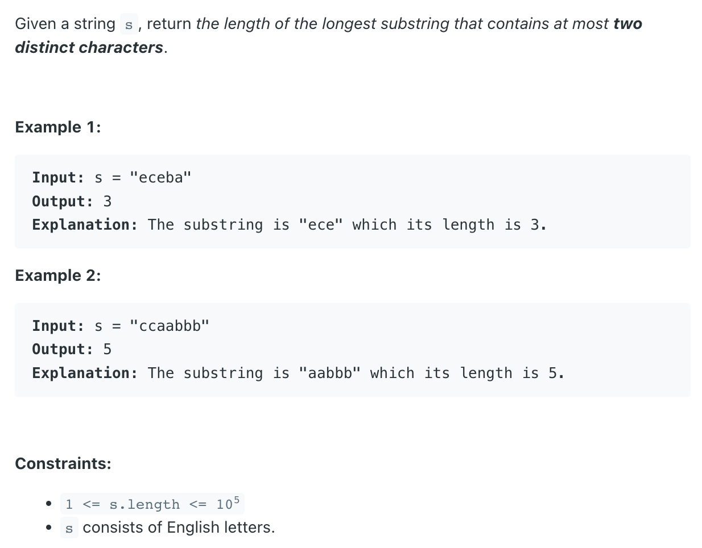

## 159. Longest Substring with At Most Two Distinct Characters

---

```java
class _159_LongestSubstringWithAtMostTwoDistinctCharacters {
    public int lengthOfLongestSubstringTwoDistinct(String s) {
        Map<Character, Integer> map = new HashMap<>();
        int left = 0, count = 0, len = 0;

        for (int right = 0; right < s.length(); right++) {
            char c = s.charAt(right);
            map.put(c, map.getOrDefault(c, 0) + 1);
            if (map.get(c) == 1) {
                count++; // new char
            }
            while (count > 2) {
                char cTmp = s.charAt(left);
                map.put(cTmp, map.get(cTmp) - 1);
                if (map.get(cTmp) == 0) {
                    count--;
                }
                left++;
            }
            len = Math.max(len, right - left + 1);
        }
        return len;
    }
}
```