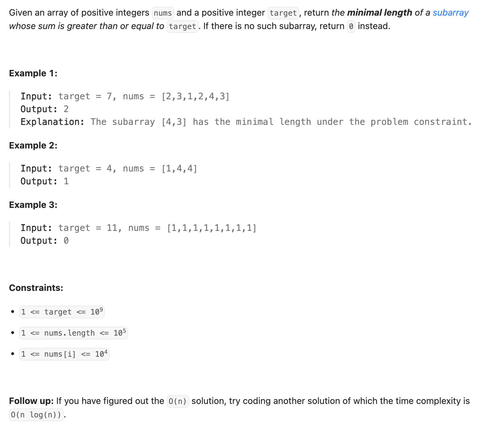
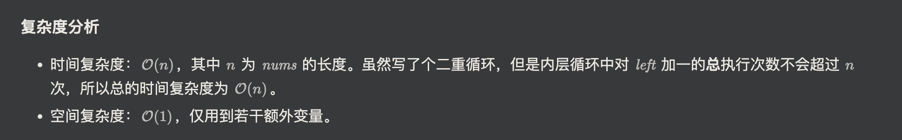

## 209. Minimum Size Subarray Sum

---

- [neetcode video](https://youtu.be/aYqYMIqZx5s?t=294)

```java
class _209_MinimumSizeSubarraySum {
    public int minSubArrayLen(int target, int[] nums) {
        int minLen = nums.length + 1;
        int left = 0;
        int curSum = 0;

        for (int right = 0; right < nums.length; right++) {
            curSum += nums[right];
            while (curSum >= target) {
                minLen = Math.min(minLen, right - left + 1);
                curSum -= nums[left];
                left++;
            }
        }

        return minLen == nums.length + 1 ? 0 : minLen;
    }
}
```
---

```py
class Solution:
    def minSubArrayLen(self, target: int, nums: List[int]) -> int:
        n = len(nums)
        res = float('inf')
        curr_sum = 0
        left = 0
        for right, x in enumerate(nums):
            curr_sum += x
            while curr_sum >= target:
                res = min(res, right - left + 1)
                curr_sum -= nums[left]
                left += 1
        return res if res != float('inf') else 0
```
---

