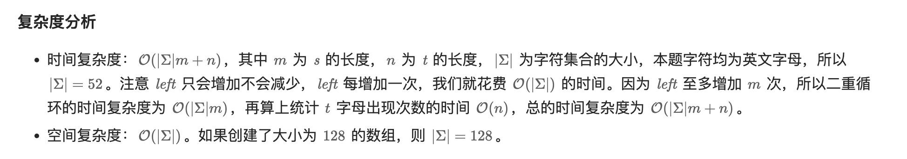
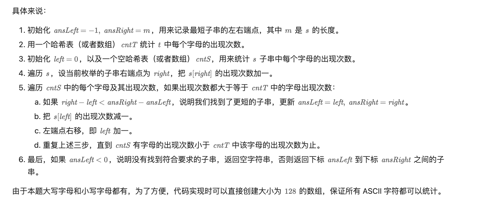

## 76. Minimum Window Substring


---
### Slding Window

- [leetcode 官方解释](https://www.youtube.com/watch?v=YWBNoH25lRw)


```ruby
   left = 0,   right = 0

    s = A D O B E C O D E B A N C           t = A B C
        r              since sFreq[A] < tFreq[A]  :  matchingCharsCount++ 
                             sFreq[right]++  => 1


    s = A D O B E C O D E B A N C           t = A B C
          r              

    s = A D O B E C O D E B A N C           t = A B C
            r              

    s = A D O B E C O D E B A N C           t = A B C
              r         since sFreq[B] < tFreq[B]  :  matchingCharsCount++ 
                              sFreq[right]++  => 2


    s = A D O B E C O D E B A N C           t = A B C
                r 

    s = A D O B E C O D E B A N C           t = A B C
                  r      since sFreq[C] < tFreq[C]  :  matchingCharsCount++  
                               sFreq[right]++  => 3      minLen = 6     


    s = A D O B E C O D E B A N C           t = A B C
        l         r           

    s = A D O B E C O D E B A N C           t = A B C
          l           r        when (matchingCharsCount == t.length()) :
                               sFreq[A] == tFreq[A] : =>  matchingCharsCount--   =>   2
                               sFreq[left]--       left++   
                               right++;
```
---

```py
class Solution:
    def minWindow(self, s: str, t: str) -> str:
        s_count = Counter()
        t_count = Counter(t)

        res_left, res_right = -1, len(s)
        left = 0
        for right, c in enumerate(s):
            s_count[c] += 1
            while s_count >= t_count:
                if right - left + 1 < res_right - res_left + 1:
                    res_left, res_right = left, right
                s_count[s[left]] -= 1
                left += 1
        return "" if res_left < 0 else s[res_left: res_right + 1]
```


---




```java
class final_version {
    public String minWindow(String s, String t) {
        char[] sArr = s.toCharArray();
        int m = sArr.length;
        int resLeft = -1, resRight = m;
        int[] s_count = new int[128];
        int[] t_count = new int[128];
        for (char c : t.toCharArray()) {
            t_count[c]++;
        }
        int left = 0;
        for (int right = 0; right < m; right++) {
            s_count[sArr[right]]++;
            while (isCovered(s_count, t_count)) {
                if (right - left + 1 < resRight - resLeft + 1) {
                    resLeft = left;
                    resRight = right;
                }
                s_count[sArr[left]]--;
                left++;
            }
        }
        return resLeft == -1 ? "" : s.substring(resLeft, resRight + 1);
    }

    // optimized space
    private boolean isCovered(int[] s_count, int[] t_count) {
        for (int i = 'A'; i <= 'Z'; i++) {
            if (s_count[i] < t_count[i]) {
                return false;
            }
        }
        for (int i = 'a'; i <= 'z'; i++) {
            if (s_count[i] < t_count[i]) {
                return false;
            }
        }
        return true;
    }

    // easy way
//    private boolean isCovered(int[] s_count, int[] t_count) {
//        for (int i = 0; i < 128; i++) {
//            if (s_count[i] < t_count[i]) {
//                return false;
//            }
//        }
//        return true;
//    }
}
```
---



```py
class Solution:
    def minWindow(self, s: str, t: str) -> str:
        s_count = Counter()
        t_count = Counter(t)

        res_left, res_right = -1, len(s)
        left = 0
        for right, c in enumerate(s):
            s_count[c] += 1
            while s_count >= t_count:
                if right - left + 1 < res_right - res_left + 1:
                    res_left, res_right = left, right
                s_count[s[left]] -= 1
                left += 1
        return "" if res_left < 0 else s[res_left: res_right + 1]
```


---

### Brute Force


- [youtube video4.1 => 2:00:15]()
---

```java
class Solution {
    public String minWindow(String s, String t) {
        if (s == null || t == null || t.length() > s.length()) return "";        

        int resLen = Integer.MAX_VALUE;
        String res = "";
        StringBuilder sb = null;
        Map<Character, Integer> map = new HashMap<>();
        for (char tc : t.toCharArray()) {
            map.put(tc, map.getOrDefault(tc, 0) + 1);
        }
        for (int i = 0; i < s.length(); i++) {
            // sb.setLength(0);
            sb = new StringBuilder();
            for (int j = i; j < s.length(); j++) {
                sb.append(s.charAt(j));
                boolean includeTstr = check(map, sb.toString());
                if (includeTstr) {
                    if (sb.length() < resLen) {
                        resLen = sb.length();
                        res = sb.toString();
                    }
                }
            }
        }
        return res;        
    }
    
    private boolean check(Map<Character, Integer> map, String sub) {
        boolean res = true;
        for (Map.Entry<Character, Integer> entry : map.entrySet()) {
            int count = 0;
            for (char c : sub.toCharArray()) {
                if (entry.getKey() == c) {
                    count++;
                }
            }
            if (count < entry.getValue()) {
                res = false;
            }
        }
        return res;
    }    
}
```

---

- [youtube 2:09:00]()


- Note: `match` **represent the map's keySet()** , that is T sting's all chars!

### Method 2

```java
class MinimumWindowSubstring {
    /**
     * Sliding Window
     */
    public String minWindow(String s, String t) {
        if (s == null || t == null || t.length() > s.length()) {
            return "";
        }
        Map<Character, Integer> map = buildMap(t);
        int left = 0;
        int start = -1;
        int match = 0;
        int shortest = Integer.MAX_VALUE;
        for (int right = 0; right < s.length(); right++) {
            // step 1: Add right
            char cur = s.charAt(right);
            Integer count = map.get(cur);
            // count == null 的情况，当前这个char如果根本不在T 中,
            // 那么以当前fast结尾一定不是最短的 (最短的substring两头的char肯定都在t中)
            if (count != null) {
                if (count == 1) {
                    match++;
                }
                map.put(cur, count - 1);
            }
            // Step 2: move left
            // while 当前sliding window满足条件, move left, 一直移动到第一个不满足条件的left为止
            // while loop 里所有的sliding window都是满足条件的, 所以每一次都可以更新global min
            while (match == map.size()) {
                /*
                0   1   2   3   4
                    4 - 1 + 1 = 4
                 */
                if (right - left + 1 < shortest) {
                    shortest = right - left + 1;
                    start = left;
                }
                cur = s.charAt(left);
                count = map.get(cur);
                if (count != null) {
                    if (count == 0) {
                        match--;
                    }
                    map.put(cur, count + 1);
                }
                left++;
            } // left 在第一个不满足要求的位置
        }
        return shortest == Integer.MAX_VALUE ? "" : s.substring(start, start + shortest);
    }

    private Map<Character, Integer> buildMap(String t) {
        Map<Character, Integer> map = new HashMap<>();
        for (char c : t.toCharArray()) {
            map.put(c, map.getOrDefault(c, 0) + 1);
        }
        return map;
    }
}

```