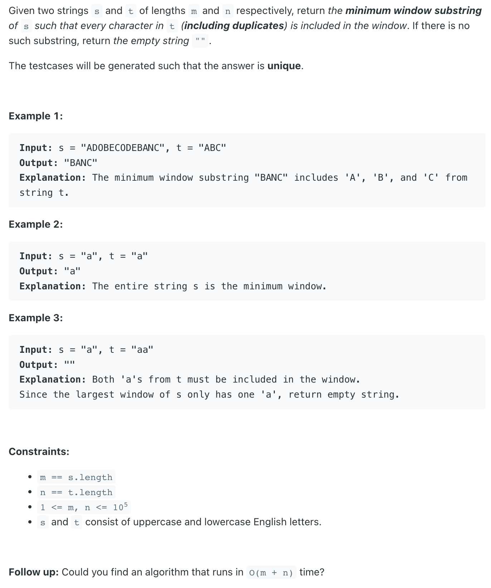
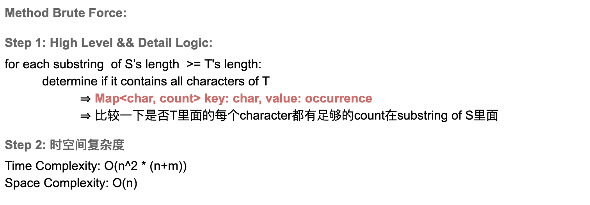
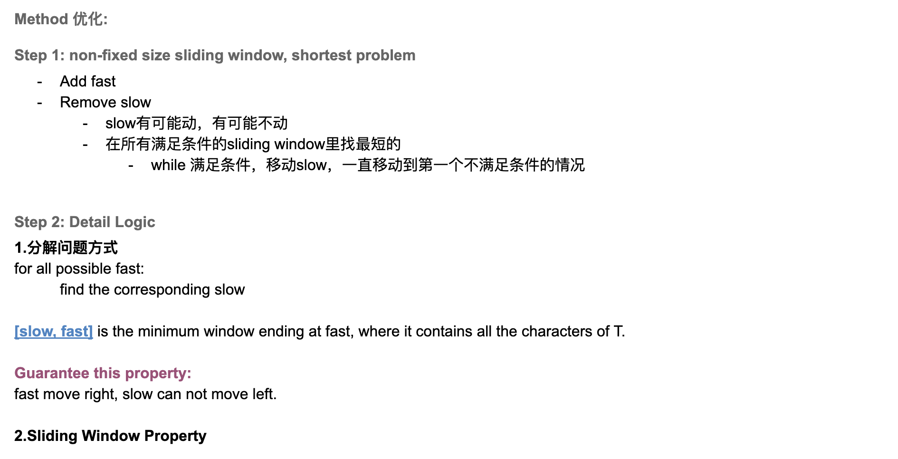

## 76. Minimum Window Substring



---
### Brute Force

- [youtube video4.1 => 2:00:15]()
---

```java
class Solution {
    public String minWindow(String s, String t) {
        if (s == null || t == null || t.length() > s.length()) return "";        

        int resLen = Integer.MAX_VALUE;
        String res = "";
        StringBuilder sb = null;
        Map<Character, Integer> map = new HashMap<>();
        for (char tc : t.toCharArray()) {
            map.put(tc, map.getOrDefault(tc, 0) + 1);
        }
        for (int i = 0; i < s.length(); i++) {
            // sb.setLength(0);
            sb = new StringBuilder();
            for (int j = i; j < s.length(); j++) {
                sb.append(s.charAt(j));
                boolean includeTstr = check(map, sb.toString());
                if (includeTstr) {
                    if (sb.length() < resLen) {
                        resLen = sb.length();
                        res = sb.toString();
                    }
                }
            }
        }
        return res;        
    }
    
    private boolean check(Map<Character, Integer> map, String sub) {
        boolean res = true;
        for (Map.Entry<Character, Integer> entry : map.entrySet()) {
            int count = 0;
            for (char c : sub.toCharArray()) {
                if (entry.getKey() == c) {
                    count++;
                }
            }
            if (count < entry.getValue()) {
                res = false;
            }
        }
        return res;
    }    
}
```

---

### Slding Window



```java
/**
 * Input: s = "ADOBECODEBANC", t = "ABC"
 */
class _76_MinimumWindowSubstring {
    /**
     * Sliding Window
     */
    public static String minWindow(String s, String t) {
        if (s == null || t == null || t.length() > s.length()) {
            return "";
        }
        Map<Character, Integer> map = buildMap(t);
        int slow = 0;
        int start = -1;
        int match = 0;
        int shortest = Integer.MAX_VALUE;
        for (int fast = 0; fast < s.length(); fast++) {
            // step 1: Add fast
            char cur = s.charAt(fast);
            Integer count = map.get(cur);
            // count == null 的情况，当前这个char如果根本不在T 中,
            // 那么以当前fast结尾一定不是最短的 (最短的substring两头的char肯定都在t中)
            if (count != null) {
                /*
                0   1   2   3   4
                    4 - 1 + 1 = 4
                 */                
                if (count == 1) {
                    match++;
                }
                map.put(cur, count - 1);
            }
            // Step 2: move slow
            // while 当前sliding window满足条件, move slow, 一直移动到第一个不满足条件的slow为止
            // while loop 里所有的sliding window都是满足条件的,所以每一次都可以更新global min
            while (match == map.size()) {
                if (fast - slow + 1 < shortest) {
                    shortest = fast - slow + 1;
                    start = slow;
                }
                cur = s.charAt(slow);
                count = map.get(cur);
                if (count != null) {
                    if (count == 0) {
                        match--;
                    }
                    map.put(cur, count + 1);
                }
                slow++;
            } // slow 在第一个不满足要求的位置
        }
        return shortest == Integer.MAX_VALUE ? "" : s.substring(start, start + shortest);
    }

    private static Map<Character, Integer> buildMap(String t) {
        Map<Character, Integer> map = new HashMap<>();
        for (char c : t.toCharArray()) {
            map.put(c, map.getOrDefault(c, 0) + 1);
        }
        return map;
    }

    public static void main(String[] args) {
        String s = "ADOBECODEBANC", t = "ABC";
        String res = minWindow(s, t);
        System.out.println(res); // BANC
    }
}
```