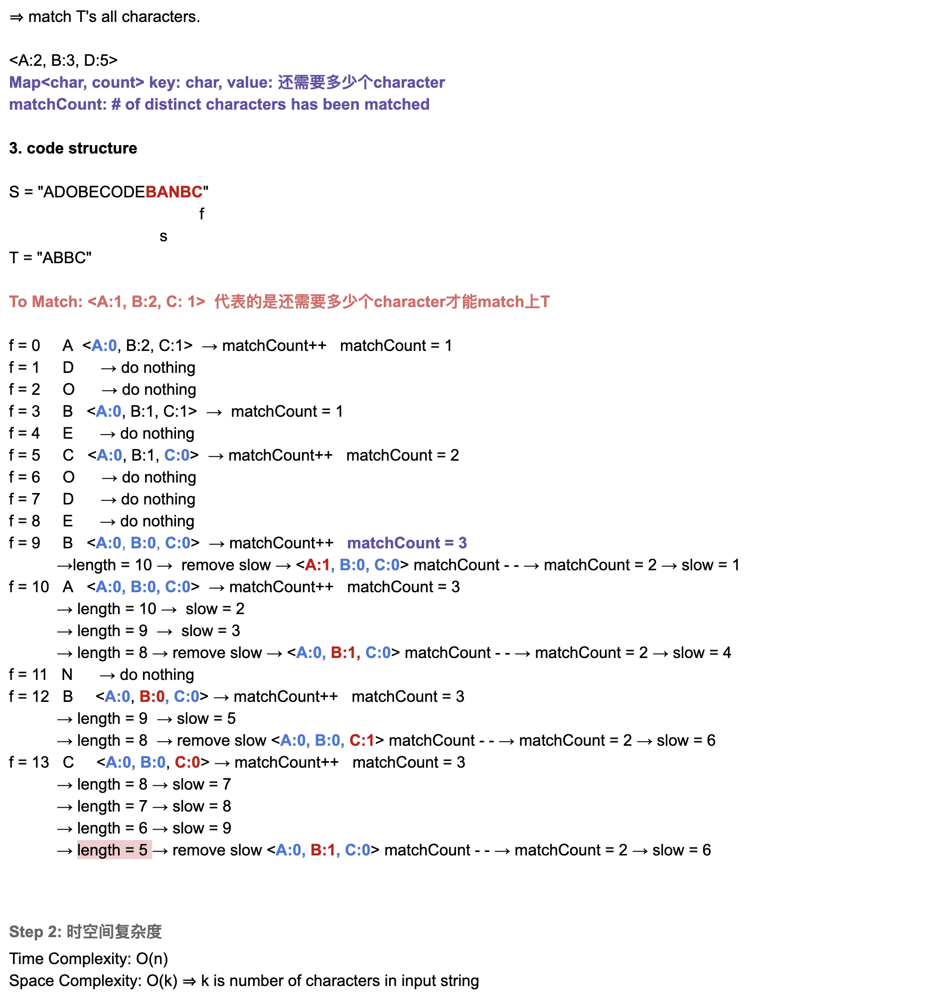

## 76. Minimum Window Substring


---
### Slding Window

- [leetcode 官方解释](https://www.youtube.com/watch?v=YWBNoH25lRw)


```ruby
   left = 0,   right = 0

    s = A D O B E C O D E B A N C           t = A B C
        r              since sFreq[A] < tFreq[A]  :  matchingCharsCount++ 
                             sFreq[right]++  => 1


    s = A D O B E C O D E B A N C           t = A B C
          r              

    s = A D O B E C O D E B A N C           t = A B C
            r              

    s = A D O B E C O D E B A N C           t = A B C
              r         since sFreq[B] < tFreq[B]  :  matchingCharsCount++ 
                              sFreq[right]++  => 2


    s = A D O B E C O D E B A N C           t = A B C
                r 

    s = A D O B E C O D E B A N C           t = A B C
                  r      since sFreq[C] < tFreq[C]  :  matchingCharsCount++  
                               sFreq[right]++  => 3      minLen = 6     


    s = A D O B E C O D E B A N C           t = A B C
        l         r           

    s = A D O B E C O D E B A N C           t = A B C
          l           r        when (matchingCharsCount == t.length()) :
                               sFreq[A] == tFreq[A] : =>  matchingCharsCount--   =>   2
                               sFreq[left]--       left++   
                               right++;
```
---
```java
class MinimumWindowSubstring {
    public String minWindow(String s, String t) {
        if (s == null || t == null || s.length() < t.length()) {
            return "";
        }
        //维护两个数组，记录已有字符串指定字符的出现次数，和目标字符串指定字符的出现次数
        //ASCII表总长128,    0 ~ 127         ascii('z') = 122
        int[] winFreq = new int[128];
        int[] tFreq = new int[128];

        //将目标字符串指定字符的出现次数记录
        for (int i = 0; i < t.length(); i++) {
            tFreq[t.charAt(i)]++;
        }

        //分别为左指针，右指针，最小长度(初始值为一定不可达到的长度)
        int left = 0, right = 0;
        int minLen = Integer.MAX_VALUE;

        // matchingCharsCount 表示滑动窗口内部包含`T`中字符的个数,(也可以说包含T的size)，窗口内单个字符个数等于`T`中对应的字符个数的时候不再增加
        int matchingCharsCount = 0;
        int start = 0;

        // [left, right)
        while (right < s.length()) {

            if (tFreq[s.charAt(right)] == 0) {
                right++;
                continue;
            }

            /*    s = F F A D D B A C C D E N C        t = A A B
                  when it was first time that meet 'A'
                  winFreq[A] = 0,  tFreq[A] = 2   =>      winFreq[s[right]] <  tFreq[s[right]]
            */
            //当右边界向右滑动时，且 winFreq[s[right]] < tFreq[s[right]] 时, matchingCharsCount + 1
            if (winFreq[s.charAt(right)] < tFreq[s.charAt(right)]) {
                matchingCharsCount++;
            }

            //已有字符串中目标字符出现的次数+1
            winFreq[s.charAt(right)]++;

            //当且仅当已有字符串已经包含了所有目标字符串的字符的个数，且出现频次一定大于或等于指定频次
            while (matchingCharsCount == t.length()) {

                //当窗口的长度比已有的最短值小时，更改最小值，并记录起始位置
                if (right - left + 1 < minLen) {
                    minLen = right - left + 1;
                    start = left;
                }

                //如果左边即将要去掉的字符不被目标字符串需要，那么不需要多余判断，直接可以移动左指针
                if (tFreq[s.charAt(left)] == 0) {
                    left++;
                    continue;
                }

                //当左边界向右滑动时，且 winFreq[s[left]] == tFreq[s[left]] 时, matchingCharsCount-1
                if (winFreq[s.charAt(left)] == tFreq[s.charAt(left)]) {
                    matchingCharsCount--;
                }

                //已有字符串中目标字符出现的次数-1
                winFreq[s.charAt(left)]--;
                //移动左指针
                left++;
            }

            //移动右指针
            right++;
        }

        //如果最小长度还为初始值，说明没有符合条件的子串
        if (minLen == Integer.MAX_VALUE) {
            return "";
        }

        return s.substring(start, start + minLen);
    }
}
```

---

### Brute Force


- [youtube video4.1 => 2:00:15]()
---

```java
class Solution {
    public String minWindow(String s, String t) {
        if (s == null || t == null || t.length() > s.length()) return "";        

        int resLen = Integer.MAX_VALUE;
        String res = "";
        StringBuilder sb = null;
        Map<Character, Integer> map = new HashMap<>();
        for (char tc : t.toCharArray()) {
            map.put(tc, map.getOrDefault(tc, 0) + 1);
        }
        for (int i = 0; i < s.length(); i++) {
            // sb.setLength(0);
            sb = new StringBuilder();
            for (int j = i; j < s.length(); j++) {
                sb.append(s.charAt(j));
                boolean includeTstr = check(map, sb.toString());
                if (includeTstr) {
                    if (sb.length() < resLen) {
                        resLen = sb.length();
                        res = sb.toString();
                    }
                }
            }
        }
        return res;        
    }
    
    private boolean check(Map<Character, Integer> map, String sub) {
        boolean res = true;
        for (Map.Entry<Character, Integer> entry : map.entrySet()) {
            int count = 0;
            for (char c : sub.toCharArray()) {
                if (entry.getKey() == c) {
                    count++;
                }
            }
            if (count < entry.getValue()) {
                res = false;
            }
        }
        return res;
    }    
}
```

---

- [youtube 2:09:00]()




- Note: `match` **represent the map's keySet()** , that is T sting's all chars!

### Method 2

```java
class MinimumWindowSubstring {
    /**
     * Sliding Window
     */
    public String minWindow(String s, String t) {
        if (s == null || t == null || t.length() > s.length()) {
            return "";
        }
        Map<Character, Integer> map = buildMap(t);
        int left = 0;
        int start = -1;
        int match = 0;
        int shortest = Integer.MAX_VALUE;
        for (int right = 0; right < s.length(); right++) {
            // step 1: Add right
            char cur = s.charAt(right);
            Integer count = map.get(cur);
            // count == null 的情况，当前这个char如果根本不在T 中,
            // 那么以当前fast结尾一定不是最短的 (最短的substring两头的char肯定都在t中)
            if (count != null) {
                if (count == 1) {
                    match++;
                }
                map.put(cur, count - 1);
            }
            // Step 2: move left
            // while 当前sliding window满足条件, move left, 一直移动到第一个不满足条件的left为止
            // while loop 里所有的sliding window都是满足条件的, 所以每一次都可以更新global min
            while (match == map.size()) {
                /*
                0   1   2   3   4
                    4 - 1 + 1 = 4
                 */
                if (right - left + 1 < shortest) {
                    shortest = right - left + 1;
                    start = left;
                }
                cur = s.charAt(left);
                count = map.get(cur);
                if (count != null) {
                    if (count == 0) {
                        match--;
                    }
                    map.put(cur, count + 1);
                }
                left++;
            } // left 在第一个不满足要求的位置
        }
        return shortest == Integer.MAX_VALUE ? "" : s.substring(start, start + shortest);
    }

    private Map<Character, Integer> buildMap(String t) {
        Map<Character, Integer> map = new HashMap<>();
        for (char c : t.toCharArray()) {
            map.put(c, map.getOrDefault(c, 0) + 1);
        }
        return map;
    }

    public static void main(String[] args) {
        MinimumWindowSubstring minimumWindowSubstring = new MinimumWindowSubstring();
        String s = "ADOBECODEBANC", t = "ABC";
        String res = minimumWindowSubstring.minWindow(s, t);
        System.out.println(res); // BANC
    }
}

```