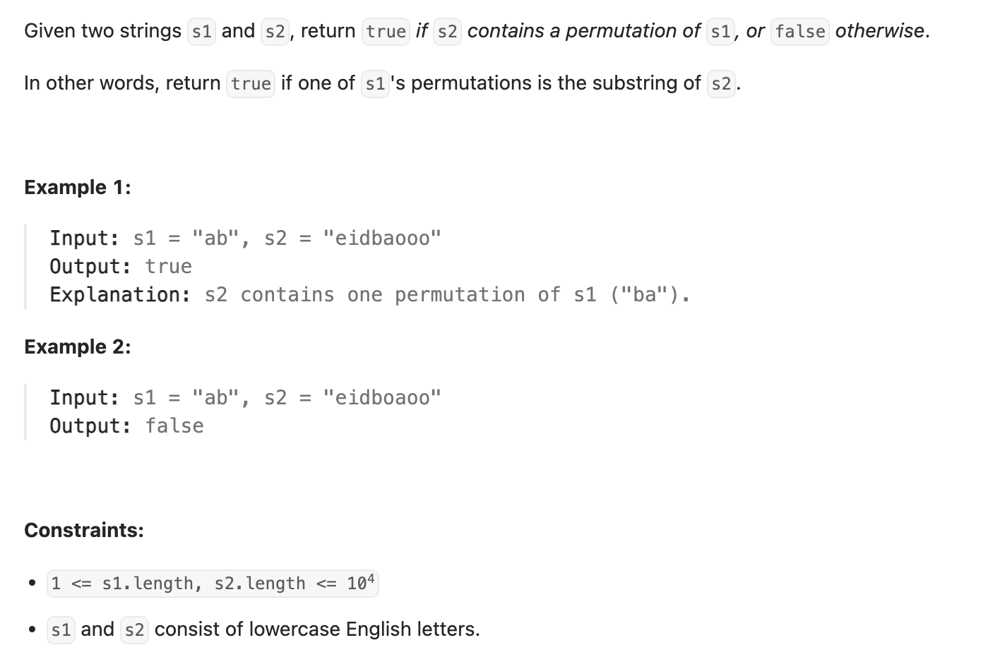

## 567. Permutation in String


- [官方中文解释](https://leetcode.cn/problems/permutation-in-string/solutions/599202/zi-fu-chuan-de-pai-lie-by-leetcode-solut-7k7u/#:~:text=4%2B-,%E6%96%B9%E6%B3%95%E4%B8%80%EF%BC%9A%E6%BB%91%E5%8A%A8%E7%AA%97%E5%8F%A3,%E5%B0%B1%E5%A4%9A%E7%BB%9F%E8%AE%A1%E4%B8%80%E6%AC%A1%E8%BF%9B%E5%85%A5%E7%AA%97%E5%8F%A3%E7%9A%84%E5%AD%97%E7%AC%A6%EF%BC%8C%E5%B0%91%E7%BB%9F%E8%AE%A1%E4%B8%80%E6%AC%A1,-%E7%A6%BB%E5%BC%80%E7%AA%97%E5%8F%A3%E7%9A%84)


- [中文图解](https://leetcode.cn/problems/permutation-in-string/solutions/599528/zhu-shi-chao-xiang-xi-de-hua-dong-chuang-rc7d/)
---
```ruby
    Input: s1 = "ab", s2 = "eidbaooo"        
                                    [a, b] => cnt1 {a:1, b:1} 
                                    [e, i] => cnt2 {e:1, i:1} 

                        cnt2 {e:1, i:1}
    e  i  d  b  a  o  o  o 


                        cnt2 {i:1, d:1}
    e  i  d  b  a  o  o  o 
    l 
          r


                        cnt2 {d:1, b:1}
    e  i  d  b  a  o  o  o 
       l 
             r


                        cnt2 {b:1, a:1}
    e  i  d  b  a  o  o  o 
          l 
                r

           cnt1 == cnt2, is True
                                 return True
 
```

---
```java
class Solution {
    public boolean checkInclusion(String s1, String s2) {
        int len1 = s1.length(), len2 = s2.length();
        if (len1 > len2) return false;

        int[] cnt1 = new int[26];
        int[] cnt2 = new int[26];
        
        for (char c : s1.toCharArray()) {
            cnt1[c - 'a']++;
        }
        for (int i = 0; i < len1 - 1; i++) {
            char c = s2.charAt(i);
            cnt2[c - 'a']++;
        }

        int left = 0;
        for (int right = len1 - 1; right < s2.length(); right++) {
            char c = s2.charAt(right);
            cnt2[c - 'a']++;
            if (Arrays.equals(cnt1, cnt2)) {
                return true;
            }

            cnt2[s2.charAt(left) - 'a']--;
            left++;
        }
        return false;
    }
}
```


---
## Method 2


```java
class Solution {
    public boolean checkInclusion(String s1, String s2) {
        if (s1.length() > s2.length()) return false;
        
        
        int[] freq1 = new int[128];
        int[] freq2 = new int[128];
        for (char c : s1.toCharArray()) {
            freq1[c]++;
        }
        int len1 = s1.length();
        for (int i = 0; i < len1 - 1; i++) {
            freq2[s2.charAt(i)]++;
        }
        int left = 0;
        for (int right = len1 - 1; right < s2.length(); right++) {
            char c = s2.charAt(right);
            freq2[c]++;
            if (Arrays.equals(freq1, freq2)) {
                return true;
            }
            freq2[s2.charAt(left)]--;
            left++;
        }
        return false;
    }
}
```