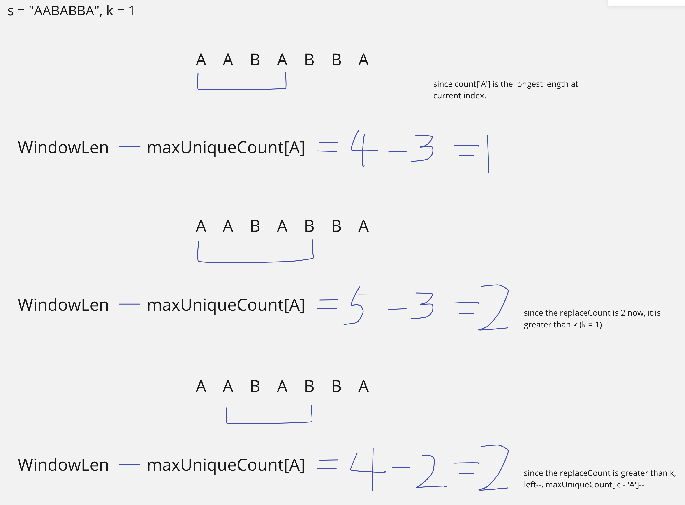

## 424. Longest Repeating Character Replacement


- `replaceCount`: number of replacement needed for all characters in window to be the same

- Each time we expand right, we include a new character in window.
  If `replaceCount` is bigger than `k`, we got an `invalid window`, we should skip it until window is valid again, 
  but only expands window size, never shrink (because even if we got a smaller window thats valid, it doesn't matter because we 
  already found a window thats bigger and valid)

- [youtube video](https://www.youtube.com/watch?v=gqXU1UyA8pk)
---

---
```java
class _424_LongestRepeatingCharacterReplacement {
    public int characterReplacement(String s, int k) {
        int maxUniqueCount = 0;
        int left = 0;
        int longest = 0;
        int[] count = new int[26];
        for (int right = 0; right < s.length(); right++) {
            char c = s.charAt(right);
            count[c - 'A']++;
            maxUniqueCount = Math.max(maxUniqueCount, count[c - 'A']);
            int replaceCount = right - left + 1 - maxUniqueCount;
            if (replaceCount > k) {
                // invalid window
                count[s.charAt(left) - 'A']--;
                left++;
            } else {
                longest = Math.max(longest, right - left + 1);
            }
        }
        return longest;
    }
}
```