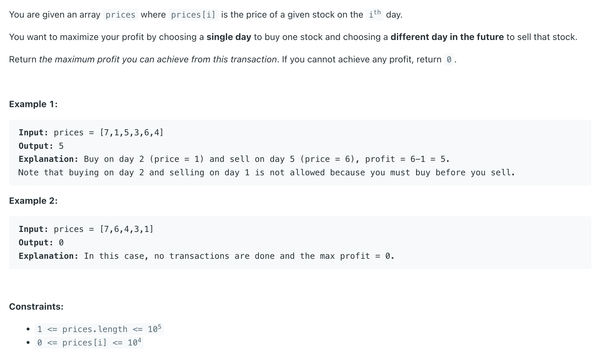
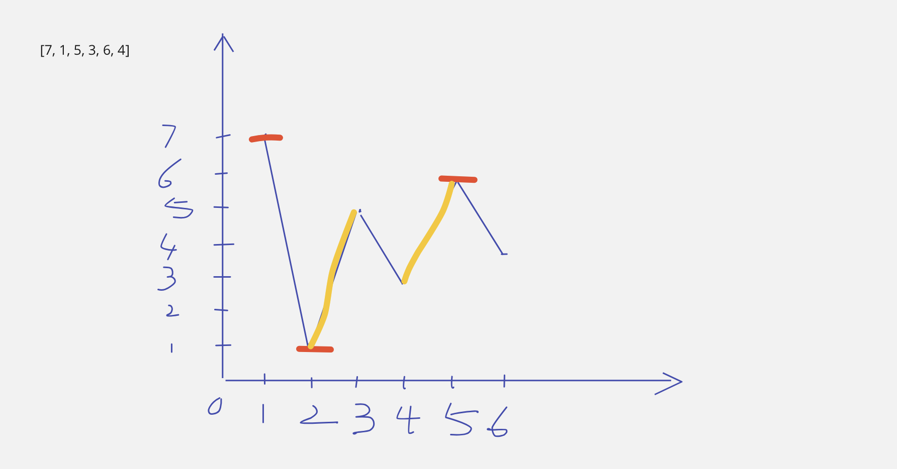

## 121. Best Time to Buy and Sell Stock

---

### slidng window

- [youtube](https://www.youtube.com/watch?v=1pkOgXD63yU)



- Buy on `day 2` (price = 1) and sell on `day 5` (price = 6), maxprofit = `6 - 1 = 5`.

```java
class Solution {
    public int maxProfit(int[] prices) {
        int left = 0, right = 1; // left=buy, right=sell
        int maxProfit = 0;
        while (right < prices.length) {
            if (prices[left] < prices[right]) {
                int profit = prices[right] - prices[left];
                maxProfit = Math.max(maxProfit, profit);
            } else {
                while (prices[left] > prices[right]) {
                    left++;
                }
            } 
            right++;
        }
        return maxProfit;
    }
}
```
---

### Optimal method:

```java
class Solution {
    public int maxProfit(int[] prices) {
        int left = 0, right = 1; // left=buy, right=sell
        int maxProfit = 0;
        while (right < prices.length) {
            if (prices[left] < prices[right]) {
                int profit = prices[right] - prices[left];
                maxProfit = Math.max(maxProfit, profit);
            } else {
                left = right;
            } 
            right++;
        }
        return maxProfit;
    }
}
```