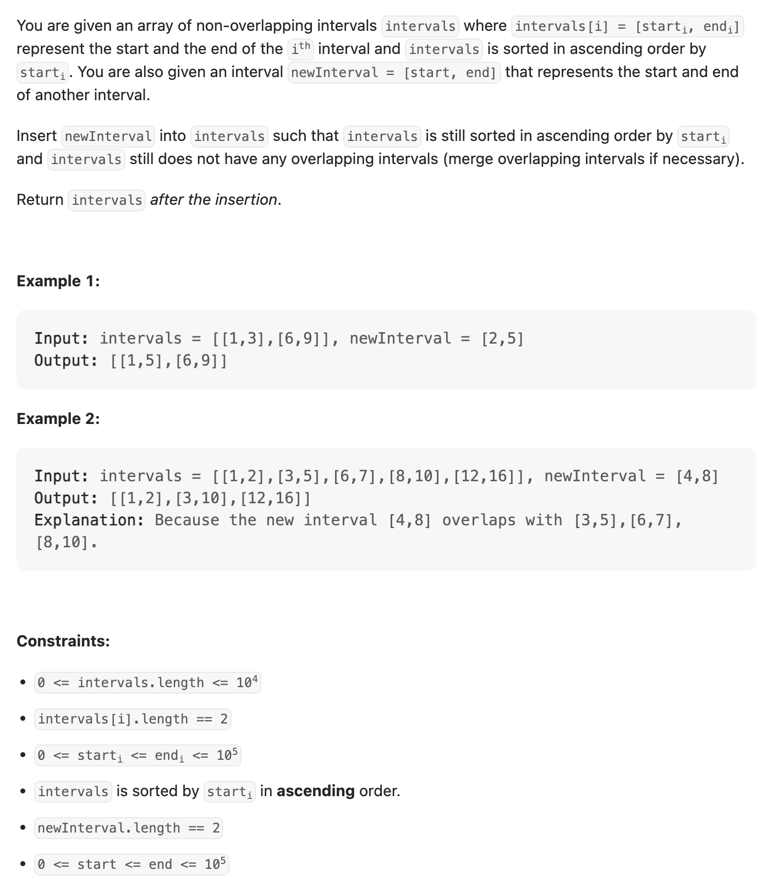
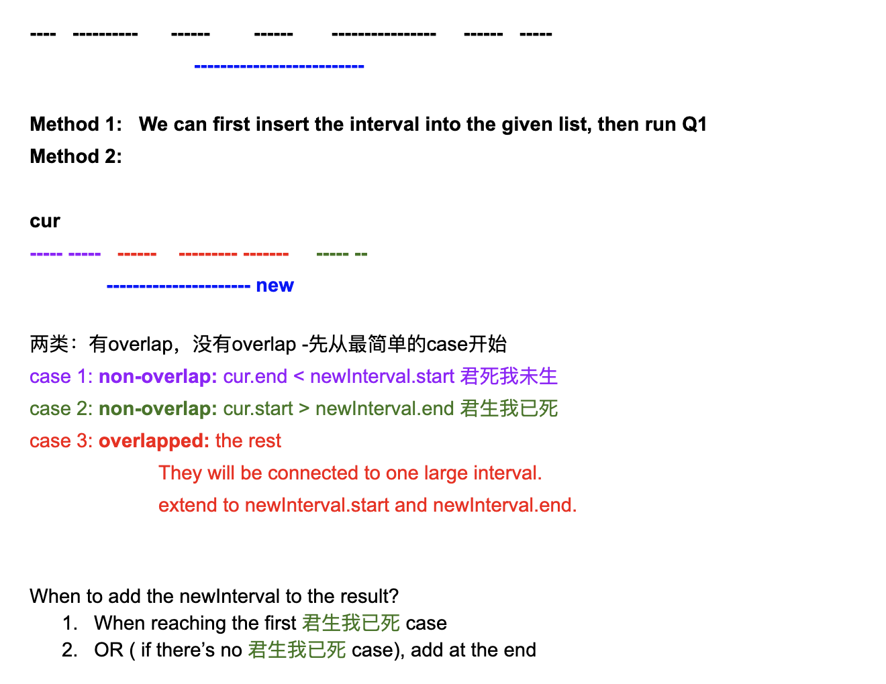

## 57. Insert Interval




```java
class _57_InsertInterval {
    public int[][] insert(int[][] intervals, int[] newInterval) {
        if (intervals == null || intervals.length == 0) return null;

        List<int[]> res = new ArrayList<>();
        boolean inserted = false;
        for (int i = 0; i < intervals.length; i++) {
            int[] cur = intervals[i];
            if (cur[1] < newInterval[0]) {
                res.add(cur);
            } else if (cur[0] > newInterval[1]) {
                if (!inserted) {
                    res.add(newInterval);
                    inserted = true;
                }
                res.add(cur);
            } else {
                newInterval[0] = Math.min(newInterval[0], cur[0]);
                newInterval[1] = Math.max(newInterval[1], cur[1]);
            }
        }
        if (!inserted) {
            res.add(newInterval);
        }
        return res.stream().toArray(int[][]::new);
    }

    public static void main(String[] args) {
        int[][] intervals = new int[][]{
                {1, 2}, {3, 5}, {6, 7}, {8, 10}, {12, 16}
        };
        _57_InsertInterval insertInterval = new _57_InsertInterval();
        int[][] res = insertInterval.insert(intervals, new int[]{4, 8});
        System.out.println(Arrays.deepToString(res));
        // [[1, 2], [3, 10], [12, 16]]
    }
}
```