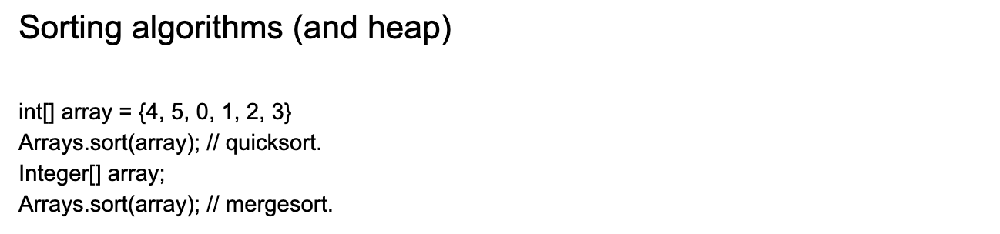

## Sorting

- **QuickSort** is used for **arrays** of primitive types while **mergeSort** for `Object[]` **arrays**.
  For primitives the stability of the **sort** is meaningless, as you cannot distinguish two values that 
  are equal. Hence, **quicksort** is used (except when **sorting** an **array** of Objects, for which 
  **mergeSort** is performed)

