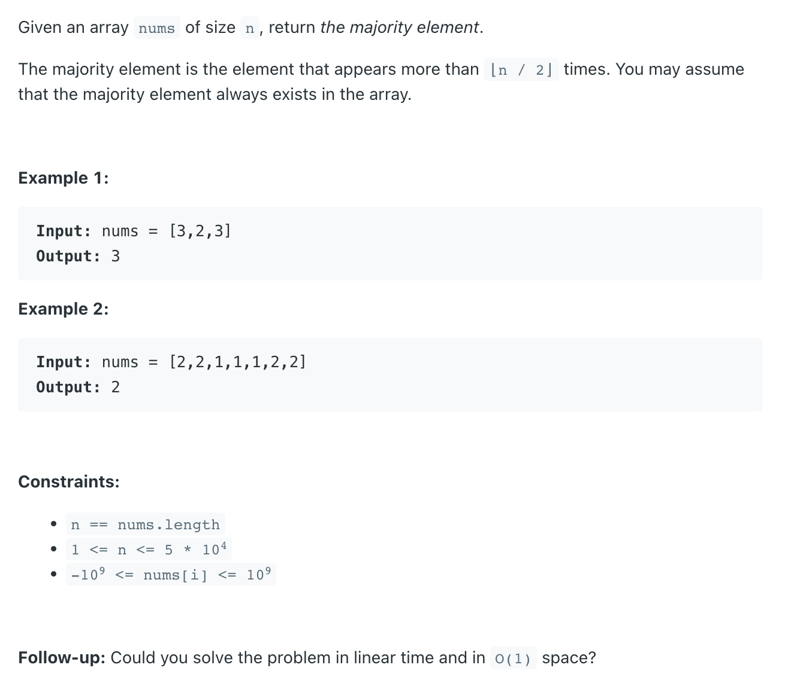

## 169. Majority Element


#### Solution:
- We can solve the problem using the Boyer-Moore Voting Algorithm. 
  This algorithm allows us to find the majority element in linear time and constant space complexity.

- The basic idea of the algorithm is to maintain a `count` variable to keep track of the majority element so far. 
  Initially, we assume the `first element` to be the `majority element` and **initialize the count to 1**. 
  Then, we traverse the array from the second element onwards. 
  - If the current element is the **same as** the majority element, we `increment` the count. 
    Otherwise, we `decrement` the `count`. If the **count becomes zero**, we update the majority element to the current 
    element and set the `count` to `1`.

- At the end of the traversal, the majority element will be the element that has the `highest` count. We can verify that 
  the majority element appears more than `⌊n / 2⌋` times by counting the occurrences of the majority element in the 
  array.

---
### Space O(1)

```java
class MajorityVotingAlgorithm {
    public static int majorityElement(int[] nums) {
        if (nums == null || nums.length == 0) return 0;

        int count = 0;
        int majority = nums[0];
        for (int num : nums) {
            if (num == majority) {
                count++;
            } else {
                count--;
            }
            if (count == 0) {
                majority = num;
                count = 1;
            }
        }
        return majority;
    }

    public static void main(String[] args) {
        int arr[] = {1, 1, 1, 1, 2, 3, 4};
        int majority = majorityElement(arr);
        System.out.println(majority); // 1
    }
}
```
---
### Java 7

```java
class solution_java7 {
    public int majorityElement(int[] nums) {
        Map<Integer, Integer> map = new HashMap<>();
        for (int num : nums) {
            map.put(num, map.getOrDefault(num, 0) + 1);
            if (map.get(num) > nums.length / 2) {
                return num;
            }
        }
        return -1;
    }
}
```


---
### Java 8

```java
public class solution_java8 {
    public int majorityElement(int[] nums) {
        if (nums == null || nums.length == 0) return 0;

        Map<Integer, Integer> map = new HashMap<>();
        for (int num : nums) {
            if (!map.containsKey(num)) {
                map.put(num, 1);
            } else {
                map.put(num, map.get(num) + 1);
            }
        }

        return Collections.max(map.entrySet(), (e1, e2) ->
                (e1.getValue() - e2.getValue())).getKey();

//        return Collections.max(map.entrySet(), Comparator.comparingInt(Map.Entry::getValue)).getKey();
    }
}
```
