## 4. Median of Two Sorted Arrays
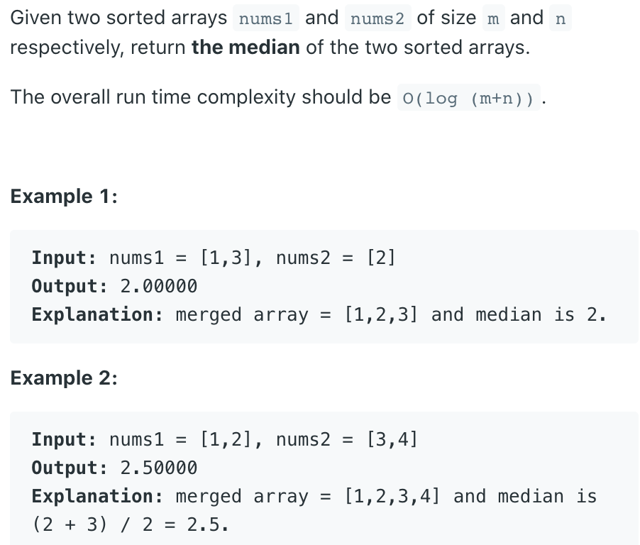
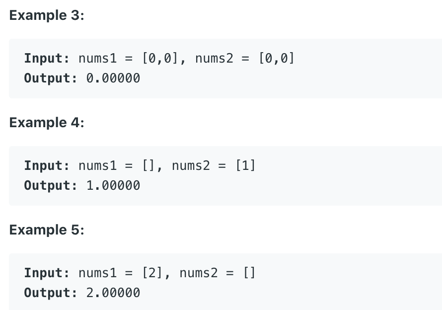
---

### Binary Search Template I   `O(T) = lg(min(m, n))`

- [Tushar Roy youtube](https://www.youtube.com/watch?v=LPFhl65R7ww&t=1212s)

```ruby
    x:    x1  x2 |  x3  x4  x5  x6
    y:    y1  y2  y3  y4  y5 | y6  y7  y8  y9

    left: 2 + 5 == 4 + 3
    required condition:   x2 <= y6
                          y5 <= x3
                        avg( max(x2, y5), min(x3, y6) )

    partitionX: how many nums in the left hand side on X
    partitionY: how many nums in the left hand side on Y

    partitionX + partitionY = (x + y + 1) / 2

    Found: 
         maxLeftX <= minRightY
         maxLeftY <= minRightX
    else if:
         maxLeftX > minRightY
         move towards left in X
    else     
         move towards right in X


Example 1:
         0    1    2   3   4     5
    x:   1    3    8   9   15  
    ------------------------------------
    0    1    2   3   4    5     6
    y:   7   11   18  19   21   25 

                                     left: 0
                                     right: 4
                                     partitionX = (4 + 0) / 2 = 2
                                     partitionY = (5 + 6 + 1) / 2  - 2 = 4

    1, 3             |  8, 9, 15
    7, 11, 18, 19    |  21, 25


    since maxLeftY > minRightX => 19 > 8  :
                            left = partitionX + 1
                                     
                                     left: 3
                                     right: 4
                                     partitionX = (3 + 4) / 2 = 3
                                     partitionY = (5 + 6 + 1) / 2  - 3 = 3

    1, 3, 8          | 9, 15
    7, 11, 18        |  19, 21, 25


    since maxLeftY > minRightX => 18 > 9  :
                            left = partitionX + 1
                                     
                                     left: 4
                                     right: 4
                                     partitionX = (4 + 4) / 2 = 4
                                     partitionY = (5 + 6 + 1) / 2  - 4 = 2


    1, 3, 8, 9       | 15
    7, 11,           | 18, 19, 21, 25                                     


    Now, meet the conditions:      maxLeftX <= minRightY
                                   maxLeftY <= minRightX
    since numsX.len + numsY.len is ODD num, so
                                        max(9, 11) = 11
                                        


Example 2:
         0    1    2   3   4     5
    x:   23   26   31  35   
    ------------------------------------
    0    1    2   3   4    5     6
    y:   3    5   7   9    11    16

                                     left: 0
                                     right: 4
                                     partitionX = (4 + 0) / 2 = 2
                                     partitionY = (4 + 6 + 1) / 2  - 2 = 3    


    23, 26       | 31, 35
    3, 5, 7      |  9, 11, 16


    since maxLeftX > minRightY => 26 > 9  :
                            right = partitionX - 1

                                     left: 0
                                     right: 1
                                     partitionX = (0 + 1) / 2 = 0
                                     partitionY = (4 + 6 + 1) / 2  - 0 = 5    


               - INF
                { }     | 23, 26, 31, 35
    3, 5, 7, 9, 11      | 16


    Now, meet the conditions:      maxLeftX <= minRightY
                                   maxLeftY <= minRightX

                                   avg( max(-INF, 11), min(23, 16) )
                                   avg(11, 16) = 13.5
```
---

```java
class MedianOfTwoSortedArrays_t1 {
    public double findMedianSortedArrays(int[] nums1, int[] nums2) {
        // if nums1's length is greater than nums2's length, switch them
        if (nums1.length > nums2.length) {
            return findMedianSortedArrays(nums2, nums1);
        }

        int x = nums1.length;
        int y = nums2.length;

        int left = 0;
        int right = x;

        while (left <= right) {
            int partitionX = left + ((right - left) >> 1);
            int partitionY = ((x + y + 1) >> 1) - partitionX;

            // if partitionX is 0 it menas nothing is there on left side. Use -INF for maxLeftX
            // if partitionX is length of nums1 then there is nothing on right side. Use +INF for maxRightX
            int maxLeftX = (partitionX == 0) ? Integer.MIN_VALUE : nums1[partitionX - 1];
            int minRightX = (partitionX == x) ? Integer.MAX_VALUE : nums1[partitionX];

            int maxLeftY = (partitionY == 0) ? Integer.MIN_VALUE : nums2[partitionY - 1];
            int minRightY = (partitionY == y) ? Integer.MAX_VALUE : nums2[partitionY];

            if (maxLeftX <= minRightY && maxLeftY <= minRightX) {
                // we have partitioned array at correct place
                // Now we get max of left elements and min of right elements to get the median in case of even length combined array size
                // or get max of left elements for ODD length combined array size.
                if ((x + y) % 2 == 0) {
                    return (double) (Math.max(maxLeftX, maxLeftY) + Math.min(minRightX, minRightY)) / 2;
                } else {
                    return (double) Math.max(maxLeftX, maxLeftY);
                }
            } else if (maxLeftX > minRightY) {// we are too far on right side for partitionX. Go on left side.
                right = partitionX - 1;
            } else { // we are too far on left side for partitionX. Go on right side.
                left = partitionX + 1;
            }
        }

        return Double.MIN_VALUE;
    }
}
```


---
### Binary Search Template II   `O(T) = lg(min(m, n))`

- [官方教程](https://leetcode.cn/problems/median-of-two-sorted-arrays/solutions/258842/xun-zhao-liang-ge-you-xu-shu-zu-de-zhong-wei-s-114/)

- [我喜欢的 idea](https://leetcode.cn/problems/median-of-two-sorted-arrays/solutions/15086/he-bing-yi-hou-zhao-gui-bing-guo-cheng-zhong-zhao-/)

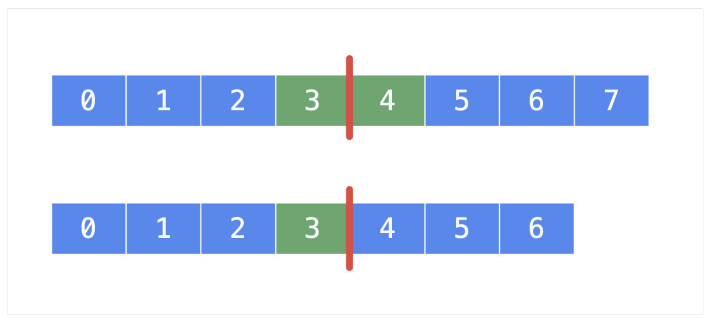

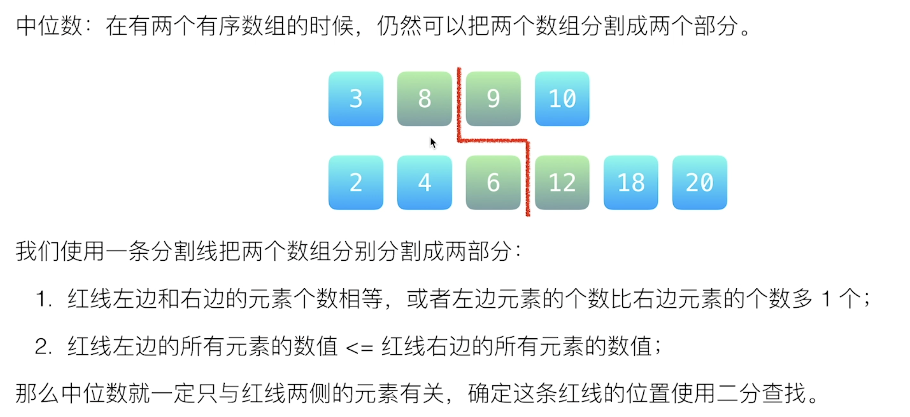

- 注意他们之间关系是 `交叉 <=`

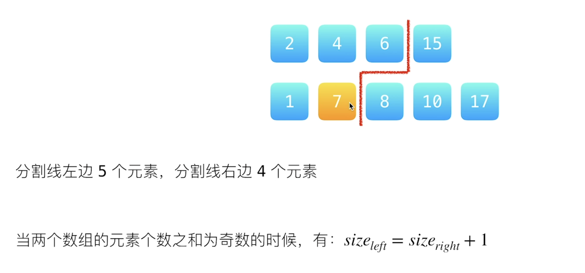

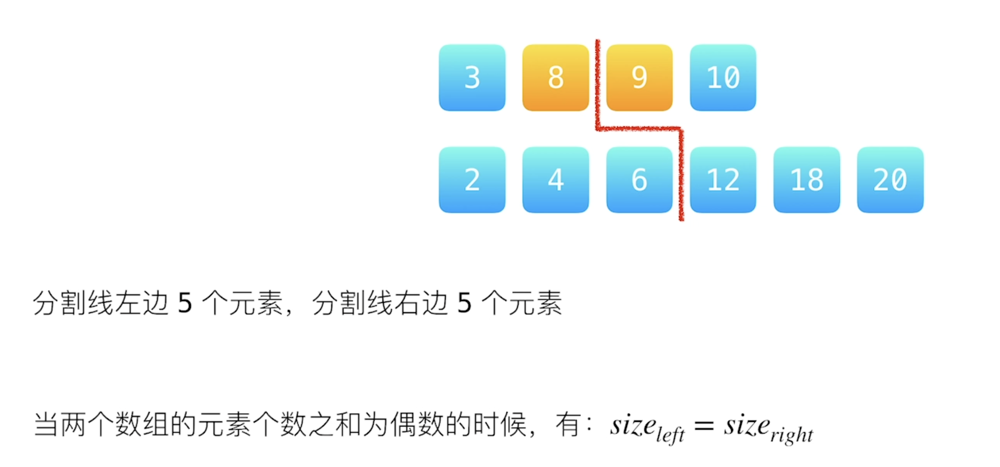


**分割线左边的最大值**，和 **分割线右边的最小值**，就是分别的两个**中位数**


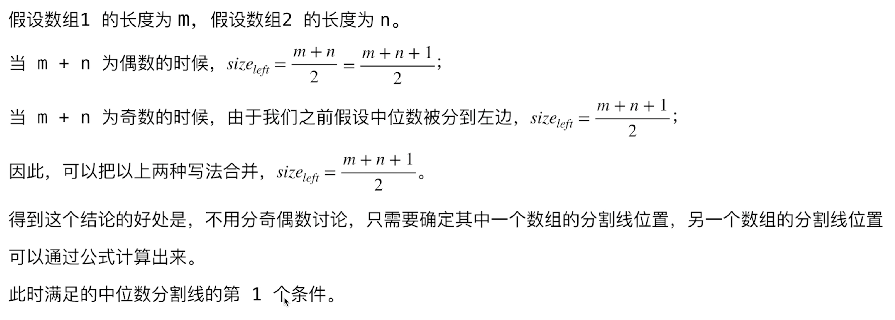

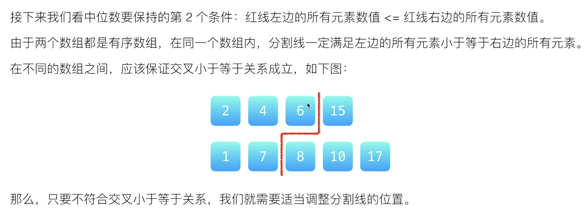

- `6 <=8` and `7 <=15`

- 以下是**不满足条件**的情况：

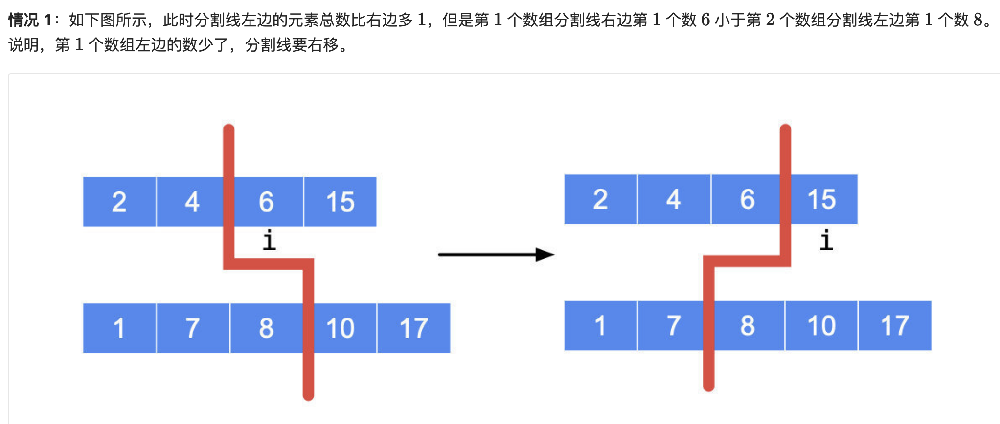

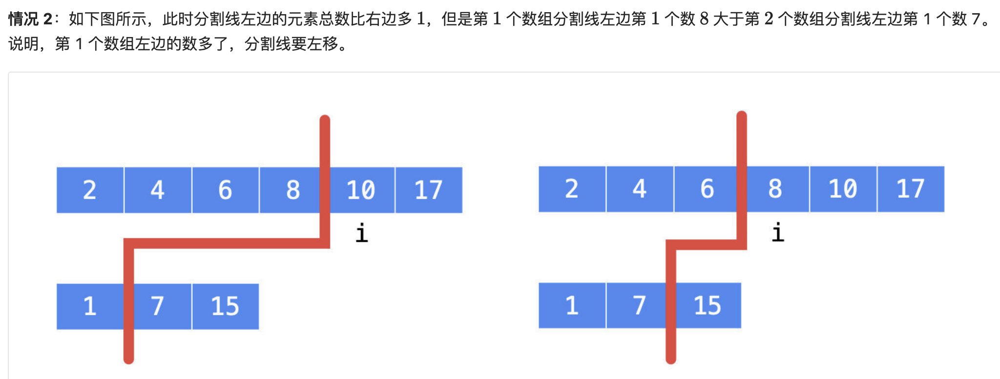

---
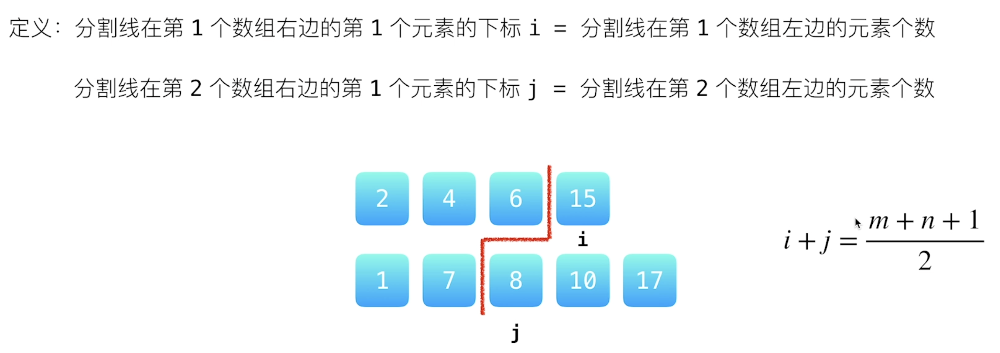

- `totalLeft = (m + n + 1) / 2` => `totalLeft = 5`
- `i = left + (right - left + 1) /2`, 这里为了防止 `[left(i), right]` ，进入死循环
- `j = totalLeft - i` => `j = 5 - 3 = 2`


```java
class Solution {
    public double findMedianSortedArrays(int[] nums1, int[] nums2) {
        if (nums1.length > nums2.length) {
            return findMedianSortedArrays(nums2, nums1);
        }

        int m = nums1.length;
        int n = nums2.length;

        // 分割线左边的所有元素需要满足的个数 m + (n - m + 1) / 2;
        int totalLeft = (m + n + 1) >>> 1;

        // 在 nums1 的区间 [0, m] 里查找恰当的分割线，
        // 使得 nums1[i - 1] <= nums2[j] && nums2[j - 1] <= nums1[i]
        int left = 0;
        int right = m;

        while (left <= right) {
            int i = (left + right) >>> 1;
            int j = totalLeft - i;
            
            
            // 接下来我们做数组是否分别越界的检测
            int nums1LeftMax = i == 0 ? Integer.MIN_VALUE : nums1[i - 1];
            int nums1RightMin = i == m ? Integer.MAX_VALUE : nums1[i];
            int nums2LeftMax = j == 0 ? Integer.MIN_VALUE : nums2[j - 1];
            int nums2RightMin = j == n ? Integer.MAX_VALUE : nums2[j];            

            if (nums1LeftMax <= nums2RightMin && nums2LeftMax <= nums1RightMin) {
                if (((m + n) % 2) == 0) {
                    return (double) ((Math.max(nums1LeftMax, nums2LeftMax) + Math.min(nums1RightMin, nums2RightMin))) / 2;
                } else {
                    return Math.max(nums1LeftMax, nums2LeftMax);
                }                
            }            
            else if (nums1LeftMax > nums2RightMin) {
                right = i - 1;
            } else { 
                left = i + 1;
            }
        }        
        return Double.MIN_VALUE;
    }
}
```

---

### Merge Sort `O(m + n)`


```ruby
# ex1: even length

   A [ 1 | 3 | 5 | 7 ]
   B [ 2 | 4 ]
merge[ 1 | 2 | 3 | 4 | 5 | 7 ]

if (n % 2 == 0)
    return (merge[(n - 1) / 2] + merge[n /2]) / 2.0;

    merge[(n - 1) / 2] 
=   merge[(6 - 1) / 2] = merge[2] = 3

    merge[n / 2] 
=   merge[6 / 2] = merge[3] = 4

return (3 + 4) / 2.0 = 3.5


# ex2: odd length

   A [ 1 | 3 | 5 ]
   B [ 2 | 4 ]
merge[ 1 | 2 | 3 | 4 | 5 ]

if (n % 2 != 0)
    return merge[n /2];

    merge[n / 2] 
=   merge[5 / 2] = 3

return 3
```

- T = O(m + n)
- Space = O(m + n)

---
```java

class Solution {
    public double findMedianSortedArrays(int[] nums1, int[] nums2) {
      int[] mergedArray = merge(nums1, nums2);
      int n = mergedArray.length;
      if (n % 2 == 0) {
        return (mergedArray[(n - 1) / 2] + mergedArray[n / 2]) / 2.0;
      } else {
        return mergedArray[n / 2];
      }
    }
    
    private int[] merge(int[] nums1, int[] nums2) {
        int m = nums1.length;
        int n = nums2.length;
        int[] merged = new int[m + n];
        int i = 0;
        int j = 0;
        int idx = 0;
        while (i < m && j < n) {
            if (nums1[i] <= nums2[j]) {
                merged[idx++] = nums1[i++];
            } else {
                merged[idx++] = nums2[j++];
            }
        }
        
        while (i < m) {
            merged[idx++] = nums1[i++];
        }
        while (j < n) {
            merged[idx++] = nums2[j++];
        }        
        return merged;
    }
}
```