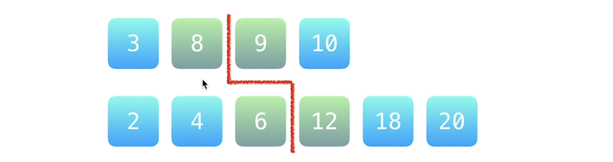
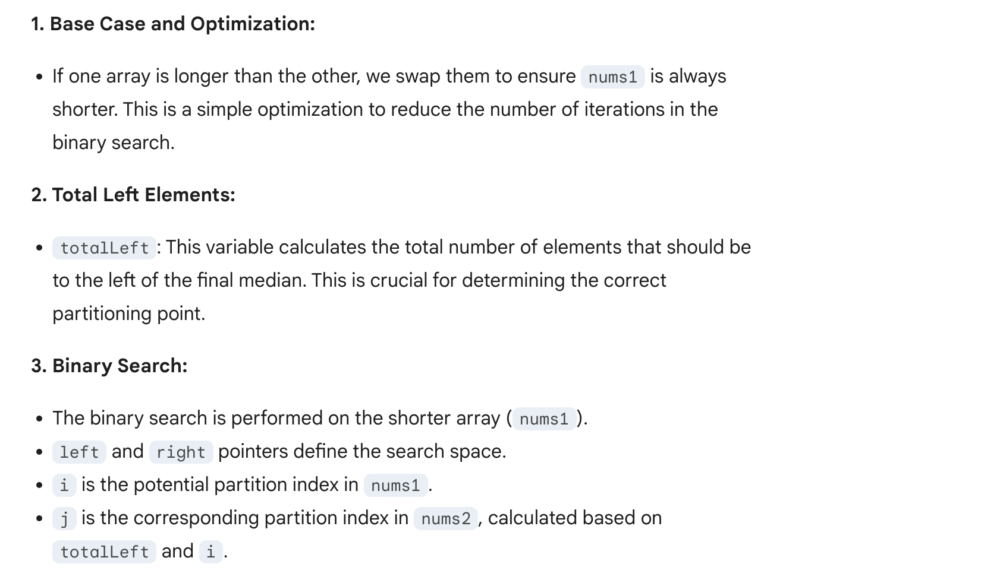
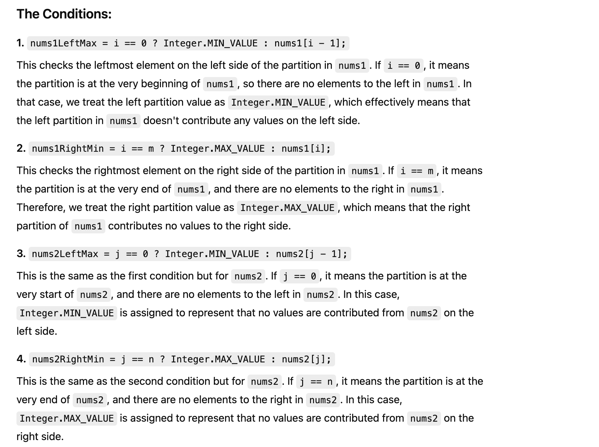

## 4. Median of Two Sorted Arrays


---

### Binary Search Template I   `O(T) = lg(min(m, n))`

- [Tushar Roy youtube](https://www.youtube.com/watch?v=LPFhl65R7ww&t=1212s)

- [官方教程](https://leetcode.cn/problems/median-of-two-sorted-arrays/solutions/258842/xun-zhao-liang-ge-you-xu-shu-zu-de-zhong-wei-s-114/)

- [我喜欢的 idea](https://leetcode.cn/problems/median-of-two-sorted-arrays/solutions/15086/he-bing-yi-hou-zhao-gui-bing-guo-cheng-zhong-zhao-/)




- 1. The **num** of elements on the left side of the **red line** is equal to the num of elements on the right side, 
  OR: there is **one more element on the left side**:  `left - right = 1`
- 2. Every element on the left is **less than or equal** to every element on the right.

- 注意他们之间关系是 `交叉 <=`


**分割线左边的最大值**，和 **分割线右边的最小值**，就是分别的两个**中位数**


- `6 <=8` and `7 <=15`

- 以下是**不满足条件**的情况：


---


- `totalLeft = (m + n + 1) / 2` => `totalLeft = 5`
- `i = left + (right - left) /2` = 
- `j = totalLeft - i` => `j = 5 - 3 = 2`

---





### Why Do We Need to Check Boundary Values?

- When partitioning the arrays, we may encounter cases where:
  - The partition is at the **very start** of one of the arrays.
  - The partition is at the **very end** of one of the arrays.



---
```java
class Solution {
    public double findMedianSortedArrays(int[] nums1, int[] nums2) {
        if (nums1.length > nums2.length) {
            return findMedianSortedArrays(nums2, nums1);
        }

        int m = nums1.length;
        int n = nums2.length;

        // 分割线左边的所有元素需要满足的个数 m + (n - m + 1) / 2;
        int totalLeft = (m + n + 1) >>> 1;

        // 在 nums1 的区间 [0, m] 里查找恰当的分割线，
        // 使得 nums1[i - 1] <= nums2[j] && nums2[j - 1] <= nums1[i]
        int left = 0;
        int right = m;

        while (left <= right) {
            int i = (left + right) >>> 1;
            int j = totalLeft - i;
            
            
            // 接下来我们做数组是否分别越界的检测
            int nums1LeftMax = i == 0 ? Integer.MIN_VALUE : nums1[i - 1];
            int nums1RightMin = i == m ? Integer.MAX_VALUE : nums1[i];
            int nums2LeftMax = j == 0 ? Integer.MIN_VALUE : nums2[j - 1];
            int nums2RightMin = j == n ? Integer.MAX_VALUE : nums2[j];            

            if (nums1LeftMax <= nums2RightMin && nums2LeftMax <= nums1RightMin) {
                if (((m + n) % 2) == 0) {
                    return (double) ((Math.max(nums1LeftMax, nums2LeftMax) + Math.min(nums1RightMin, nums2RightMin))) / 2;
                } else {
                    return Math.max(nums1LeftMax, nums2LeftMax);
                }                
            }            
            else if (nums1LeftMax > nums2RightMin) { // nums1[i - 1] > nums2[j]
                right = i - 1;
            } else {  // nums2[j - 1] > nums1[i]
                left = i + 1;
            }
        }        
        return Double.MIN_VALUE;
    }
}
```
---


### Python


```py
class Solution:
    def findMedianSortedArrays(self, nums1: List[int], nums2: List[int]) -> float:
        if len(nums1) > len(nums2):
            return self.findMedianSortedArrays(nums2, nums1)

        m, n = len(nums1), len(nums2)
        total_left = (m + n + 1) // 2

        left = 0
        right = m

        while left <= right:
            i = (left + right) // 2;
            j = total_left - i

            nums1_left_max = float('-inf') if i == 0 else nums1[i - 1]
            nums1_right_min = float('inf') if i == m else nums1[i]
            nums2_left_max = float('-inf') if j == 0 else nums2[j - 1]
            nums2_right_min = float('inf') if j == n else nums2[j]

            if nums1_left_max <= nums2_right_min and nums2_left_max <= nums1_right_min:
                if (m + n) % 2 == 0:
                    return (max(nums1_left_max, nums2_left_max) + min(nums1_right_min, nums2_right_min)) / 2
                else:
                    return max(nums1_left_max, nums2_left_max)

            elif nums1_left_max > nums2_right_min:
                right = i - 1
            else:
                left = i + 1

        return float('-inf')
```


---

### Merge Sort `O(m + n)`


```ruby
# ex1: even length

   A [ 1 | 3 | 5 | 7 ]
   B [ 2 | 4 ]
merge[ 1 | 2 | 3 | 4 | 5 | 7 ]

if (n % 2 == 0)
    return (merge[(n - 1) / 2] + merge[n /2]) / 2.0;

    merge[(n - 1) / 2] 
=   merge[(6 - 1) / 2] = merge[2] = 3

    merge[n / 2] 
=   merge[6 / 2] = merge[3] = 4

return (3 + 4) / 2.0 = 3.5


# ex2: odd length

   A [ 1 | 3 | 5 ]
   B [ 2 | 4 ]
merge[ 1 | 2 | 3 | 4 | 5 ]

if (n % 2 != 0)
    return merge[n /2];

    merge[n / 2] 
=   merge[5 / 2] = 3

return 3
```

- T = O(m + n)
- Space = O(m + n)

---
```java

class Solution {
    public double findMedianSortedArrays(int[] nums1, int[] nums2) {
      int[] mergedArray = merge(nums1, nums2);
      int n = mergedArray.length;
      if (n % 2 == 0) {
        return (mergedArray[(n - 1) / 2] + mergedArray[n / 2]) / 2.0;
      } else {
        return mergedArray[n / 2];
      }
    }
    
    private int[] merge(int[] nums1, int[] nums2) {
        int m = nums1.length;
        int n = nums2.length;
        int[] merged = new int[m + n];
        int i = 0;
        int j = 0;
        int idx = 0;
        while (i < m && j < n) {
            if (nums1[i] <= nums2[j]) {
                merged[idx++] = nums1[i++];
            } else {
                merged[idx++] = nums2[j++];
            }
        }
        
        while (i < m) {
            merged[idx++] = nums1[i++];
        }
        while (j < n) {
            merged[idx++] = nums2[j++];
        }        
        return merged;
    }
}
```