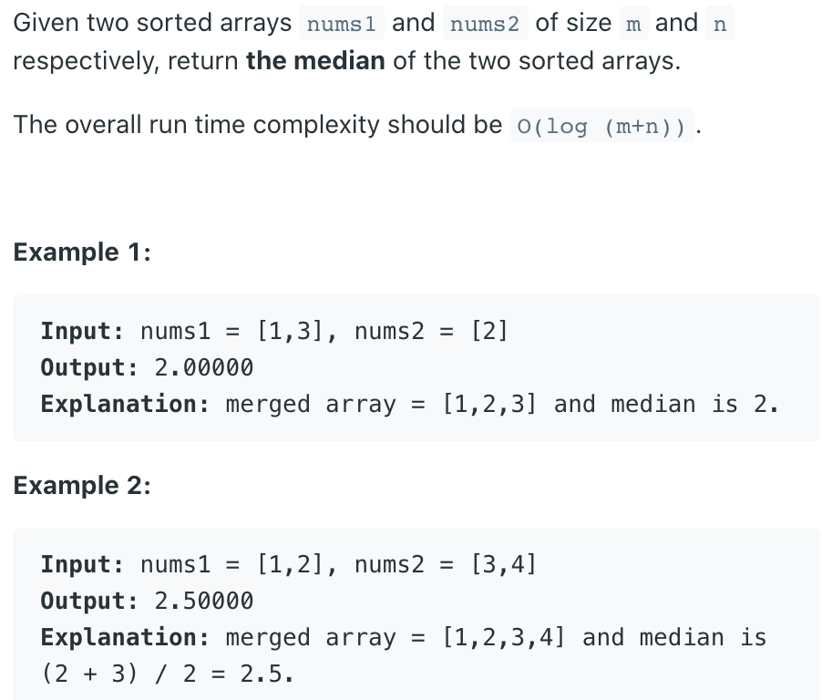
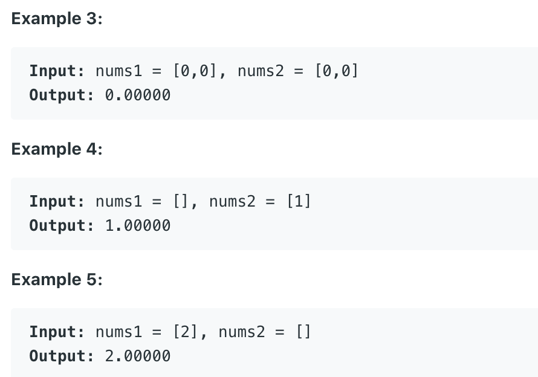
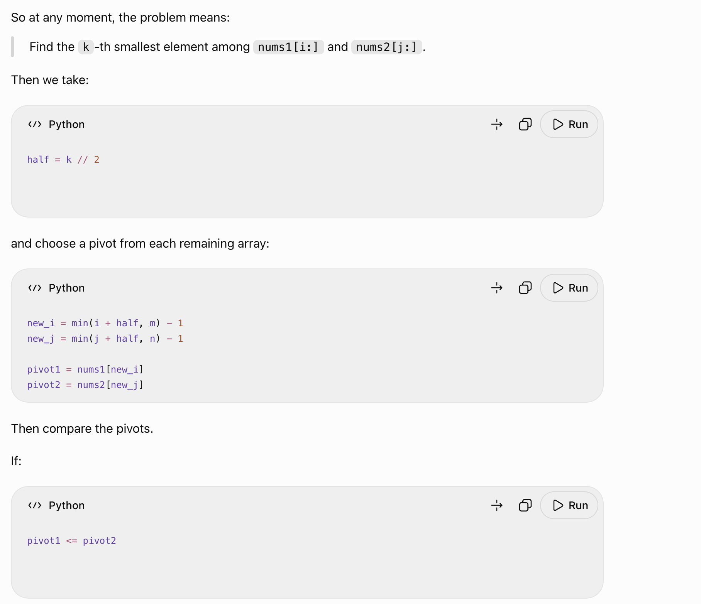
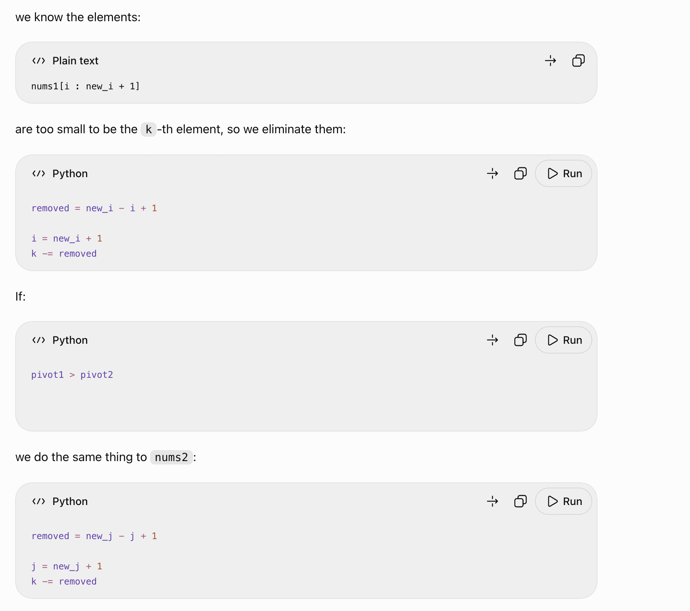
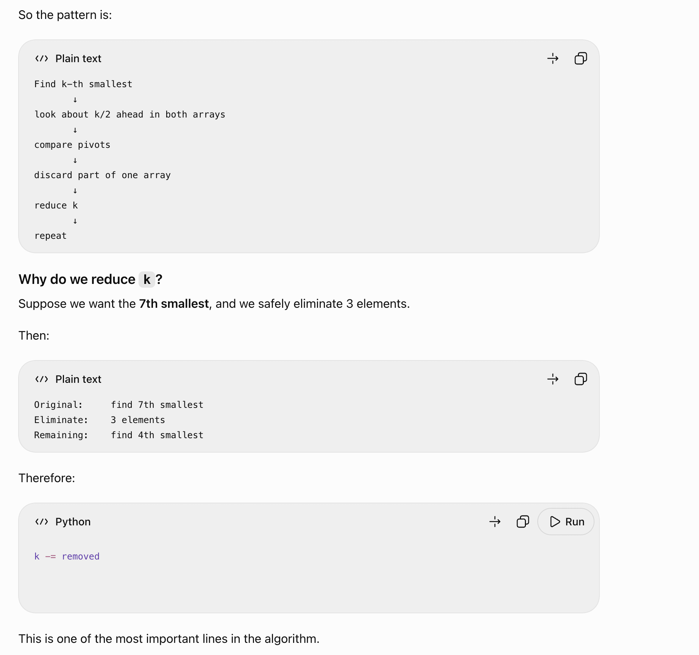
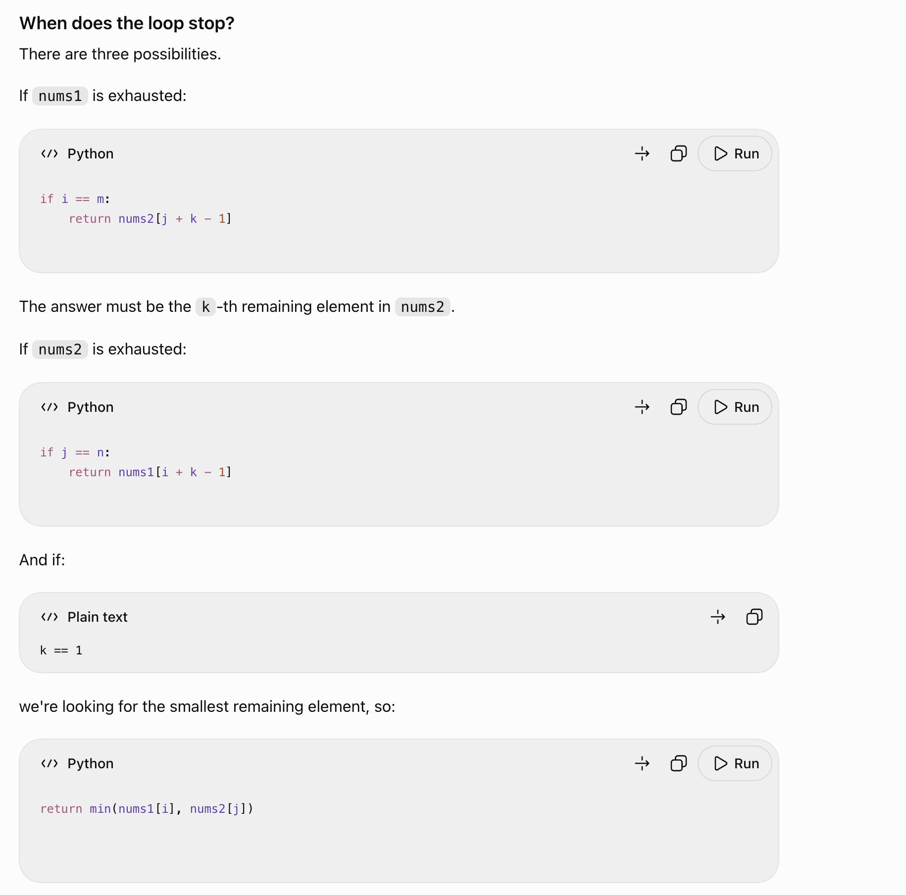
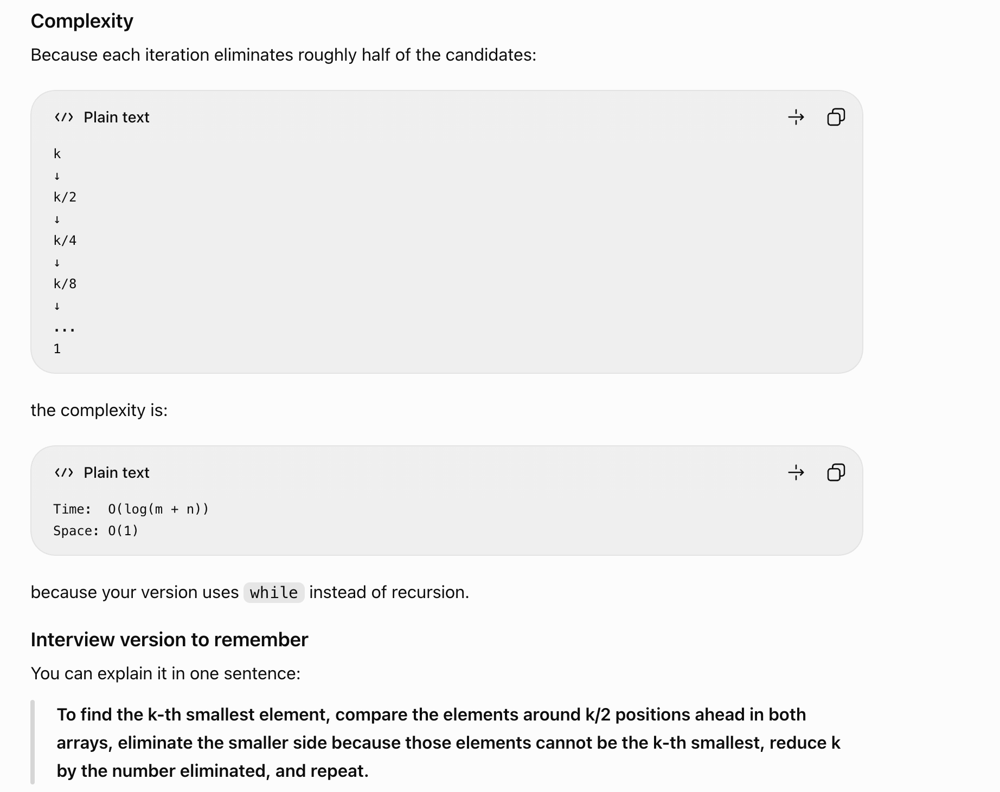
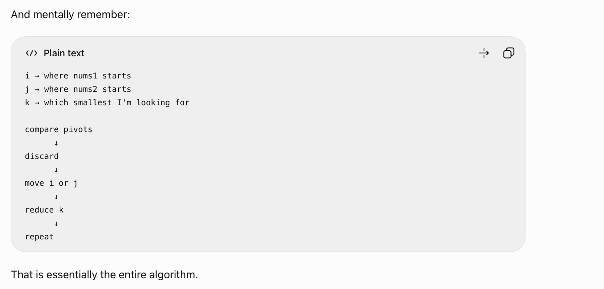

## 4. Median of Two Sorted Arrays


---

### Binary Search Template I   `O(T) = lg(min(m, n))`

- [Tushar Roy youtube](https://www.youtube.com/watch?v=LPFhl65R7ww&t=1212s)

---


### Core idea

- Instead of **merging two sorted arrays**, we directly find the **k-th smallest element**.

- For the median:

```py
Odd total:
    find the (total // 2 + 1)-th smallest

Even total:
    find the total//2-th smallest
    find the total//2 + 1-th smallest
    take their average
```

- The key helper is:  `findKth(nums1, nums2, k)`
- It repeatedly** eliminates elements that are guaranteed to be too small**.


#### How `findKth` works

```py
i = current starting index in nums1
j = current starting index in nums2
k = the rank we're looking for among remaining elements
```













---

```py
class Solution:
    def findKth(self, nums1, nums2, i, j, k):
        m, n = len(nums1), len(nums2)

        # Case 1: nums1 is exhausted
        if i == m:
            return nums2[j + k - 1]

        # Case 2: nums2 is exhausted
        if j == n:
            return nums1[i + k - 1]

        # Case 3: find the smallest remaining number
        if k == 1:
            return min(nums1[i], nums2[j])

        half = k // 2

        new_i = min(i + half, m) - 1
        new_j = min(j + half, n) - 1

        pivot1 = nums1[new_i]
        pivot2 = nums2[new_j]

        if pivot1 <= pivot2:
            removed = new_i - i + 1
            return self.findKth(nums1, nums2, new_i + 1, j, k - removed)
        else:
            removed = new_j - j + 1
            return self.findKth(nums1, nums2, i, new_j + 1, k - removed)

    def findMedianSortedArrays(self, nums1: List[int], nums2: List[int]) -> float:
        m, n = len(nums1), len(nums2)
        total = m + n

        if total % 2 == 1:
            return self.findKth(nums1, nums2, 0, 0, total // 2 + 1)

        left = self.findKth(nums1, nums2, 0, 0, total // 2)

        right = self.findKth(nums1, nums2, 0, 0, total // 2 + 1)

        return (left + right) / 2
```


---

### Merge Sort `O(m + n)`


```ruby
# ex1: even length

   A [ 1 | 3 | 5 | 7 ]
   B [ 2 | 4 ]
merge[ 1 | 2 | 3 | 4 | 5 | 7 ]

if (n % 2 == 0)
    return (merge[(n - 1) / 2] + merge[n /2]) / 2.0;

    merge[(n - 1) / 2] 
=   merge[(6 - 1) / 2] = merge[2] = 3

    merge[n / 2] 
=   merge[6 / 2] = merge[3] = 4

return (3 + 4) / 2.0 = 3.5


# ex2: odd length

   A [ 1 | 3 | 5 ]
   B [ 2 | 4 ]
merge[ 1 | 2 | 3 | 4 | 5 ]

if (n % 2 != 0)
    return merge[n /2];

    merge[n / 2] 
=   merge[5 / 2] = 3

return 3
```

- T = O(m + n)
- Space = O(m + n)

---
```java

class Solution {
    public double findMedianSortedArrays(int[] nums1, int[] nums2) {
      int[] mergedArray = merge(nums1, nums2);
      int n = mergedArray.length;
      if (n % 2 == 0) {
        return (mergedArray[(n - 1) / 2] + mergedArray[n / 2]) / 2.0;
      } else {
        return mergedArray[n / 2];
      }
    }
    
    private int[] merge(int[] nums1, int[] nums2) {
        int m = nums1.length;
        int n = nums2.length;
        int[] merged = new int[m + n];
        int i = 0;
        int j = 0;
        int idx = 0;
        while (i < m && j < n) {
            if (nums1[i] <= nums2[j]) {
                merged[idx++] = nums1[i++];
            } else {
                merged[idx++] = nums2[j++];
            }
        }
        
        while (i < m) {
            merged[idx++] = nums1[i++];
        }
        while (j < n) {
            merged[idx++] = nums2[j++];
        }        
        return merged;
    }
}
```