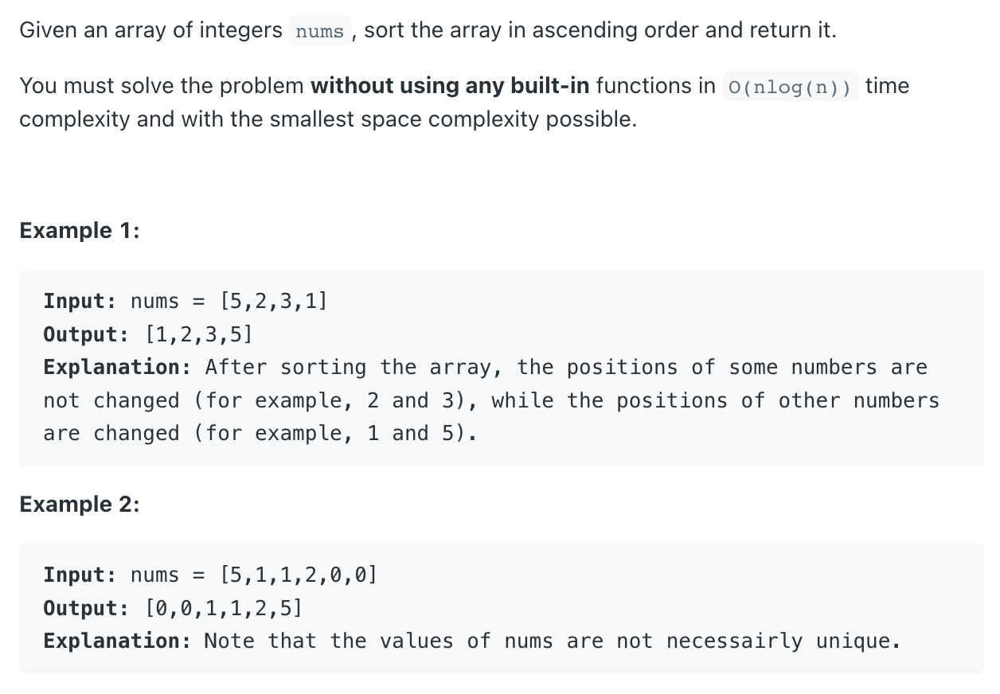

## 912. Sort an Array


- [Quick Sort](https://novemberfall.github.io/LeetCode-NoteBook/#/Array/quick)
---

- High Level 说，挑一个 **Pivot**, 左手边比 pivot smaller, 右手边比 pivot greater

---

```java
class QuickSort {
    public int[] sortArray(int[] nums) {
        if (nums == null || nums.length <= 1) {
            return nums;
        }
        quickSort(nums, 0, nums.length - 1);
        return nums;
    }

    private void quickSort(int[] array, int left, int right) {
        if (left >= right) {
            return;
        }
        //define a pivot and use the pivot to partition the array
        int pivotPos = partition(array, left, right);
        // piovt is already at its position, when we do the recursive call on
        // the two partitions, pivot should not be included in any of them
        quickSort(array, left, pivotPos - 1);
        quickSort(array, pivotPos + 1, right);
    }

    private int partition(int[] array, int left, int right) {
        int pivotIndex = left + new Random().nextInt(right - left + 1);
        // Random.nextInt() : The nextInt() is used to get the next random integer value
        // from this random number | new Random().nextInt(10) => return between 0 and 9
        // so that's why nextInt(right - left + 1)
        int pivot = array[pivotIndex];
        //swap the pivot element to the rightmost position first
        swap(array, pivotIndex, right);
        int leftBound = left;
        int rightBound = right - 1;
        while (leftBound <= rightBound) {
            if (array[leftBound] < pivot) {
                leftBound++;
            } else if (array[rightBound] >= pivot) {
                rightBound--;
            } else {
                /*
                          [1    3     8     9    |5]
                                      i->
                                    <-j
                */
                // 当 leftBound, rightBound 重叠在一起， 自己和自己交换
                swap(array, leftBound, rightBound);
                leftBound++;
                rightBound--;
            }
        }
        swap(array, leftBound, right);
        return leftBound;
    }

    private void swap(int[] array, int pivotIndex, int right) {
        int tmp = array[pivotIndex];
        array[pivotIndex] = array[right];
        array[right] = tmp;
    }

    public static void main(String[] args) {
        QuickSort quickSort = new QuickSort();
        int[] nums = new int[]{1, 9, 8, 5, 3};
        int[] res = quickSort.sortArray(nums);
        System.out.println(Arrays.toString(res));
    }
}
```