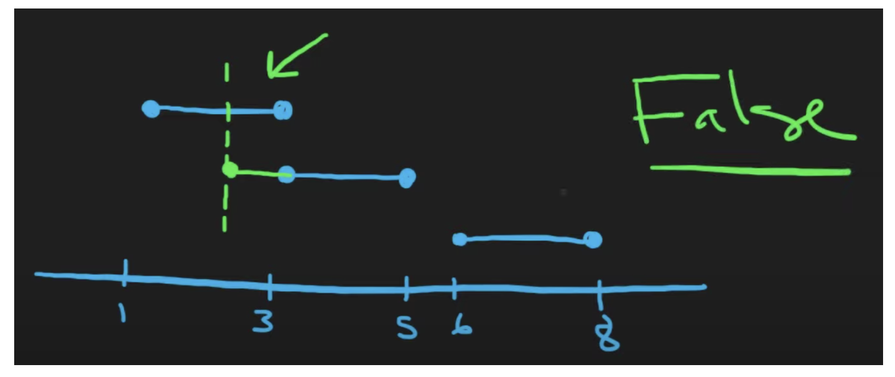

## 252. Meeting Rooms


```ruby
Input: = [[0,30],[5,10],[15,20]]
Output: = false

--------------------------------
0                             30
      -------
      5    10 
```



```java
class Solution {
    public boolean canAttendMeetings(int[][] intervals) {
        if (intervals == null || intervals.length == 0) return true;
        
        Arrays.sort(intervals, (a, b) -> a[0] - b[0]);
        
        for (int i = 1; i < intervals.length; i++) {
            int[] lastInterval = intervals[i - 1];
            if (lastInterval[1] <= intervals[i][0]) {
                continue;
            } else {
                return false;
            }            
        }
        return true;
    }
}
```