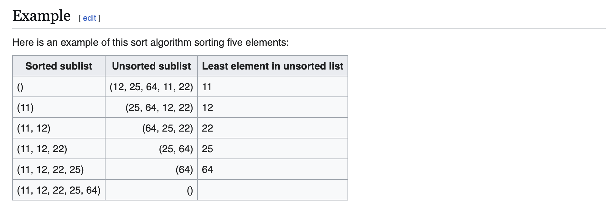
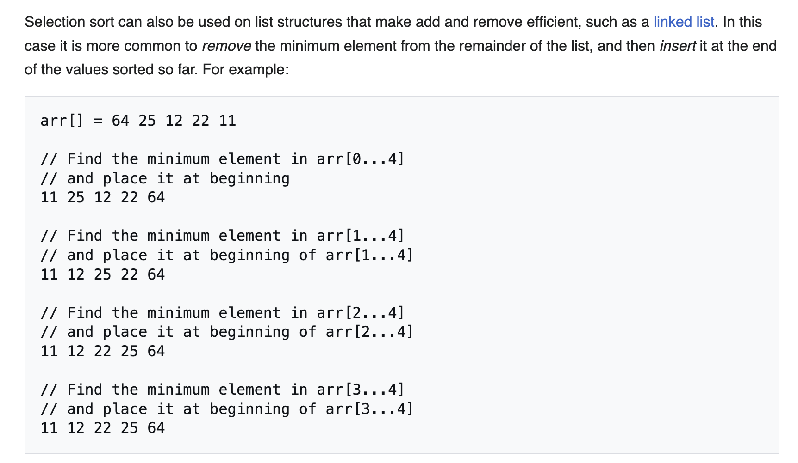
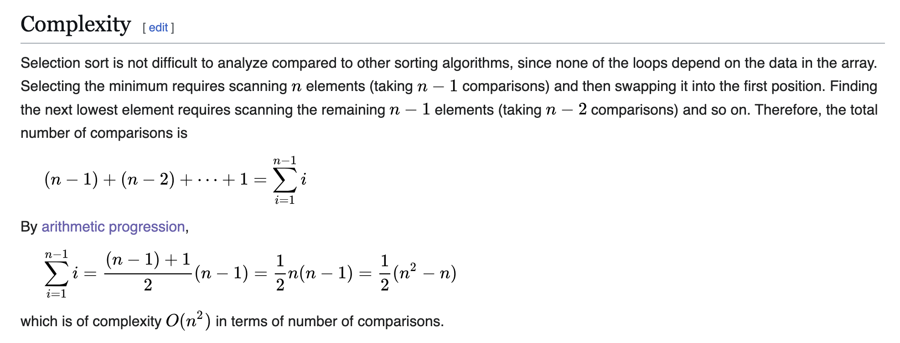

## Selection sort

- **Worst-case**: o(n^2)
- **swap**: o(n)
  
- **best-case**: o(n^2)
- **swap**: o(1)

- **Average**: o(n^2)

---








---

```py
class Solution(object):
  def solve(self, array):
    """
    input: int[] array
    return: int[]
    """
    # write your solution here
    n = len(array)
    # because the last element is the minimum 
    for i in range(n - 1):
      min_idx = i
      for j in range(i + 1, n):
        if array[min_idx] > array[j]:
          min_idx = j
      array[i], array[min_idx] = array[min_idx], array[i]
    return array

```