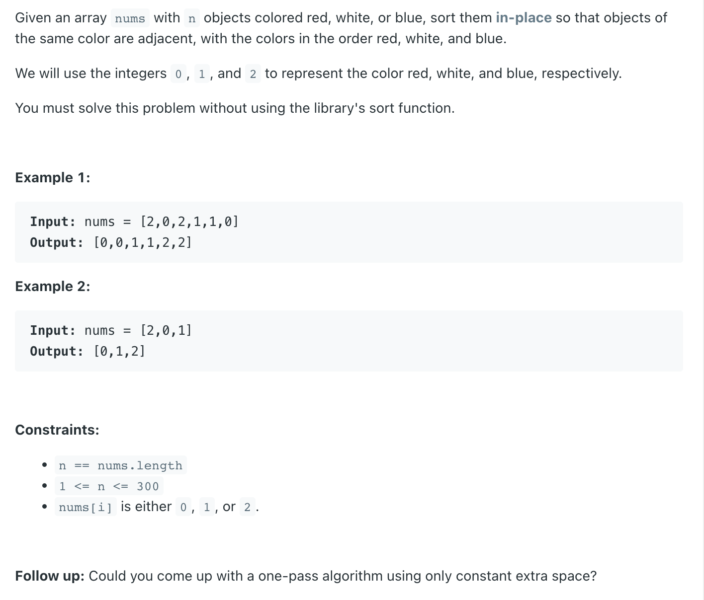

## 75. Sort Colors

---

- if we want to do it via **one-pass** alogorithm, the best way is using `Quick Sort`:

- [youtube](https://www.youtube.com/watch?v=4xbWSRZHqac&t=10s)

---
```java
class _75_SortColors {
    public void sortColors(int[] nums) {
        quickSort(nums, 0, nums.length - 1);
    }

    private void quickSort(int[] nums, int left, int right) {
        if (left >= right) {
            return;
        }
        int pivotPos = partition(nums, left, right);
        quickSort(nums, left, pivotPos - 1);
        quickSort(nums, pivotPos + 1, right);
    }

    private int partition(int[] nums, int left, int right) {
        int pivotIdx = left + new Random().nextInt(right - left + 1);
        int pivot = nums[pivotIdx];
        swap(nums, pivotIdx, right);
        int leftBound = left;
        int rightBound = right - 1;
        while (leftBound <= rightBound) {
            if (nums[leftBound] < pivot) {
                leftBound++;
            } else if (nums[rightBound] >= pivot) {
                rightBound--;
            } else {
                swap(nums, leftBound, rightBound);
                leftBound++;
                rightBound--;
            }
        }
        swap(nums, leftBound, right);
        return leftBound;
    }

    private void swap(int[] nums, int pivotIdx, int right) {
        int tmp = nums[pivotIdx];
        nums[pivotIdx] = nums[right];
        nums[right] = tmp;
    }
}
```
---

#### Python

```py
class Solution:
    def sortColors(self, nums: List[int]) -> None:
        """
        Do not return anything, modify nums in-place instead.
        """
        self.quickSort(nums, 0, len(nums) - 1)

    def quickSort(self, nums: List[int], left: int, right: int) -> None:
        if left >= right:
            return
        pivot = self.partition(nums, left, right)
        self.quickSort(nums, left, pivot - 1)
        self.quickSort(nums, pivot + 1, right)

    def partition(self, nums:List[int], left:int, right:int) -> int:
        privotIdx = random.randint(left, right)
        pivotVal = nums[privotIdx]
        self.swap(nums, privotIdx, right)
        leftBound = left
        rightBound = right - 1
        while leftBound <= rightBound:
            if nums[leftBound] < pivotVal:
                leftBound += 1
            elif nums[rightBound] >= pivotVal:
                rightBound -= 1
            else:
                self.swap(nums, leftBound, rightBound)
                leftBound += 1
                rightBound -= 1
        self.swap(nums, leftBound, right)
        return leftBound

    def swap(self, nums:List[int], left:int, right:int) -> None:
        temp = nums[left]
        nums[left] = nums[right]
        nums[right] = temp
```