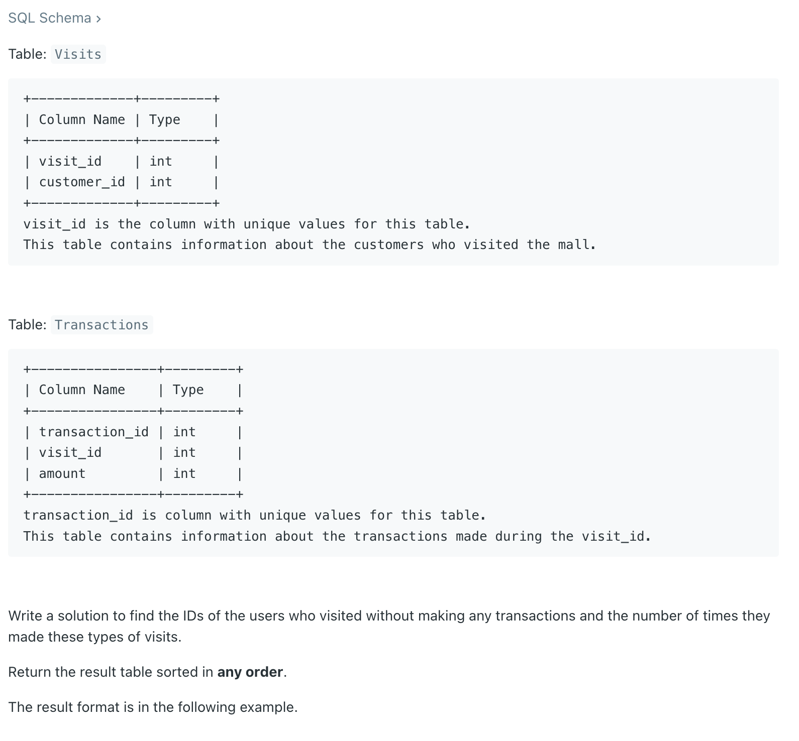
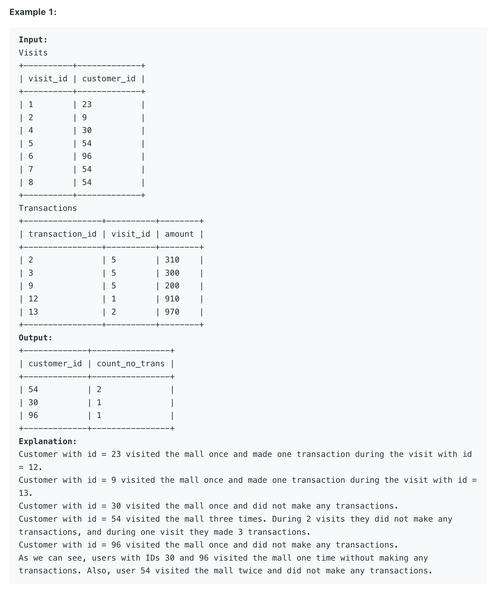

## 1581. Customer Who Visited but Did Not Make Any Transactions



```sql
# Write your MySQL query statement below

SELECT v.customer_id, COUNT(v.visit_id) AS count_no_trans 
from Visits v 
LEFT JOIN Transactions t 
ON v.visit_id = t.visit_id  
WHERE t.transaction_id IS NULL 
GROUP BY v.customer_id; 
```