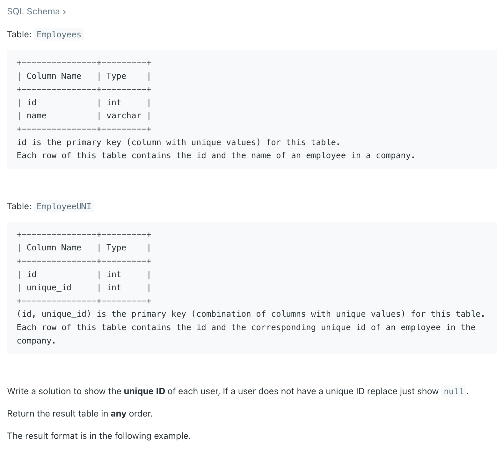
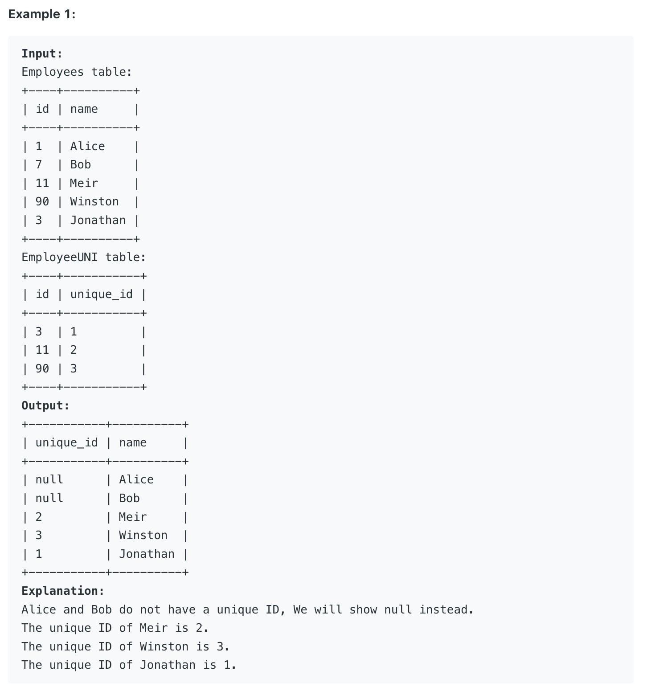

## 1378. Replace Employee ID With The Unique Identifier



---

```sql
# Write your MySQL query statement below
SELECT 
EmployeeUNI.unique_id, Employees.name
FROM Employees LEFT JOIN EmployeeUNI ON Employees.id = EmployeeUNI.id
```