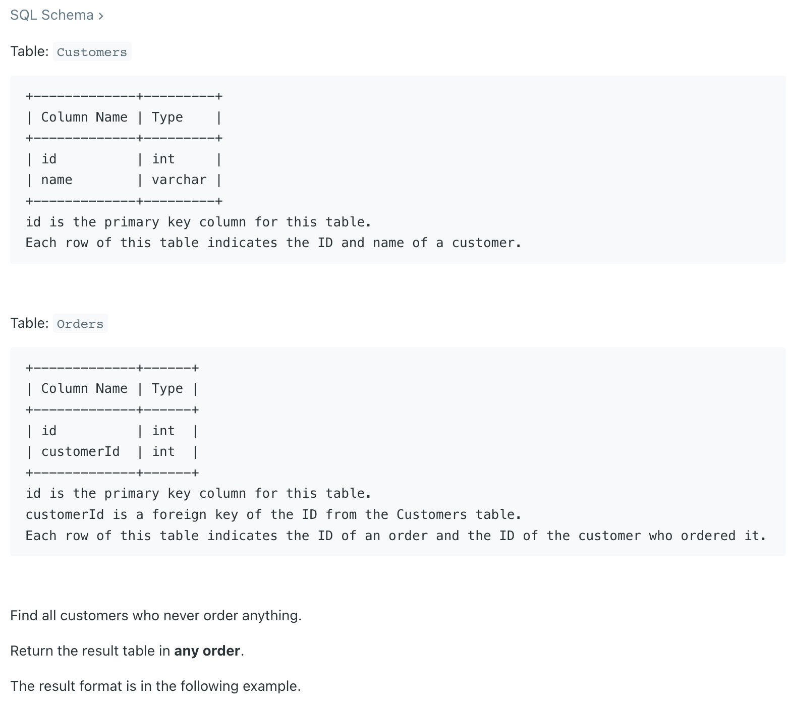
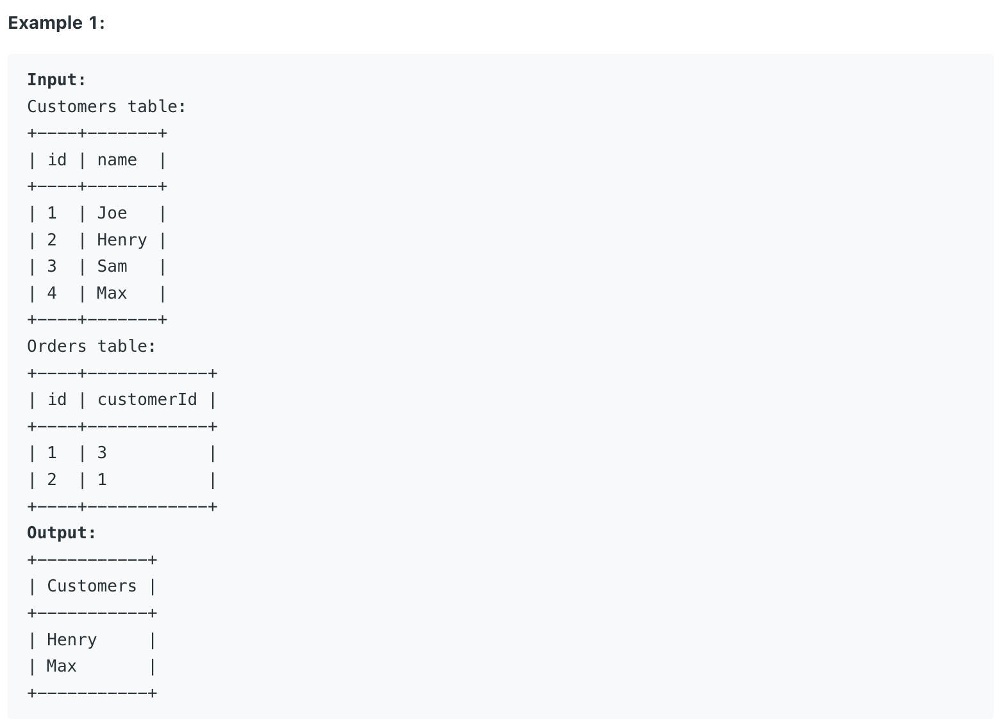

## 183. Customers Who Never Order



- When the joint result shows `Null`, it means this customer doesn’t place any order, 
  so it could be an identifier to be filtered.

---
```sql
# Write your MySQL query statement below
SELECT name AS Customers
FROM Customers
LEFT JOIN Orders
ON Customers.id = Orders.customerId
WHERE Orders.customerId is NULL
```