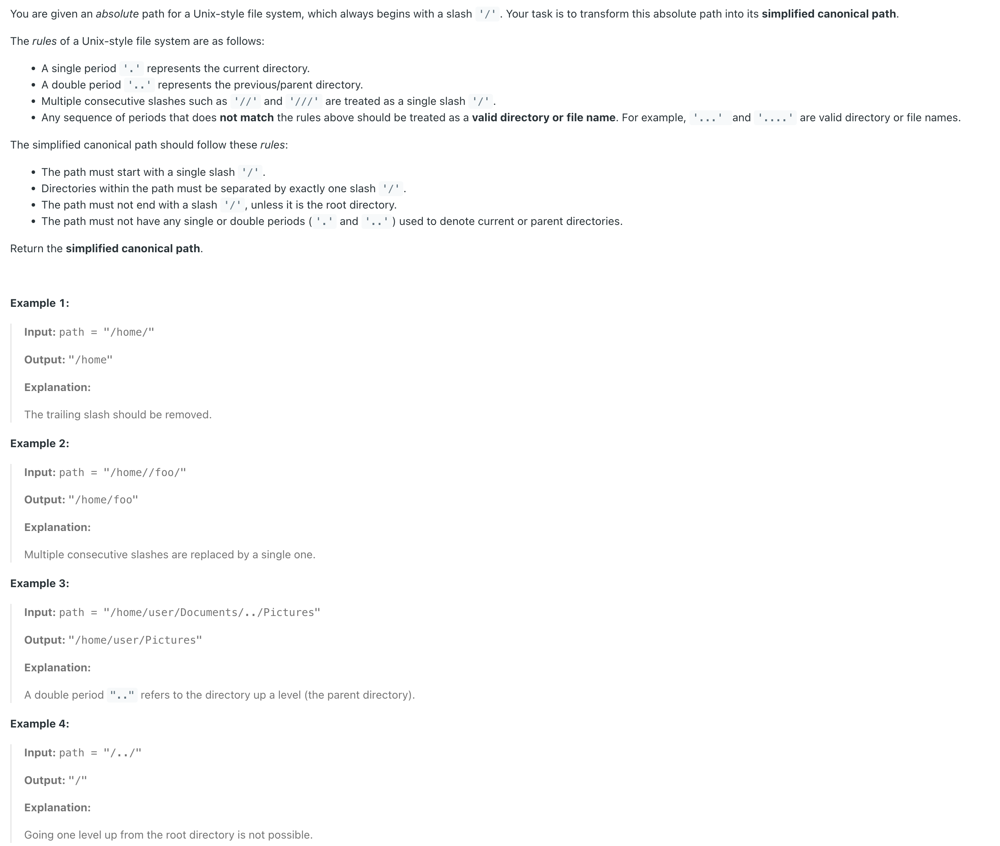
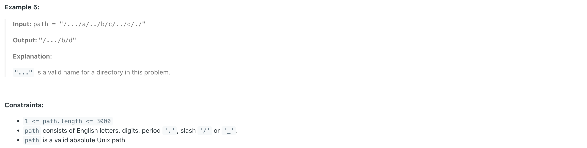

## 71. Simplify Path


---

```java
public class SimplifyPath_Stack {
    public String simplify(String path) {
        Stack<String> stack = new Stack<>();
        StringBuilder res = new StringBuilder();
        String[] dirs = path.split("/");

        // Note: first String is ""
        // [, a, ., b, .., .., c]

        for (int i = 0; i < dirs.length; i++) {
            if (dirs[i].equals(".")) {
                continue;
            }
            if (!dirs[i].equals("") && !dirs[i].equals("..")) {
                stack.push(dirs[i]);
            } else if (!stack.isEmpty() && dirs[i].equals("..")) {
                stack.pop();
            }
        }

        if (stack.isEmpty()){
            return "/";
        }

        while (!stack.isEmpty()) {
            String top = stack.pop();
            System.out.println(top);
            res.insert(0, top).insert(0, "/");
        }
        return res.toString();
    }

    public static void main(String[] args) {
        SimplifyPath_Stack sp = new SimplifyPath_Stack();
//        String res = sp.simplify("a/./b/../../c/");
        String res = sp.simplify("/a/./b/../../c/");
        System.out.println(res); //  /c

        res = sp.simplify("/a/b/c/d/../e");
        System.out.println(res); //   /a/b/c/e
    }
}
```
---

