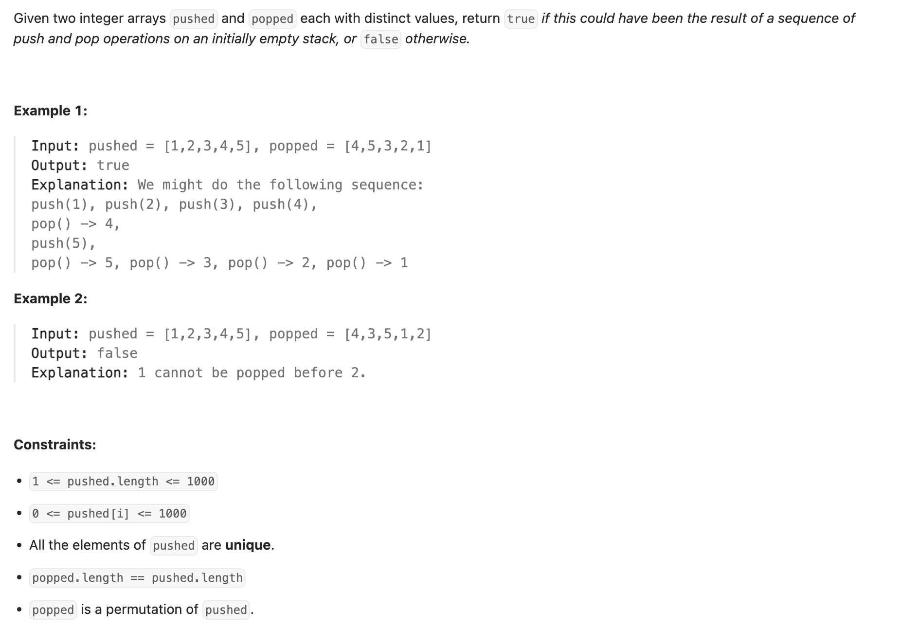

## 946. Validate Stack Sequences


---

```py
class Solution:
    def validateStackSequences(self, pushed: List[int], popped: List[int]) -> bool:
        j = 0
        stk = []
        for e in pushed:
            stk.append(e)
            while stk and j < len(popped) and stk[-1] == popped[j]:
                stk.pop()
                j += 1
        return j == len(popped)
```