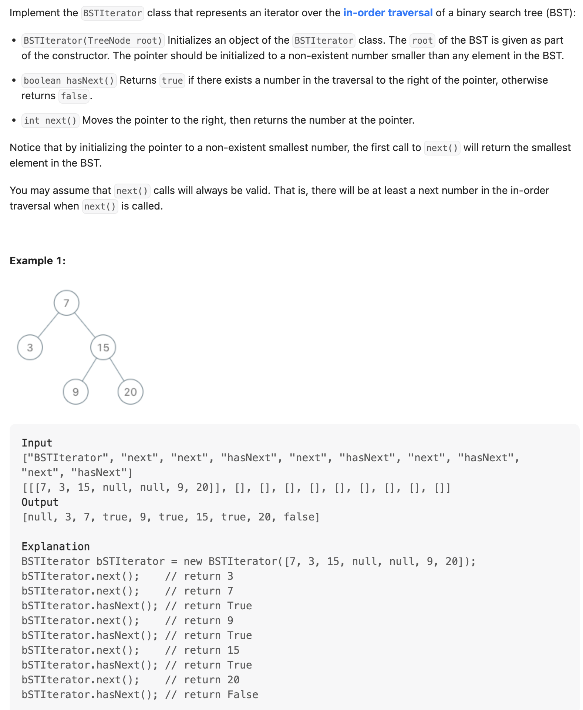
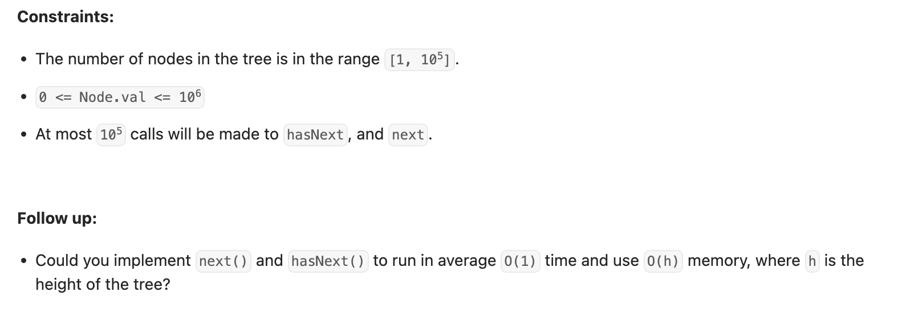

## 173. Binary Search Tree Iterator


---
```ruby

stk [7, 3]
next: 


stk [7, ]
next: 3 => 


stk [ ]
next: 3 => 7


stk [15, ]
next: 3 => 7


stk [15, 9]
next: 3 => 7 


stk [15, ]
next: 3 => 7 => 9


stk [20 ]
next: 3 => 7 => 9 => 15


stk [ ]
next: 3 => 7 => 9 => 15 => 20
```

---
```java
class _173_BinarySearchTreeIterator {
    static class TreeNode {
        int val;
        TreeNode left;
        TreeNode right;

        TreeNode() {
        }

        TreeNode(int val) {
            this.val = val;
        }

        TreeNode(int val, TreeNode left, TreeNode right) {
            this.val = val;
            this.left = left;
            this.right = right;
        }
    }

    Deque<TreeNode> stack;

    public _173_BinarySearchTreeIterator(TreeNode root) {
        stack = new ArrayDeque<>();
        TreeNode cur = root;
        while (cur != null) {
            stack.push(cur);
            cur = cur.left;
        }
    }

    public int next() {
        if (hasNext()) {
            TreeNode node = stack.pop();

            // Traversal cur node's right branch
            TreeNode cur = node.right;
            while (cur != null) {
                stack.push(cur);
                cur = cur.left;
            }
            return node.val;
        }
        return -1;
    }

    public boolean hasNext() {
        return !stack.isEmpty();
    }

    public static void main(String[] args) {
        TreeNode root = new TreeNode(7);
        root.left = new TreeNode(3);
        root.right = new TreeNode(15);
        root.right.left = new TreeNode(9);
        root.right.right = new TreeNode(20);

        _173_BinarySearchTreeIterator bsti = new _173_BinarySearchTreeIterator(root);
        System.out.println(bsti.next());
        System.out.println(bsti.next());
        System.out.println(bsti.hasNext());
        System.out.println(bsti.next());
        System.out.println(bsti.hasNext());
        System.out.println(bsti.next());
        System.out.println(bsti.hasNext());
        System.out.println(bsti.next());
        System.out.println(bsti.hasNext());
        // [3, 7, true, 9, true, 15, true, 20, false]
    }
}
```