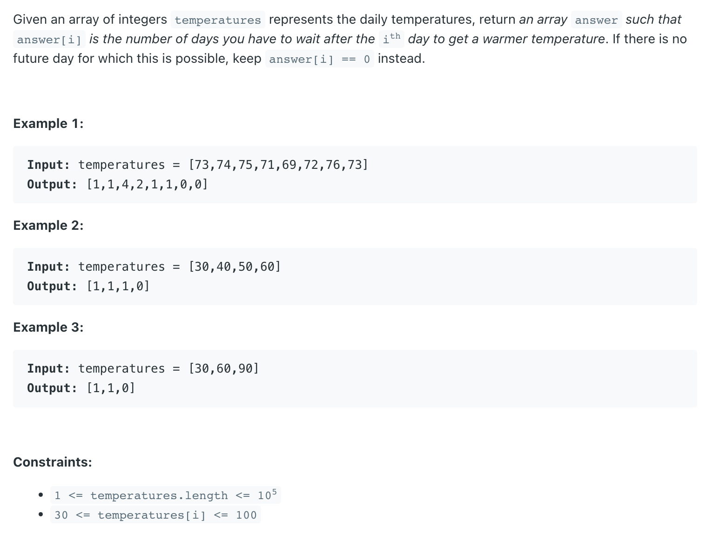

## 739. Daily Temperatures


---
### Stack

- [youtube video](https://www.youtube.com/watch?v=cTBiBSnjO3c&ab_channel=NeetCode)

```java
class DailyTemperatures {
    public int[] dailyTemperatures(int[] temperatures) {
        Stack<Integer> stk = new Stack<>();
        int[] res = new int[temperatures.length];
        for (int i = 0; i < temperatures.length; i++) {
            while (!stk.isEmpty() && temperatures[stk.peek()] < temperatures[i]) {
                int idx = stk.pop();
                res[idx] = i - idx;
            }
            stk.push(i);
        }
        return res;
    }
}
```


---
### Brute Force

- T(N^2)

```java
class Solution {
    public int[] dailyTemperatures(int[] temperatures) {
        int[] res = new int[temperatures.length];
        for (int left = 0; left < temperatures.length; left++) {
            for (int right = left + 1; right < temperatures.length; right++) {
                if (temperatures[left] < temperatures[right]) {
                    res[left] = right - left;
                    break;
                }
            }
        }
        return res;
    }
}
```