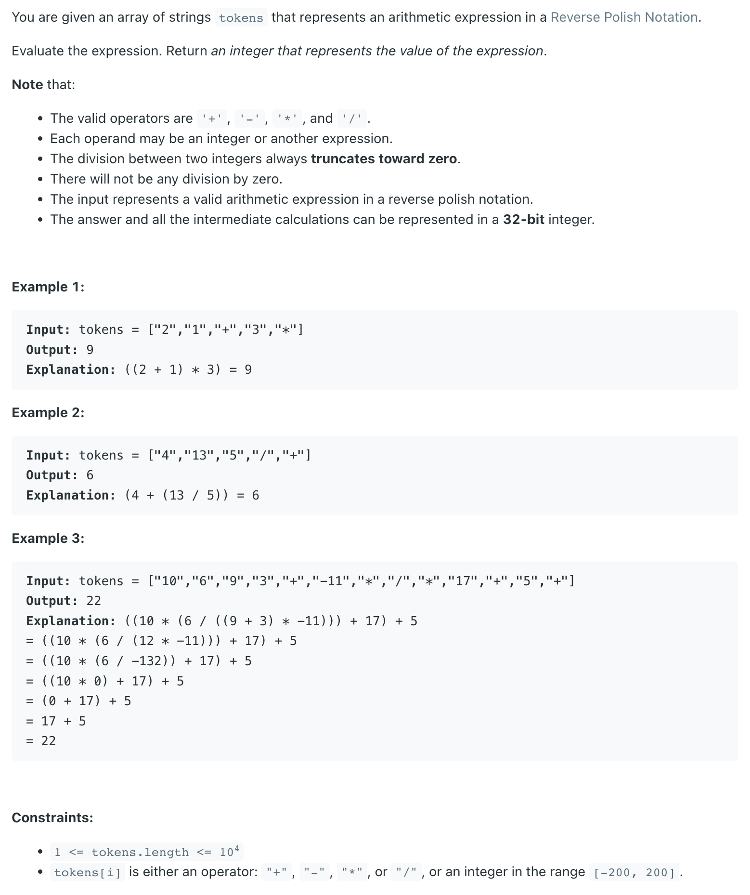

## 150. Evaluate Reverse Polish Notation


- 后缀表达式的计算方法：遍历整个表达式，如果为数字则入栈，如果为符号则将前面两个数字出栈，先出栈的在右边后出栈的在左边符号放中间算出来结果再扔到栈中即
  可。（loop through the whole expression, if `number` then `push`, if `operator` then **pop two numbers**, calculate the 
  result with the operator, push res back to stack）
---

```java
class _150_EvaluateReversePolishNotation {
    public int evalRPN(String[] tokens) {
        int right, left;
        Stack<Integer> stk = new Stack<>();
        for (String str : tokens) {
            if (str.equals("+")) {
                stk.add(stk.pop() + stk.pop());
            } else if (str.equals("-")) {
                right = stk.pop();
                left = stk.pop();
                stk.add(left - right);
            } else if (str.equals("*")) {
                stk.add(stk.pop() * stk.pop());
            } else if (str.equals("/")) {
                right = stk.pop();
                left = stk.pop();
                stk.add(left / right);
            } else {
                stk.add(Integer.valueOf(str));
            }
        }
        return stk.pop();
    }
}
```