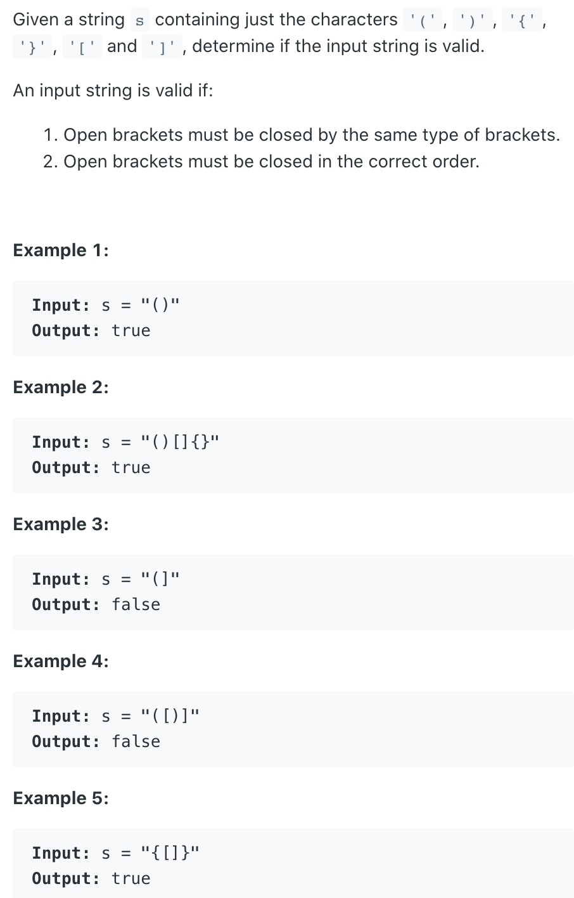

## 20. Valid Parentheses

---
```ruby
     s = "( ) [ ] { }"
          i  
     stk: (  


     s = "( ) [ ] { }"
            i  
     stk:   


     s = "( ) [ ] { }"
              i  
     stk: [ 


     s = "( ) [ ] { }"
                i  
     stk: 
     
     
     s = "( ) [ ] { }"
                  i  
     stk: {  


     s = "( ) [ ] { }"
                    i  
     stk:   
```
---
```java
class Solution {
    public boolean isValid(String s) {
        char[] arr = s.toCharArray();
        Deque<Character> stack = new LinkedList();
        for (char c : arr) {         
            if (c == ')') {
                if (stack.isEmpty() || stack.pop() != '(') {
                    return false;
                }
            } else if (c == ']') {
                if (stack.isEmpty() || stack.pop() != '[') {
                    return false;
                }
            } else if (c == '}') {
                if (stack.isEmpty() || stack.pop() != '{') {
                    return false;
                }
            } else {
                stack.push(c);
            }           
        }
        return stack.isEmpty();
    }
}
```