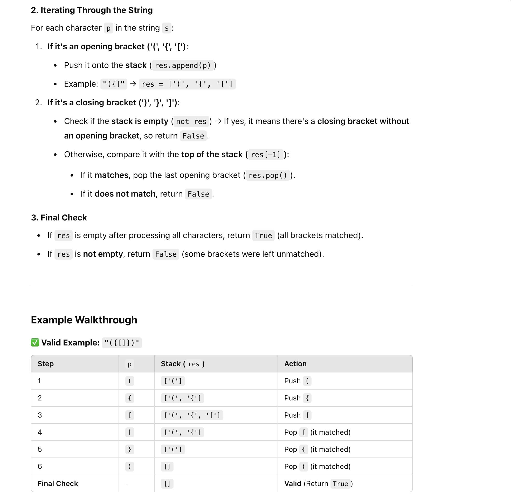
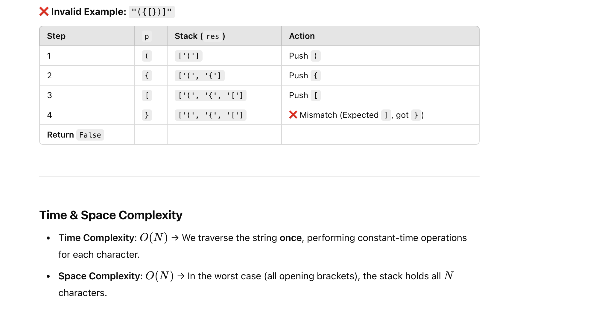

## 20. Valid Parentheses

---

```py
class Solution(object):
    def isValid(self, s: str):
        res = []
        match = {'(': ')', '{': '}', '[': ']'}
        for p in s:
            if p in match: # If it's an opening bracket
                res.append(p)
            elif not res or match[res[-1]] != p: # If stack is empty or top does not match
                return False
            elif match[res[-1]] == p:
                res.pop() # Remove the last opening bracket as it matched correctly
        return not res # Return True if stack is empty (all matched)
```



---


#### Java

```java

class Solution {
    public boolean isValid(String s) {
        Stack<Character> stack = new Stack<>();
        Map<Character, Character> match = new HashMap<>();
        match.put('(', ')');
        match.put('{', '}');
        match.put('[', ']');

        for (char p : s.toCharArray()) {
            if (match.containsKey(p)) {
                stack.push(p);
            } else if (stack.isEmpty() || match.get(stack.peek()) != p) {
                return false;
            } else {
                stack.pop();
            }
        }
        return stack.isEmpty();
    }
}

```