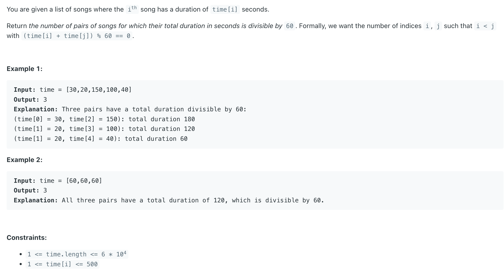

## 1010. Pairs of Songs With Total Durations Divisible by 60

---

```java
/*
    Mathematical Property: (a + b) % num = (a % num + b % num) % num

    t % 60 gets the remainder from 0 to 59.
    We count the occurrence of each remainders in a array/hashmap map

    we want to know that, for each t, how many x satisfy
        (t + x) % 60 = 0.
    The straight forward idea is to take
        x % 60 = 60 - t % 60

        One solution is to use x % 60 = (60 - t % 60) % 60
        why I use `(60 - t % 60) % 60` instead of `(60 - t % 60)` ?
                   because if t = 60, then ==> (60 - t % 60) => 60 - 0 = 60, which is out of bound!
 */
class _1010_PairsOfSongs_TotalDurations_DivisibleBy_60 {
    public int numPairsDivisibleBy60(int[] time) {
        int[] map = new int[60];
        int res = 0;
        for (int t : time) {
           res += map[(60 - t % 60) % 60];
           map[t % 60]++;
        }
        return res;
    }
}
```