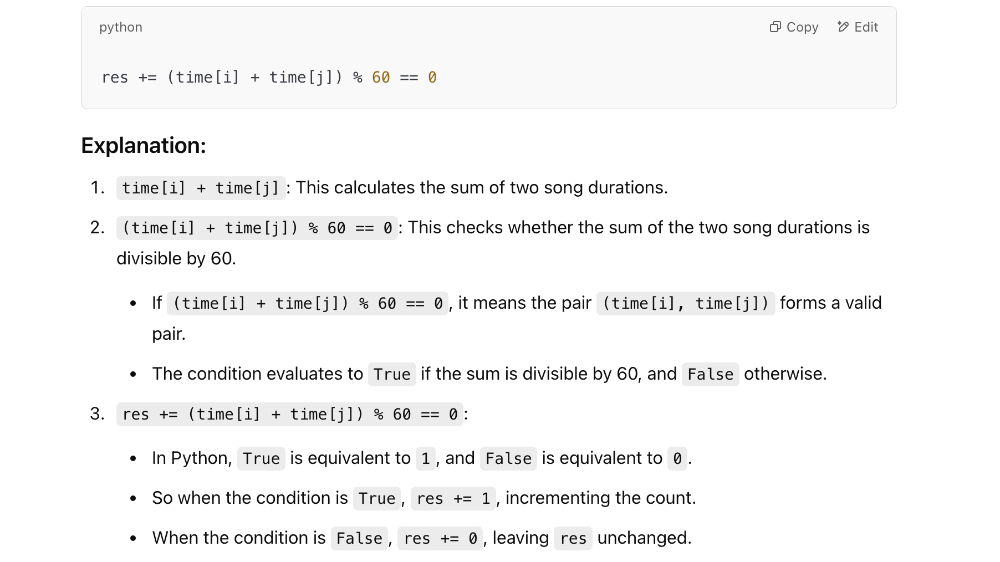
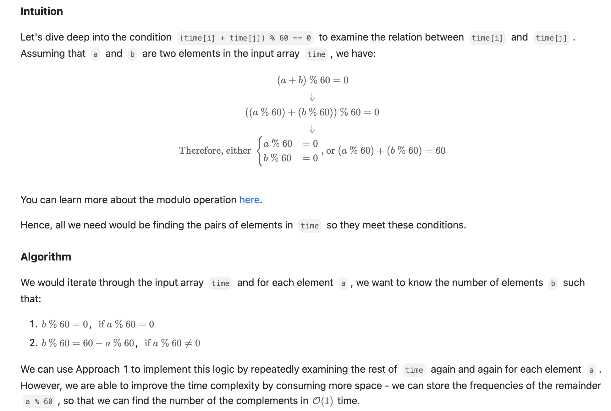
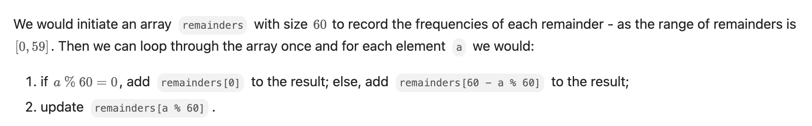
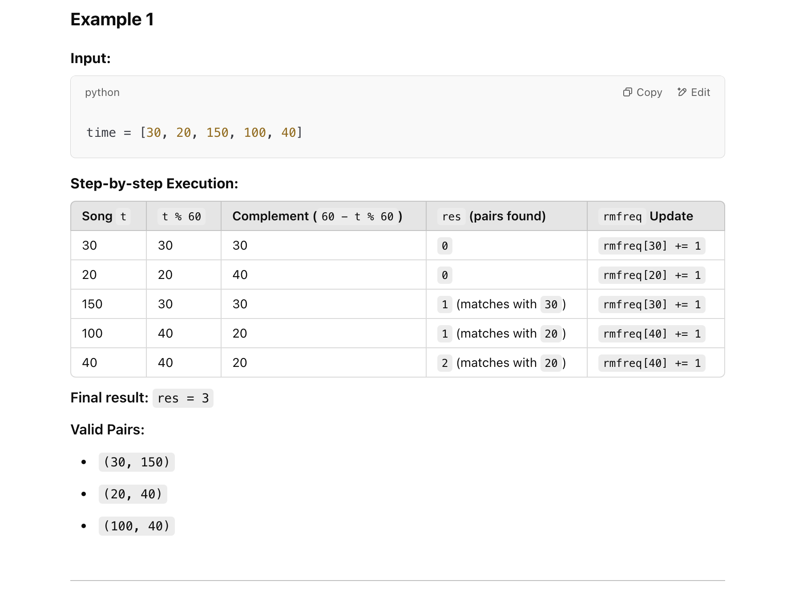

## 1010. Pairs of Songs With Total Durations Divisible by 60

---
### Brute Force

```py
class Solution:
    def numPairsDivisibleBy60(self, time: List[int]) -> int:
        res = 0
        n = len(time)
        for i in range(n):
            for j in range(i + 1, n):
                res += (time[i] + time[j]) % 60 == 0
        return res
```


---


### Approach 2: Use an Array to Store Frequencies









```py
class Solution:
    def numPairsDivisibleBy60(self, time: List[int]) -> int:
        rmfreq = [0] * 60
        res = 0
        for t in time:
            if t % 60 == 0:
                res += rmfreq[0]
            else:
                res += rmfreq[60 - t % 60]
            rmfreq[t % 60] += 1
        return res
```