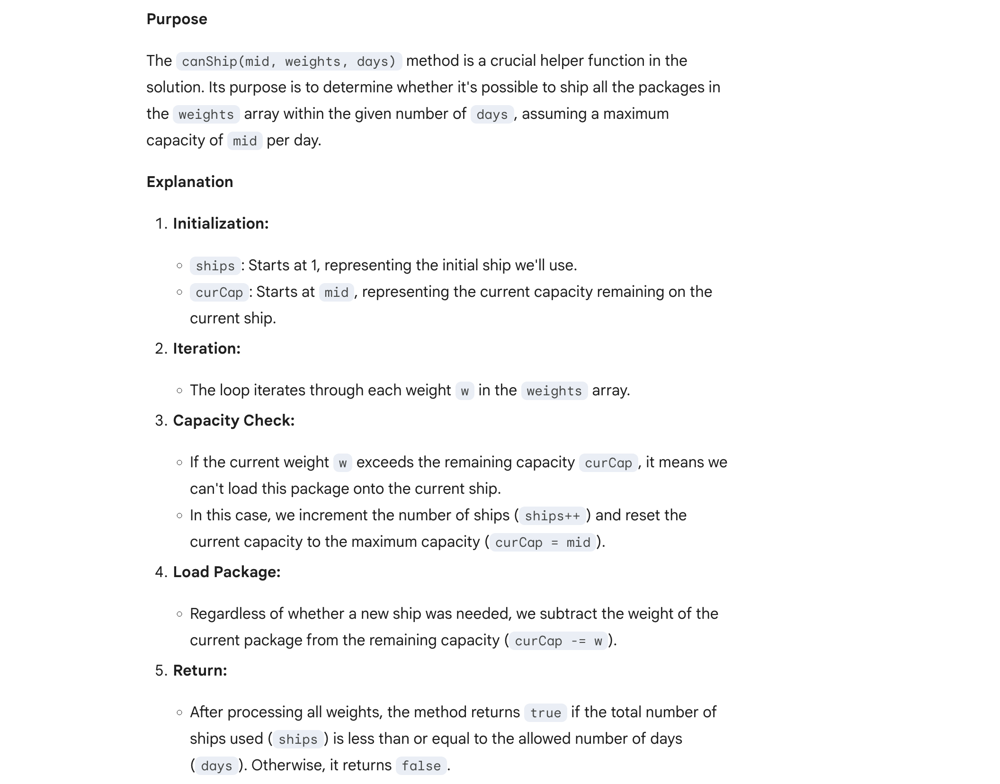
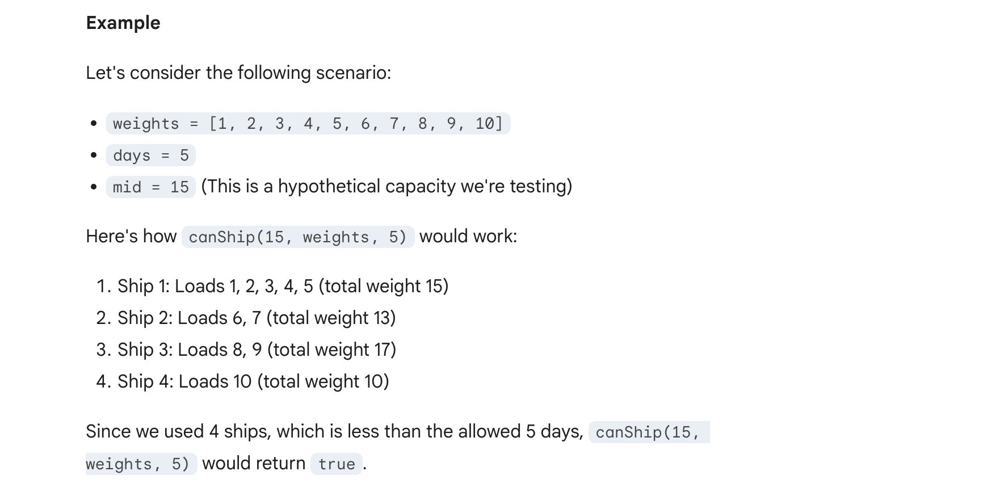

## 1011. Capacity To Ship Packages Within D Days

---

- [youtube](https://www.youtube.com/watch?v=ER_oLmdc-nw&t=158s)






- T = O(N * lg S)   # **S** =  the `sum` of all weights.
- space = O(1)

---
```java
class Solution {
    public int shipWithinDays(int[] weights, int days) {
        int left = Arrays.stream(weights).max().getAsInt();
        int right = Arrays.stream(weights).sum();

        int res = Integer.MAX_VALUE;
        while (left <= right) {
            int mid = (left + right) >>> 1;  // avoid overflow. same as (lo + hi) / 2
            if (canShip(mid, weights, days)) {
                res = Math.min(res, mid);
                right = mid - 1;
            } else {
                left = mid + 1;
            }
        }
        return res;
    }

    private boolean canShip(int mid, int[] weights, int days) {
        int ships = 1;
        int curCap = mid;
        for (int w : weights) {
            if (curCap < w) {
                ships++;
                curCap = mid;
            }
            curCap -= w;
        }
        return ships <= days;
    }
}
```
---


#### Python

```python
class Solution:
    def shipWithinDays(self, weights: List[int], days: int) -> int:
        left = max(weights)
        right = sum(weights)

        res = math.inf
        while left <= right:
            mid = (left + right) // 2
            if self.canShip(mid, weights, days):
                res = min(res, mid)
                right = mid - 1
            else:
                left = mid + 1
        return res

    def canShip(self, mid: int, weights: List[int], days: int) -> bool:
        ships = 1
        curCap = mid
        for w in weights:
            if curCap < w:
                ships += 1
                curCap = mid
            curCap -= w
        return ships <= days
```