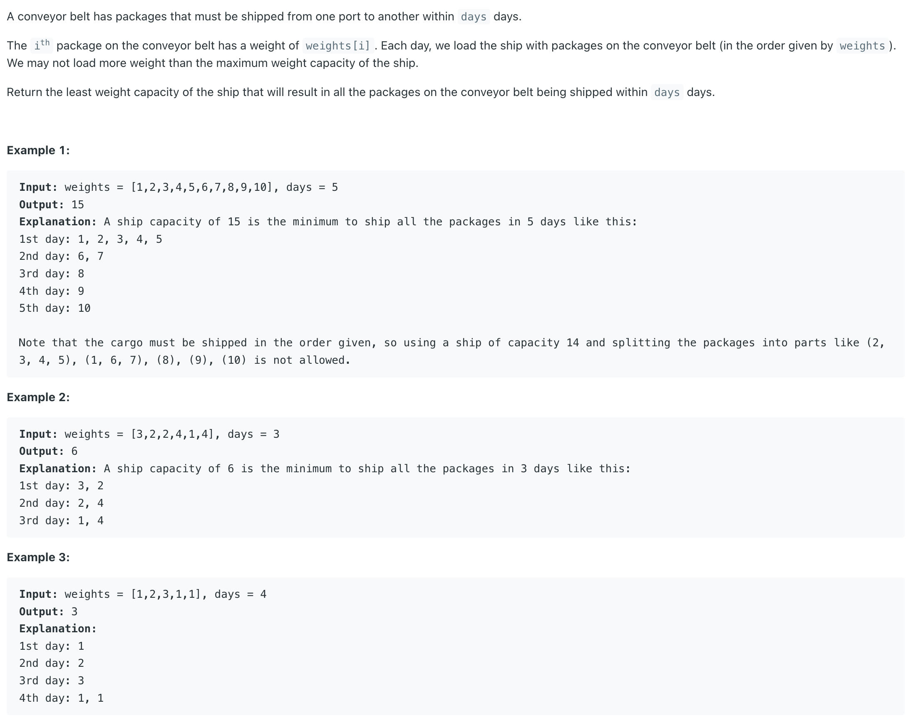

## 1011. Capacity To Ship Packages Within D Days

---

```java
class Solution {
    public int shipWithinDays(int[] weights, int days) {
        int left = Arrays.stream(weights).max().getAsInt();
        int right = Arrays.stream(weights).sum();

        int res = Integer.MAX_VALUE;
        while (left <= right) {
            int mid = (left + right) >>> 1;  // avoid overflow. same as (lo + hi) / 2
            if (canShip(mid, weights, days)) {
                res = Math.min(res, mid);
                right = mid - 1;
            } else {
                left = mid + 1;
            }
        }
        return res;
    }

    private boolean canShip(int mid, int[] weights, int days) {
        int ships = 1;
        int curCap = mid;
        for (int w : weights) {
            if (curCap - w < 0) {
                ships++;
                curCap = mid;
            }
            curCap -= w;
        }
        return ships <= days;
    }
}
```