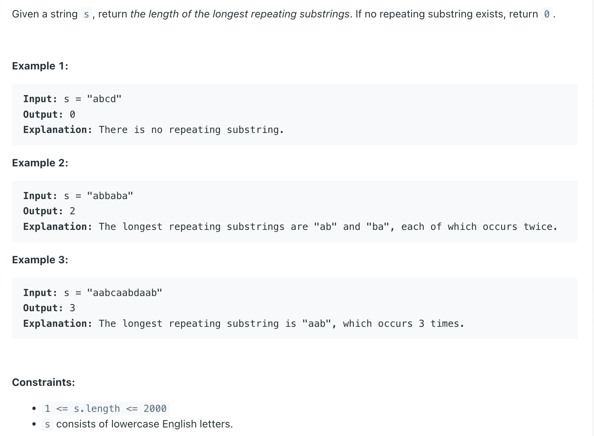

## 1062. Longest Repeating Substring

---

### Brue Force O(N^3)

```java
class bruteForce {
    public int longestRepeatingSubstring(String s) {
        if (s.length() == 0) return 0;

        int len = s.length() - 1;
        Set<String> set = new HashSet<>();
        while (len > 0) { // O(N)
            for (int i = 0; i + len <= s.length(); i++) { // O(N)
                String ss = s.substring(i, i + len); // O(N)
                if (set.contains(ss)) {
                    return len;
                }
                set.add(ss);
            }
            len--;
        }
        return 0;
    }
}
```
---

### Trie Tree O(N^2)

```ruby
    len = 5

                    ["e", "b", "a", "b", "a"]
   i = 0, j = i:      e -> b -> a -> b -> a
                     |b -> a| -> b -> a   
                      a -> b -> a   
                     |b -> a|   
                      a
   
   i = 1, j = i:      b -> a -> b -> a
                      a -> b -> a   
                      b -> a   
                      a   
                      

   i = 2, j = i:      a -> b -> a
                      b -> a   
                      a   
                      
        ...
```

---
```java
class Solution {
    static class TrieNode {
        TrieNode[] next;

        public TrieNode() {
            next = new TrieNode[26];
        }
    }
    public int longestRepeatingSubstring(String s) {
        int len = s.length();
        char[] arr = s.toCharArray();
        int res = 0;
        TrieNode root = new TrieNode();
        for (int i = 0; i < len; i++) {
            TrieNode cur = root;
            for (int j = i; j < len; j++) {
                if (cur.next[arr[j] - 'a'] == null) {
                    TrieNode newNode = new TrieNode();
                    cur.next[arr[j] - 'a'] = newNode;
                    cur = newNode;
                } else {
                    res = Math.max(res, j - i + 1);
                    cur = cur.next[arr[j] - 'a'];
                }
            }
        }
        return res;
    }
}
```