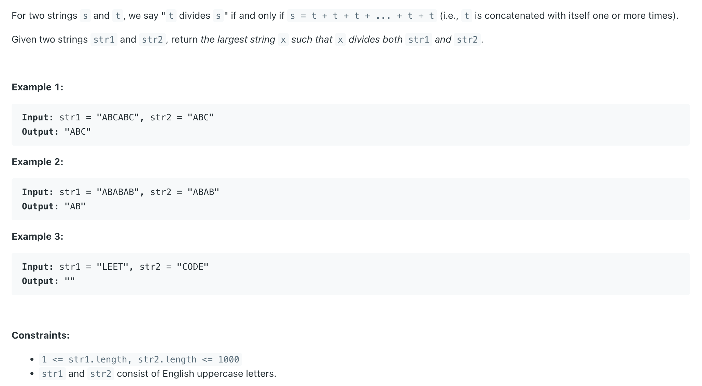
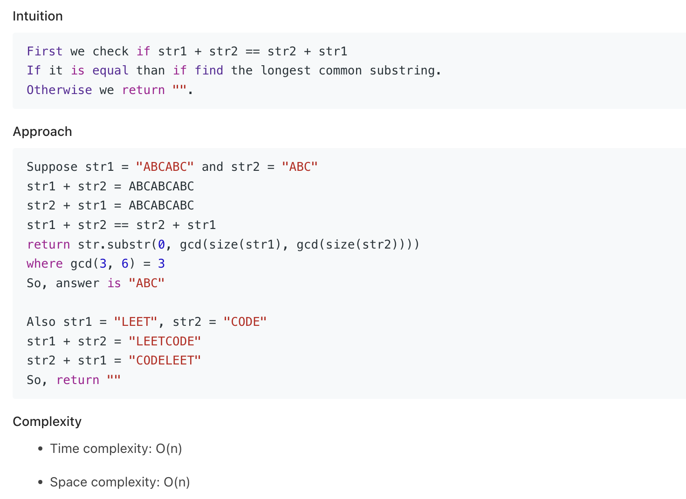

## 1071. Greatest Common Divisor of Strings

---


---

```java
class Solution {
    public String gcdOfStrings(String str1, String str2) {
        if (!(str1 + str2).equals(str2 + str1)) {
            return "";
        }

        int len = gcd(str1.length(), str2.length());
        return str1.substring(0, len);
    }

    private int gcd(int len1, int len2) {
        if (len2 == 0) {
            return len1;
        }
        
        return gcd(len2, len1 % len2);
    }
}
```
---

#### How gcd(len1, len2) Works


---

#### Python

```py
class Solution:
    def gcdOfStrings(self, str1: str, str2: str) -> str:
        # Check if concatenated strings are equal or not, if not return ""
        if str1 + str2 != str2 + str1:
            return ""

        # If strings are equal than return the substring from 0 to gcd of size(str1), size(str2)
        return str1[0:gcd(len(str1), len(str2))]
```
---

