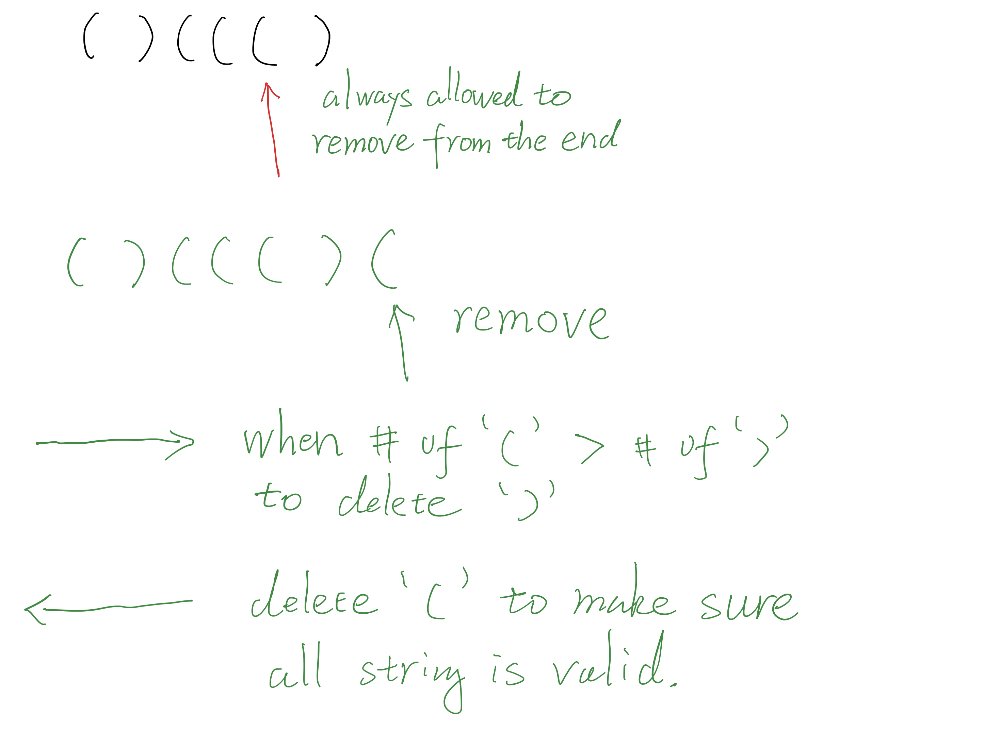

## 1249. Minimum Remove to Make Valid Parentheses

---

---

```java
class _1249_MinimumRemove_to_MakeValidParentheses {
    public String minRemoveToMakeValid(String s) {
        int n = s.length();
        if (s == null || s.length() == 0) return "";

        StringBuilder sb = new StringBuilder();
        int cnt = 0;
        for (int i = 0; i < n; i++) {
            char c = s.charAt(i);
            if (c == '(') {
                sb.append(c);
                cnt++;
            } else if (c == ')' && cnt > 0) {
                sb.append(c);
                cnt--;
            } else if (c != ')') {
                sb.append(c);
            }
        }

        StringBuilder filtered = new StringBuilder();
        for (int i = sb.length() - 1; i >= 0; i--) {
            char c = sb.charAt(i);
            if (c == '(' && cnt > 0) {
                cnt--;
            } else {
                filtered.append(c);
            }
        }

        return filtered.reverse().toString();
    }
}
```

---
#### Python

```py
class Solution:
    def minRemoveToMakeValid(self, s: str) -> str:
        res = []
        cnt = 0  # extra `(` parentheses
        for c in s:
            if c == '(':
                res.append(c)
                cnt += 1
            elif c == ')' and cnt > 0:
                res.append(c)
                cnt -= 1
            elif c != ')':  # this handle that aren't parentheses
                res.append(c)

        filtered = []
        for c in res[::-1]:
            if c == '(' and cnt > 0:  # skip this character
                cnt -= 1
            else:
                filtered.append(c)

        return "".join(filtered[::-1]) 
```